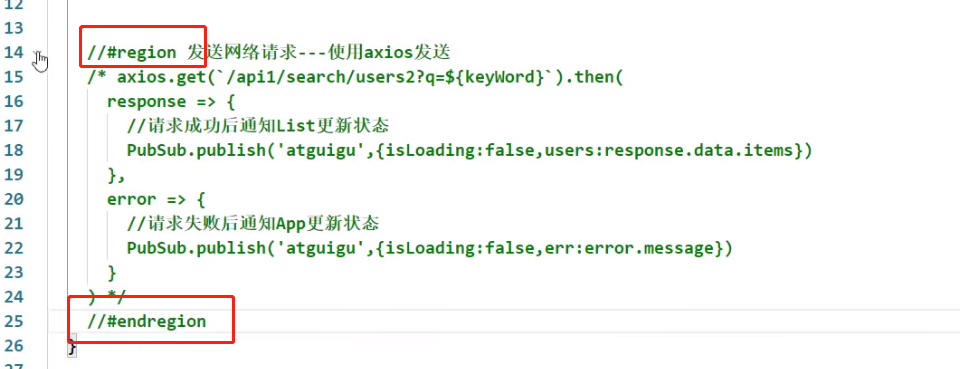
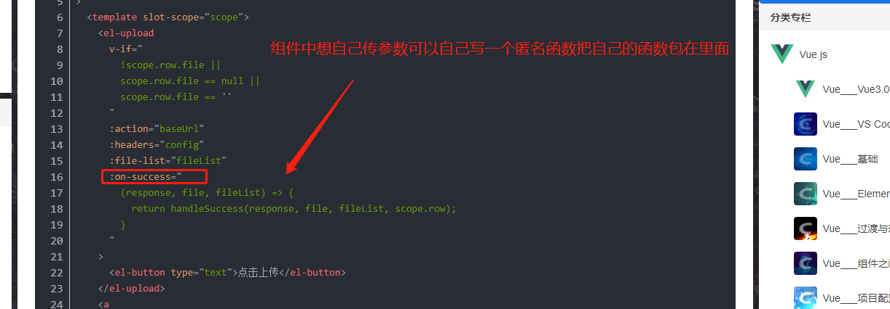

正则表达式  vue3 ts  webpack  node 珠峰前端进阶

## 一、10.11学习总结

今天学习TS章节
#### 1、最好不要用opacity设置透明度
首先子元素会继承父元素的透明度：

设置父元素opacity：0.5，子元素不设置opacity，子元素会受到父元素opacity的影响，也会有0.5的透明度。
使用 例如background-color:rgba(0,0,0,0.5)

## 二、10.12学习总结

#### 1、类的实例方法和本身方法

**类的实例直接在class里面写就可以了,本身的加个static**

```JavaScript
class Person{

    /*
    *   直接定义的属性是实例属性，需要通过对象的实例去访问：
    *       const per = new Person();
    *       per.name
    *
    *   使用static开头的属性是静态属性（类属性），可以直接通过类去访问
    *       Person.age
    *
    *   readonly开头的属性表示一个只读的属性无法修改
    * */

    // 定义实例属性
    // readonly name: string = '孙悟空';
    name = '孙悟空';

    // 在属性前使用static关键字可以定义类属性（静态属性）
    // static readonly age: number = 18;
    age = 18;


    // 定义方法
    /*
    * 如果方法以static开头则方法就是类方法，可以直接通过类去调用
    * */
    sayHello(){
        console.log('Hello 大家好！');
    }

}
```

#### 2、类的继承

extend继续原有的类,可以直接子类重写类的方法,但是要重写类的构造函数必须使用super,使用super还可以调用父类实例的方法

```JavaScript
class Animal {
        constructor(name) {
            this.name = name;
        }
        sayHello() {
            console.log('动物在叫~');
        }
    }
    class Dog extends Animal {
        constructor(name, age) {
            // 如果在子类中写了构造函数，在子类构造函数中必须对父类的构造函数进行调用
            super(name); // 调用父类的构造函数
            this.age = age;
        }
        sayHello() {
            // 在类的方法中 super就表示当前类的父类
            //super.sayHello();
            console.log('汪汪汪汪！');
        }
    }
    const dog = new Dog('旺财', 3);
    dog.sayHello();
```

## 三、10.13学习总结
#### 1、TS中防止元素不存在
```JavaScript
//如果不加!TS会提醒你报错说防止你这个元素不存在,如果你确定这个元素存在,在后面加个!号就可以(做非空判断也可以)
    constructor() {
        // 获取页面中的food元素并将其赋值给element
        this.element = document.getElementById('food')!;
    }
```

## 四、10.20学习总结
#### 1、首行缩进
text-indent:2em

#### 2、常用模块化导入导出
```JavaScript
const priceFormat = function() {
  return "¥99.88";
}

// CommonJS的导出
module.exports = {
  priceFormat
}

// ES Module
export function sum(num1, num2) {
  return num1 + num2;
}


//导入2种的方式
import { sum } from "./js/math";
const { priceFormat } = require("./js/format");
```

**安装webpack后想使用这些语法,可以直接在终端输入webpack,然后再HTML中引入被webpack解压打包后的dist里面的js文件即可**
* 如果你项目安装了不同版本的webpack,想运行,如果你直接敲webpack运行的还是全局那个版本的webpack,你需要需要 npx webpack 这样就会自动找当前项目里面的版本的webpack了
* 但是,项目里面很少输入npx webpack的  而是在packjson的script设置,为什么这里不用加npx,因为scripts会自动查找不需要加,这样你在控制台,输入npm run build 就可以打包了
```JavaScript
 "scripts": {
    "build": "webpack"
  }
```
* 默认webpack没配置的话,打包入口文件是src下面的index.js 没有这个会报错,要自己定义的话需要自己定义webpack配置文件,或者可以用下面图片的方式(比如入口文件不叫index.js叫main.js)[有配置文件,这作为了解就好了]

#### 五、npm安装包生产开发依赖

	安装 npm i xxx -D 就是开发依赖
	不加就是生产依赖
	其实影响不大,了解一下


​	
## 五、10.21学习总结
#### 1、子盒子的margin会影响到父盒子
这是因为子盒子上边届和父盒子上边届重合了 解决方法：给父盒子添加overflow：hidden即可

#### 2、css属性选择
选择class为_color元素中的第几个div
```css
._color div:nth-child(3) {
  width: 18%;
  height: 70%;
  background: red;
  border-radius: 12px;
}
```

#### 3、flex用了分行问题
用了分行假如一行2个的话,如果有5个第五个就不会在左对齐,会在中间,我们要实现左对齐可以给父盒子来一个伪元素
```css
   .test {
        ul {
            display: flex;
            justify-content: space-between;
            flex-wrap: wrap;
            text-decoration: none;
            li {
                margin-top: 10px;
                width: 32%;
                height: 100px;
                border: 1px solid #333333;
                background-color: skyblue;
            }
        }

        ul:after{  // 使用伪类元素占据单位，不影响页面
            content: "";
            height: 0;
            width: 32%;
        }
    }
```

	## 六、11.2学习总结

#### 1、关于路由传参页面刷新消失问题
用params传参,页面刷新,数据会消失,使用query传参把数据存在url上,可以解决这个问题,通过JSON.stringify()将一个JavaScript值(对象或者数组)转换为一个 JSON字符串,传过去,
然后另一个页面接收并通过JSON.parse将一个 JSON 字符串转换为对象,这样就可以解决问题


## 七、11.30学习总结

#### 1、关于react的传参父子问题


#### 2、修改对象中的值

图片注释 这个里面的done是因为done:done 所以简写了

```JavaScript
例如:
let obj = {
	a:1,b:2
}

let obj2 = {...obj,b:3}
```

## 八、12.2学习总结

#### 1、react传参简便写法


#### 2、reduce使用


#### 3、解构赋值常用的写法


#### 4、关于代码不容易折叠


#### 5、关于标签体里面内容的写法


#### 6、react兄弟组件传参


#### 7、react刷新样式丢失问题


#### 8、组件中:xxx传值函数想传参数


#### 9、合并数组


#### 10、关于map和filter
map不能改变原来数组的长度,不满足条件也会返回undefined
filter是可以筛选的,且不返回undefined

#### 11、关于监听器watch的一些属性


## 九、1.11学习总结
学习codeerwhy视频,笔记多记录于代码中

每天至少一节 争取过年前把vue3给啃下来
笔记多记录于代码里面  坚持每天看


#### 1、关于组件中的非props的接收如class  id


如果你想不继承到根节点,只弄点指定节点需要设置2个地方
1. 是需要在组件设置里面添加

2. 在指定的div下面写上$attrs接收到的属性比如class,id等
 
 

#### 2、vue3中子组件给父组件发送事件有验证参数写法


#### 3、vue3自定义指令hook封装使用


1. main.js 插件和自定义指令都需要在这里导入使用

#### 4、vue3插件的使用
插件的注册有2种方式对象或者函数
1. 对象


2. 函数

你就可以在函数里面写一些逻辑啊  比如全局注册指令,mixin混入点什么的

#### 5、vue router懒加载+meta+路由404匹配

是this.route图片里面写错了


#### 6、router4插槽功能


#### 7、vuex中简版获取state写法(vue2和vue3)

1. vue2写法
```JavaScript
	<template>
	  <div>
	    <h2>Home:{{ $store.state.counter }}</h2>
	    <h2>Home:{{ sCounter }}</h2>
	    <h2>Home:{{ sName }}</h2>
	    <!-- <h2>Home:{{ age }}</h2>
	    <h2>Home:{{ height }}</h2> -->
	  </div>
	</template>
	
	<script>
	  import { mapState } from 'vuex'
	
	  export default {
	    computed: {
	      fullName() {
	        return "Kobe Bryant"
	      },
		  //2种写法数组或者对象,对象写法可以从命名
		  //mapState函数返回的是一个对象所以用展开运算符展开
	      // 其他的计算属性, 从state获取
	      // ...mapState(["counter", "name", "age", "height"])
	      ...mapState({
	        sCounter: state => state.counter,
	        sName: state => state.name
	      })
	    }
	  }
	</script>
	
	<style scoped>
	
	</style>
```

2. vue3
```JavaScript
<template>
  <div>
    <h2>Home:{{ $store.state.counter }}</h2>
    <hr>
    <h2>{{sCounter}}</h2>
    <h2>{{counter}}</h2>
    <h2>{{name}}</h2>
    <h2>{{age}}</h2>
    <h2>{{height}}</h2>
    <hr>
  </div>
</template>

<script>
  import { mapState, useStore } from 'vuex'
  import { computed } from 'vue'

  export default {
    computed: {
      fullName: function() {
        return "1fdasfdasfad"
      },
      ...mapState(["name", "age"])
    },

    setup() {
      const store = useStore()
      const sCounter = computed(() => store.state.counter)
      // const sName = computed(() => store.state.name)
      // const sAge = computed(() => store.state.age)

      const storeStateFns = mapState(["counter", "name", "age", "height"])
	  //这个是自己想的办法实际上没有也可以就一个一个取(进阶小知识)
      // {name: function, age: function, height: function}
      // {name: ref, age: ref, height: ref}
	  /* computed里面的值就是键值对键+值(值是函数) 下面的方法就是帮忙实现这个操作的  为什么要.bind那因为computed底层原理拿vuex
	  里面的值是通过this.$store拿的 所以需要绑定一个bind */
      const storeState = {}
      Object.keys(storeStateFns).forEach(fnKey => {
        const fn = storeStateFns[fnKey].bind({$store: store})
        storeState[fnKey] = computed(fn)
      })

      return {
        sCounter,
        ...storeState
      }
    }
  }
</script>

<style scoped>

</style>
```


#### 8、vuex的getter使用(基本使用+mapGetters)
```JavaScript
 getters: {
	 //接受2个参数,第一个参数是state,第二个参数是getters里面的值(就是比如在getter里面想用里面的值)
    totalPrice(state, getters) {
      let totalPrice = 0
      for (const book of state.books) {
        totalPrice += book.count * book.price
      }
      return totalPrice * getters.currentDiscount
    },
    currentDiscount(state) {
      return state.discount * 0.9
    },
	//getters也可以返回一个函数让外面使用的时候传进来 比如$store.getters.totalPriceCountGreaterN(这里面就是接受的值)
    totalPriceCountGreaterN(state, getters) {
      return function(n) {
        let totalPrice = 0
        for (const book of state.books) {
          if (book.count > n) {
            totalPrice += book.count * book.price
          }
        }
        return totalPrice * getters.currentDiscount
      }
    },
    nameInfo(state) {
      return `name: ${state.name}`
    },
    ageInfo(state) {
      return `age: ${state.age}`
    },
    heightInfo(state) {
      return `height: ${state.height}`
    }
  }
  ```
  
#### 9、vuex中actions执行异步
执行异步,想等到数据获取后再进行操作,可以返回一个promise


## 十、3.1学习总结
#### 1、关于PC端适配
1. 安装插件npm i -S lib-flexible
2. 在main.js中进行配置
```
import { createApp } from 'vue'
import App from './App.vue' 
import router from './router' 
import store from './store' // 引用 
import 'lib-flexible/flexible.js' 
createApp(App).use(store).use(router).mount('#app')
```
3. 修改flexible配置
因为默认情况下只会在540px分辨率一下生效 所以我们需要根据我们的项目分辨率进行调整
在node_module/lib-flexible/flexible.js中修改代码如下
```JavaScript
// 修改原始的 
// if (width / dpr > 540) { 
// width = 540 * dpr; 
// } 
// var rem = width / 10; 
// 修改成为 
// 最小400px，最大适配2560px 
	if (width / dpr < 400) { 
	width = 400 * dpr; 
	} else if (width / dpr > 2560) { 
		width = 2560 * dpr; 
	}
	// 设置成24等份，设计稿时1920px的，这样1rem就是80px （1920/24=80）方便使用 
	var rem = width / 24;

```
这个时候重启项目大家打开浏览器调试器 即可发现在浏览器大小改变的时候 在html根节点上会自动设
置一个font-size

4. 我们在写代码的时候发现如果我们都根据80px为1rem在编写代码的时候转换非常的麻烦 所以我们可以
在vscode中安装一个cssrem的插件帮助我们进行转换 这样一来开发过程中会更加的方便
在vscode扩展中找到 cssrem插件 最新名字叫px to rem & rpx 安装到vscode中 点击右下角设置
修改Root Font Size（基准font-size） 配置项为80即可

#### 2、开发时候开发环境的BASE_URL的3种配置方式
```JavaScript
// 1.方式一: 手动的切换不同的环境(不推荐)
// const BASE_URL = 'http://coderwhy.org/dev'
// const BASE_NAME = 'coderwhy'

// const BASE_URL = 'http://coderwhy.org/prod'
// const BASE_NAME = 'kobe'

// const BASE_URL = 'http://coderwhy.org/test'
// const BASE_NAME = 'james'

// 2.根据process.env.NODE_ENV区分
// 开发环境: development
// 生成环境: production
// 测试环境: test

let BASE_URL = ''
const TIME_OUT = 10000

if (process.env.NODE_ENV === 'development') {
  BASE_URL = 'http://123.207.32.32:8000/'
} else if (process.env.NODE_ENV === 'production') {
  BASE_URL = 'http://coderwhy.org/prod'
} else {
  BASE_URL = 'http://coderwhy.org/test'
}

export { BASE_URL, TIME_OUT }
```
方法3 vue脚手架支撑我们创建文件自动读取

#### 3、关于map
**map如果数组中的值是引用对象是会改变原数组的**
#### 4、div中使用@根路径

#### 5、vue3props接受的默认值

## 十一、3.9学习总结
#### 1、在vue3中使用route和router记得区分
router是路由跳转route是路由信息都得引入

#### 2、vue3加TS中接受props类型限制写法
这个写法好像是写数组里面的值要传什么


#### 3、数组的forEach是没有返回值的

#### 4、vue3中setup中使用记得加.value

#### 5、递归函数的理解
**for-of循环一旦有返回值就直接停止下面的运行了**
有了这句话就可以加深理解了

```JavaScript
//慢慢理解有点抽象递归
//for-of循环一旦有返回值就直接停止下面的运行了
export function searchRouteid(allRoutes: any[], curpath: string): any {
  for (const i of allRoutes) {
    if (i.type === 2 && i.url === curpath) {
      return i
    } else if (i.type === 1) {
		//这里一定要返回值 不然外面走进来是undefined了返回出去的
      const findMenu = searchRouteid(i.children ?? [], curpath)
      if (findMenu) {
        return findMenu
      }
    }
  }
}
```
#### 6、vue3计算属性关于监听注意


## 十二、3.10学习总结
#### 1、组件中的v-model的几种用法

1. (最优解)比较符合单项数据流的原则
 
 
 
 v-model组件绑定默认叫modelValue  默认绑定的事件是update:modelValue
 先解构一下浅拷贝一下(如果对象里面还是对象这样就没用了)
 然后监听变化发送修改事件
 
 2. gitHub比较高赞的方法  但是感觉还是单向的感觉

用的也是v-model
用计算属性来间接实现,但是用代码测试实际上set方法是不执行的,有没有set其实都一样(其实和方法3没啥区别)

3. (不推荐违反了单向数据流)直接用

但是实际上运用这个v-model复杂的时候很容易引起双向绑定的问题,我们也可以使用v-model原来的样子(v-model实际是这个写法的语法糖)


然后使用组件的地方

下面这个图是被绑定的想点击重置

#### 2、绑定的数据简便方法

可以把想绑定的数据全部放在这个对象里面 v-bind会帮我们结构

#### 3、组件中使用剧名插槽加作用域


#### 4、如果函数非常通用可以考虑放在vue config配置文件里面

就可以全局直接使用了


但是都写在main.ts里面太多了代码就抽离出去


注册就会执行
#### 5、vue3使用ref三步骤


#### 6、vue3中hook的使用例子
第五条笔记的代码非常通用 很多页面都会用到所以封装成一个hook


#### 7、关于v-model重命名


