每周抽出2-3天从头到尾过一遍自己的笔记
 周六去锻炼全身+跑步30分钟(主要是保持身体健康,好的身体才可以更好的学习)(又没实现过,不过可以周五公司跑步锻炼2021.6.3)
 增加家里俯卧撑和深蹲计划(太难了,基本没可能了目前2021年6.3号说的)

没有到达终点之前,先别着急享受

# 目录(天行健,君子以自强不息)
## 一、4.19学习总结
#### 1.  参数存在问题  (个人感觉好像用处好像不是那么大(ÒωÓױ)！)
	很多参数需要判断到底值在不在,
	   再进行下面的方法属性,因为假如为空会浏览器报错,
	
	   所以我们可以这样做一个**短路判断**
	  number&&number.foreach()  
   ``` javascript
   number&&number.foreach() 
   ```
   这样假如没值就不会往下走了  防止出错

#### 2.   flex布局问题
	工作中用到了flex,但是忘记了主轴使用方式百度了一下
.jpg)


#### 3.  参数复杂
		晚上学习node.js中 发现一个假如对象太复杂可以抽出来,
	然后假如有属性不一定有的话 可以先给传入值一个ES6默认值给null  
			例如parent_id=null

​    

.jpg)

## 二、4.20学习总结
#### 1. 对象嵌套复杂
		对象里面有xxx.xxx 也可以用xxx[xxx]  对象里的是变量也是不能用.需要用[][]


#### 2、跨域问题

跨域，是指**浏览器不能执行其他网站的脚本**。它是**由浏览器的同源策略造成**的，是浏览器对JavaScript实施的安全限制。

同源策略限制了一下行为：

- Cookie无法读取
- DOM 和 JS 对象无法获取
- Ajax请求发送不出去

同源是指，域名、协议、端口均为相同

**为什么需要用到跨域？**

1、自身业务是出现很多端(前后端分离开发)   2、和第三方合作  3、面试经常问

**如何处理跨域带来的ajax问题？**(解决跨域方案)

1、jsonp  

2、设置代理服务器  （正向代理，  反向代理）

3、后端设置响应头Access-Control-Allow-Origin

```
res.setHeader("Access-Control-Allow-Origin", "*")
```

跨域代码演示：

后端代码：

```js
// 入口文件
const express = require("express");

const app = express();

app.get("/get_data",(req, res)=>{
    
    res.send({name:"node", age:"11"})
})

app.listen(3001, ()=>{
    console.log(`服务器已经启动，端口为：3001`);
})
```

html代码（右键Open in Live Server）：

```html
<!--引入JQ代码-->
<script src="http://libs.baidu.com/jquery/2.0.0/jquery.min.js"></script>
```

```html
<p><span id="sp1"></span>的年龄是<span id="sp2"></span></p>
<script>
    $.ajax({
        url:'http://localhost:3001/get_data',
        type:"GET",
        success: function(data){
            $("#sp1").html(data.name)
            $("#sp2").html(data.age)
        }
    });
</script>
```

这种情况是无法访问url的 因为端口不一样

####         2.2、JSONP介绍

处理使用ajax代码发起请求外，页面某些标签也会自动发起请求。我们可以利用script标签的src属性，来发起请求。

jsonp 就是前端利用 script 在页面不刷新的情况下和服务器进行交互一种技术。拿 json 格式的数据去填充一个函数，英语：json with paddding a function 简称：jsonp

######.1、使用jsonp原理来解决跨域

前端代码：
我们在前端页面里用script标签 src 来引用请求路径 只能get 请求
```html
<p><span id="sp1"></span>的年龄是<span id="sp2"></span></p>
<script>
    function callback(data){

    	console.log("执行了callback");
        $("#sp1").html(data.name)
        $("#sp2").html(data.age)
    }    
</script>
<!-- jsonp 原理，不会出现跨域-->
<script src="http://localhost:3001/get_data"></script>
```

后端代码：
这种方法需要前后端配合,前端那个请求函数叫什么,后端也得把那个函数放在send中传出来,
如这个传出来是'callback({name:"node", age:"11"})' 然后在HTML中自调用了

```js
// 入口文件
const express = require("express");

const app = express();

app.get("/get_data",(req, res)=>{
    
    // 按照jsonp原理来响应:
    res.send('callback({name:"node", age:"11"})')
})

app.listen(3001, ()=>{
    console.log(`服务器已经启动，端口为：3001`);
})
```

####         2.3、express里的jsonp
express封装好的jsonp方法
后端代码：

```js
// 入口文件
const express = require("express");

const app = express();

app.get("/get_data",(req, res)=>{

    // express封装好的方法jsonp
    res.jsonp({name:"node", age:"11"})
})

app.listen(3001, ()=>{
    console.log(`服务器已经启动，端口为：3001`);
})
```

前端代码：
这种就不需要后端要知道前端函数名字了,比较方便

```html
<script src="http://localhost:3001/get_data?callback=callback"></script>
<!--这里第一个callback是固定，=号后面的callback是我们回调函数的名字 -->
```

####         2.4、后端设置响应头

1 直接设置响应头Access-Control-Allow-Origin

设置响应头：res.setHeader("Access-Control-Allow-Origin", "*")

后端代码：

```js
const express = require("express");

const app = express();

app.get("/get_data",(req, res)=>{

    res.setHeader("Access-Control-Allow-Origin", "*")
    res.send({name:"node", age:"11"})
})

app.listen(3001, ()=>{
    console.log(`服务器已经启动，端口为：3001`);
})
```

前端代码无需任何设置。

```html
<p><span id="sp1"></span>的年龄是<span id="sp2"></span></p>
<script>
    $.ajax({
        url:'http://localhost:3001/get_data',
        type:"GET",
        success: function(data){
            $("#sp1").html(data.name)
            $("#sp2").html(data.age)
        }
    });
</script>
```

2 使用cors模块


```js
const cors = require("cors");

app.use(cors())
```


####         2.5、设置代理服务器   
以下为vuecli中配置代理的配置 ：
官方地址：

https://cli.vuejs.org/zh/config/#devserver-proxy

 

```javascript
 <!-- 在根目录添加一个  vue.config.js  文件-->
<!-- 重启项目 -->  
module.exports = {
	<!--  以下配置的效果
       “/api/getok.php”  ->   http://122.51.238.153/getok.php修改的配置 -->

  devServer: {
      proxy: {
          //如果地址以/api开头，它就会请求到 http://122.51.238.153 
          '/api': {
              target: 'http://122.51.238.153',
              changeOrigin: true,
              ws: true, 
              pathRewrite: {
   				 '^/api': '',   //重写请求路径
 			 },
          }
      }
  }
}

target：接口域名；

changeOrigin： 如果设置为true,那么本地会虚拟一个服务端接收你的请求并代你发送该请求；
ws ： 是否代理 websockets
pathRewrite：写 /api/xx/xx. 最后代理的路径就是 http://xxx.xx.com/api/xx/xx.
不对啊, 我正确的接口路径里面没有/api啊. 所以就需要 pathRewrite,用'^/api':'', 把’/api’去掉, 这样既能有正确标识, 又能在请求接口的时候去掉/api.
```


#### 3、微信小程序页面布局          

	微信小程序所有页面外层都会包裹一个page 但它没有设置高度,然后又因为微信小程序用的都是flex布局是弹性盒子,
 没有给高会根据内容撑开,所以我们需要在公共样式中设置page高度100%(宽度的话默认已经设置不需要我们写)


.jpg)

## 三、 4.21学习总结

#### 1、flex布局子盒子靠右贴住(方法一无效,用法2)  


#### 2、圆角border-radious 四个角使用
 

#### 3、为页面添加滚动条  	


#### 4、 var的声明作用域和声明提升
var的作用域是函数作用域 ,意味着在函数里面的var成为函数局部作用域, 将在函数运行结束后被摧毁,不管函数有没有被调用 


截图结果也是报错

var a = xxx    var a会在执行的时候提到函数最上面


#### 5、 手写AJAX发送请求
```JavaScript
 obtn.onclick = () => {

        //发送ajax请求
        // 1、创建 AJAX 对象；
        let ajax = new XMLHttpRequest();
    
        // 2、设置请求路径，请求方式等；ajax.open(请求方式，路径)
        ajax.open('GET', '/get_data');
        // 3、绑定监听状态改变的处理函数，在处理函数可获取响应数据；
        ajax.onreadystatechange = ()=>{
            // 获取响应回来的数据
            if(ajax.readyState===4&& ajax.status===200){
                console.log(ajax.readyState);
                console.log(ajax.responseText);
                // 请求到数据之后，就可以把数据更新到页面上
                odiv.innerHTML = ajax.responseText;
            }
        };
        // 4、发送请求。
        ajax.send()
    }
    
    //发送promise的ajax 
     /**
             * 封装一个函数 sendAJAX 发送 GET AJAX 请求
             * 参数   URL
             * 返回结果 Promise 对象
             */
            function sendAJAX(url){
                return new Promise((resolve, reject) => {
                    const xhr = new XMLHttpRequest();
                    xhr.responseType = 'json';
                    xhr.open("GET", url);
                    xhr.send();
                    //处理结果
                    xhr.onreadystatechange = function(){
                        if(xhr.readyState === 4){
                            //判断成功
                            if(xhr.status >= 200 && xhr.status < 300){
                                //成功的结果
                                resolve(xhr.response);
                            }else{
                                reject(xhr.status);
                            }
                        }
                    }
                });
            }
        
            sendAJAX('https://api.apiopen.top/getJoke')
            .then(value => {
                console.log(value);
            }, reason => {
                console.warn(reason);
            });
```
#### 6、 数组的join()方法  
	join() 方法用于把数组中的所有元素放入一个字符串。
	
	元素是通过指定的分隔符进行分隔的。
	在本例中，我们将创建一个数组，然后把它的所有元素放入一个字符串：
	
	<script type="text/javascript">
	
	var arr = new Array(3)
	arr[0] = "George"
	arr[1] = "John"
	arr[2] = "Thomas"
	
	document.write(arr.join())
	
	</script>
	输出：
	
	George,John,Thomas  =>()什么都不加的话默认用逗号分开 (' ')引号加一个空格就是空格分开


​	
## 四、 4.22学习总结
#### 1、函数防抖


#### 2、 ES6模块化引入导出方式


总结:默认导出不能用{}导入

 #### 3、 JavaScript substring() 方法
(a,b)截取是包括a不包括b


## 五、 4.23休息

## 六、 4.24学习总结

#### 1、 对象.和[]加强理解 
  为什么要用[]  因为点运算符 例如obj.name  点运算符.后面总是字符串不能是变量[]里面就可以
  对象的属性属性名都是字符串格式或者数字模式
  所以[]里面填的值,如果没有特殊是变量 想这样获取必须加""因为是字符串

#### 2、 面试之函数的节流 
```js
function throttle(callback, wait){
    //定义开始时间
    let start = 0;
    //返回结果是一个函数
    return function(e){
        //获取当前的时间戳
        let now = Date.now();
        //判断
        if(now - start >= wait){
            //若满足条件, 则执行回调函数
            callback.call(this, e);
            //修改开始时间
            start = now;
        }
    }
}


```


## 七、 4.25学习总结
今天本来学了一晚上但是学着学着突然改变了学习计划,本来是准备看好尚硅谷的VUE源码的,听的太吃力了,然后准备从今天开始为期2个月看一个,
瓜哇教育的进阶视频,所以笔记不多,第一天的瓜哇也没看完,因为时间不够,给自己来个100天挑战吧,希望100天以后可以更强
(100天争取看好珠峰JS+vue)

#### 1、面试之手写call()
```
export function call(Fn, obj, ...args){
    //判断
    if(obj === undefined || obj === null){
        obj = globalThis;// 全局对象
    }
    //为 obj 添加临时的方法
    obj.temp = Fn;
    //调用 temp 方法
    let result = obj.temp(...args);
    //删除 temp 方法
    delete obj.temp;
    //返回执行结果
    return result;
}


```


## 八、 4.26学习总结
瓜哇教育取消,因为感觉课程不怎么样,绝对开启珠峰JS希望顺利
获取属性名对应的属性值
=>对象.属性名
=>对象[属性名]  属性名是数字或者字符串格式的
=>如果当前属性名不存在，默认的属性值是undefined
=>如果属性名是数字，则不能使用点的方式获取属性值
数组是特殊的对象

   1. 我们中括号中设置的是属性值，它的属性名是默认生成的数字，从零开始递增，而且这个数字代表每一项的位置，我们把其成为“索引” =>从零开始，连续递增，代表每一项位置的数字属性名
   2. 天生默认一个属性名 length ，存储数组的长度
   3. 由此可以得出什么,对象获取属性用obj.xx 或者Obj[xx],数组又是特殊的对象,属性值是默认从0生成的,所以获取对象的值是arr[0]这种方式
## 九、 4.27学习总结(珠峰JS第二天了)
## 
#### 1、基本类型和引用类型
let a = 123 三步骤 先创建变量a 再创建值123 最后再关联
a.x = a = {n:2} 这是先 a.x与{n:2} 关联  然后再让a与{n:2}关联起来
对象也是一样的原理 
下面用2张 周老师画图增加理解


#### 2、 加法操作符的转换  数字和字符串和对象null和undefined和数组的互相转换
一道腾讯关于转换的面试题
JS中的加减乘除本应是进行数学运算（如果遇到的值不是数字类型，也需要基于Number()方法把其转换为数字，再进行运算）；
但是JS中加法有特殊情况：相加过程中遇到字符串直接变为字符串拼接,加法中没遇到字符串那就正常转换成数字来相加

1. Number()它是按照浏览器从底层机制，把其它数据类型转换为数字
- 字符串：看是否包含非有效数字字符,包含结果就是NaN；'  '->0；
- 布尔：true->1  false->0
- null：->0
- undefined：->NaN
- 引用类型值都要先转换为字符串再转换为数字
	+ {}/正则/函数等  ->NaN
	+ [] ->' ' ->0
	+ ['12'] ->'12' ->12
	+ [12,23] ->'12,23' ->NaN
- ...

2. parseInt/parseFloat([val]) 遵循**按照字符串**从左到右查找的机制找有效数字字符（**所以传递的值一定是字符串，不是也要转换为字符串然后在查找**）
- parseInt(undefined) ->parseInt('undefined') ->NaN
- parseInt('  ') ->NaN  因为没找到有效数字字符
parseInt()函数 更专注于字符串是否包含数值模式。字符串最前面的空格会被忽 略，
从第一个非空格字符开始转换。如果第一个字符不是数值字 符、加号或减号，parseInt()立即返回NaN。
这意味着空字符串也 会返回NaN（这一点跟Number()不一样，它返回0）


.jpg)
.jpg)
.jpg)
.jpg)
.jpg)

```
var a = 'abc' + 123 + 456;
var b = '456' - '123';
/* 相加的时候如果有任一操作数是NaN，则返回NaN；
undefined转换成数字是NAN */
/* 如果有任一操作数是对象、数值或布尔值，则调用它们的 toString()方法以获取字符串，然后再应用前面的关于字符串的规则。这里[].toString为空 */
var c = 100 + true + 21.2 + null + undefined + "Tencent" + [] + null + 9 + false;
console.log(a,b,c); //abc123456 333 NaNTencentnull9false
```

#### 3、浏览器输出颜色
浏览器控制台输出的颜色


**蓝色的是数字,黑色的是字符串**


#### 4、typeof
  **typeof是一个运算符**


#### 5、三元运算符
语法：表达式1？表达式2：表达式3
表达式1是一个条件，值为Boolean类型

若表达式1的值为true，则执行表达式2的操作，并且以表达式2的结果作为整个表达式的结果；

若表达式1的值为false，则执行表达式3的操作，并且以表达式3的结果作为整个表达式的结果；
简单的用三元
.jpg)
 三元运算符与If...else语句的区别：
一般来说三元条件表达式与if...else语句有相同的表达效果，前者可以表达的后者同样也可以表达；

两者最大的不同之处在于：**if...else是语句没有返回值，三元表达式有返回值**；


#### 6、switch

.jpg)
.jpg)
**这里等价于a=1或者a=5时候 a+=2**
case得等于是默认全等===,所以有时候if的时候你用的是==,要注意区分

#### 7、z-index
当一个盒子是**父元素的子盒子**时候,想用父元素遮住子元素,只能让子元素z-index等于负数,
如果设置父元素z-index=1,子元素也会**继承**,那设置就没意义了
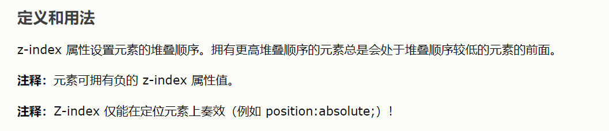


#### 8、关于样式名字的问题
关于样式 html代码片段中用的是**xx-xx**  JS用的是**驼峰命名**


#### 9、关于JS修改HTML样式
通过 xxx.style.width 获取某样式的时候  HTML中行内必须要本来就有width样式.
元素对象.style.xxx=xxx 修改元素的某一个样式值（操作的是元素行内样式，
所以如果我们没有把样式写在行内上，在JS中基于.style.xxx的方式是无法获取到样式的）
.jpg)


#### 10、break和continue

循环关键字break是直接退出下面代码什么也不执行 i++也不执行 


continue是后面代码不执行 i++是会执行的

.jpg)
## 十、 4.28学习总结(加班到1点没学习)
   今天写项目,自己太急了,很多东西都没注意,还是太着急,需要静心!还有代码写的还是不够优雅!!!!
   代码还有很长的路需要走,加油郑杰!

## 十一、4.29学习总结
#### 1、获取DOM节点后,节点对象的属性
.jpg)

#### 2、通过getElementsByTagName  


#### 3、了解console.log
console.log() 分析 为什么xx.xx 因为console是一个**对象**log是他的属性值 
所以用console.log 为什么还有个() **因为log这个属性的值是一个函数**所以需要()来执行 和传参 也叫方法(对象里面的属性值是函数的叫方法)

#### 4、JS的赋值问题
JS中值的赋值并不是单纯的赋值 而是**让变量和内存中的值进行关联**  JS是**关联赋值**

13并没有覆盖掉12,因为一开始是我们在栈内存中创建一个值12和a关联,
然后a=13又在栈内存中创建一个值13和a关联,并没有删除掉12


#### 5、腾讯面试题之NAN

1. NAN与任何数字都不相等与本身都不相等
2. type of NAN 结果是number
3. parseInt转换如果遇到非数字直接NAN,但遇到123ABC换转换成123   , ABC123则不行 因为遇到非数字就报NAN
4. 关于isNaN
.jpg)


#### 6、重要编程思想,自定义属性
.jpg)

#### 7、css  移动问题 
如果想让元素相对自己原来位置移动 就加一个相对定位relative  
然后让left top等值调整位置,且移动后元素会覆盖其他盒子的样式
例子:

原来有重叠部分,给上面小盒子设置

.jpg)


#### 8、css中class选择问题


CSS中要选择当前div里面的class要连着写

>>>>>>> 

div与.active 不能有空格 有空格就变成div子元素的.active了  
 连着写是表示div中的.active
 


#### 9、解构赋值重命名


#### 10、CSS奇数偶数行
CSS实现隔行变色  even偶数行   odd奇数行


#### 11、取余数计算概念
小的数除以大的数余数就是小的数本身

#### 12、函数的形参


**设置了形参没传,会默认undefined,所以我们需要在函数里面处理**,
判断假如没有传我们要设置形参为多少,判断这个最好用=== 因为2等会出现隐性转换,会不够精确, 
 ES6中可以直接在形参后面m=1直接写 就是没传等于1


#### 13、浏览器控制台打印问题(了解)

为什么控制台会打印东西或者输入什么东西 明明有结果还是返回一个undefined
因为浏览器是一个整体 如果有括号就把他们当成函数来执行了  **函数里面如果里面没有return 就会默认返回undefined**
例如 alert(1) 这就是一个window对象的一个方法该方法是一个函数所以用()调用,但是该函数没有返回值,就会默认返回undefined
所以是undefined

#### 14、函数的return问题
函数的返回值一定是一个值,如果是一个函数那就是把存储函数的值返回出去
如图里面返回一个函数f,只是把指向函数的地址的值返回出去
.jpg)

return是指当前函数中return**后面所有代码都不执行了**,退出函数了
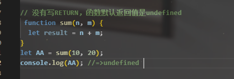

**函数没有写return默认返回undefined**


#### 14、匿名函数


#### 15、常用的输出方式


#### 16、几维的理解
.jpg)
几维数组,就是外面一个数组里面包了多少对象或者数组就是几维
对象同数组

#### 17、script 位置问题
.jpg)

#### 18、console.log(alert(1))问题
console.log(alert(1))  
1. alert(1)：执行浏览器内置的alert方法，执行方法的时候弹出一个"1"(方法的功能)，此方法没有返回值（默认返回值undefined）
2. console.log(undefined)


## 十二、4.30学习总结
周五休息 打游戏


## 十三、5.1学习总结
坐车的一天

#### 1、点击切换背景颜色的2种方式
1. 普通版    .jpg)
2. 函数数组思想法   .jpg)

#### 2、++运算和普通加运算字符串的区别
.jpg)
++是纯粹的数字计算不会字符串拼接

#### 3、substring和slice和substr区别


slice,substring正数的时候都是从几到几不包括后面那个
substr第二个参数是表示我们要截取几个
负数的情况substring全部当0处理
substr第一个是字符串长度相减,第二个当0
slice是第一第二参数都是字符串长度和负数想减
// slice 和 substring;substring如果后面小,会自动掉成0,7   slice不会,slice返回空字符串
 console.log(a.slice(7,0));
 console.log(a.substring(7,0));
#### 4、对象的又一次加强理解
.jpg)

.jpg)
和ES6语法一起理解一下

#### 5、for-in理解
.jpg)
ECMAScript中对象的属性是无序的，因此for-in语句**不能保证返回对象 属性的顺序**。
换句话说，所有可枚举的属性**都会返回一次**，但返回的顺 序可能会因浏览器而异。

## 十四、5.2学习总结

#### 1、自定义属性编程思想(又一次)


#### 2、函数的运行机制

res = null 表示res和谁都不关联 空指针

函数只创建不执行可以吗 可以 只是没意义 报错吗 不报错 因为创建的时候只是开了一个堆 把函数里面的代码当成字符串存起来了
 所以FN代表当前函数本身 FN()代表当前函数执行 具体代表return后面的值 
 函数执行一定得有结果吗 那个结果就是return后面的值 
 想看一个函数的返回的值是谁 只要看return后面的值 
 如果有return后面是啥就是啥 没有return就是undefined
 函数每次执行都是把代码从头来一遍 
 每一次都是形成一个全新的私有栈内存 
 外面想用只能函数本身return出去

#### 3、自定义属性编程属性加函数的运行机制(通过选项卡)
.jpg)


#### 4、函数的arguments


#### 5、箭头函数(初体验)
有的时候可能会看到=>xx=>xx其实是这样的
.jpg)

...arg运算符  箭头函数里面没有arguments但是有...arg  这个arg不是伪数组  可以直接用数组的方法
.jpg)

#### 6、如何基于Math.max/min获取数组中的最大值最小值？
1 . Math.min.apply(null, arr)

>>>Math.min.apply(null, [2,1,3])
<<<1

唉？不是不能接收数组类型的参数吗？这是apply方法的特性，apply方法第二个参数为参数的数组，明白了吧，虽然我们传入的是数组参数，但是apply会将数组拆分并传入调用的函数。可以说是比较巧的用法了。

2 . Math.min(...[v1, v2...])

>>>Math.min(...[2,1,3])
<<<1

这里的…（三个点）是ES6中的用法，有兴趣的可以去了解一下，低版本的JS并不支持这种用法。

#### 7、Math的常用方法
1.  Math.abs([number value])       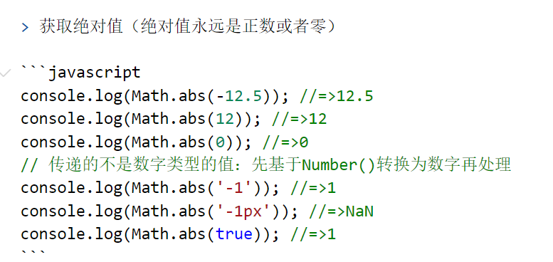

2.  Math.ceil **(向上取整)(ceil就是要比原来的数大)**/ floor**(向下取整)(floor要比原来的数小)**([number value])   (ceil就是要比原来的数大)  .jpg)

3.  Math.round() (四舍五入)    .jpg)


4.  Math.max / min ([val1],[val2],...)     > 获取一堆数中的最大值和最小值   


5. Math.sqrt / pow()


> sqrt：给一个数开平方
>
> pow：计算一个数的多少次幂
```javascript
console.log(Math.sqrt(9)); //=>3  符合N*N=M 这样的M才能整开平方
console.log(Math.sqrt(-9)); //=>NaN 负数开不了平方
console.log(Math.pow(2, 10)); //=>1024
```

6. Math.random()

> 获取0~1之间的随机小数

```javascript
for (let i = 1; i <= 10; i++) {
	console.log(Math.random());
}
/*
 * 0.09453770227521763
 * 0.06700581113042259
 * 0.10092020814995206
 * ...
 */
```

#### 8、随机获取(n~m)中的随机整数
扩展：获取 [n~m] 之间的随机整数

> 包含n也包含m
>
> n<m
```javascript
Math.round(Math.random()*(m-n)+n)
```

#### 9、数组的常用方法改变原数组的增删改查
> **这一部分方法都会修改原有的数组**
**1.实现数组增删改的方法**
`push`     也可以用原生实现ary[ary.length]

```javascript
/*
 * push : 向数组末尾增加内容
 * @params
 *   多个任意类型
 * @return
 *   新增后数组的长度 
 */
let ary = [10, 20];
let res = ary.push(30, 'AA');
// 基于原生JS操作键值对的方法，也可以向末尾追加一项新的内容
ary[ary.length] = 40;
console.log(res, ary); //=>4 [10,20,30,'AA',40]
```

`unshift`    不可以用原生 但是可以用ES6...展开运算符

```javascript
/*
 * unshift : 向数组开始位置增加内容
 * @params
 *   多个任意类型
 * @return
 *   新增后数组的长度 
 */
let ary = [10, 20];
let res = ary.unshift(30, 'AA');
console.log(res, ary); //=>4  [30,'AA',10,20]

// 基于原生ES6展开运算符，把原有的ARY克隆一份，在新的数组中创建第一项，其余的内容使用原始ARY中的信息即可，也算实现了向开始追加的效果
ary = [100, ...ary];
console.log(ary); //=>[100,30,'AA',10,20]
```

`shift`   基于原生的不能实现

```javascript
/*
 * shift : 删除数组中的第一项
 * @params
 * @return
 *   删除的那一项 
 */
let ary = [10, 20, 30, 40];
let res = ary.shift();
console.log(res, ary); //=>10  [20, 30, 40]

// 基于原生JS中的DELETE，把数组当做普通的对象，确实可以删除掉某一项内容，但是不会影响数组本身的结构特点（length长度不会跟着修改）,真实项目中杜绝这样的删除使用
delete ary[0];
console.log(ary); //=>{1:30,2:40,length:3}
```

`pop`   可以原生实现

```javascript
/*
 * pop : 删除数组中的最后一项
 * @params
 * @return
 *   删除的那一项 
 */
let ary = [10, 20, 30, 40];
let res = ary.pop();
console.log(res, ary); //=>40  [10,20,30]

// 基于原生JS让数组数组长度干掉一位，默认干掉的就是最后一项
ary.length--; //=>ary.length = ary.length - 1;
console.log(ary);
```

`splice`

```javascript
/*
 * splice : 实现数组的增加、删除、修改
 * @params
 * 	 n,m 都是数字  从索引n开始删除m个元素（m不写，是删除到末尾）
 * @return
 *   把删除的部分用新数组存储起来返回 
 */
let ary = [10, 20, 30, 40, 50, 60, 70, 80, 90];
let res = ary.splice(2, 4);
console.log(res, ary); //=>[30, 40, 50, 60]  [10, 20, 70, 80, 90]

// 基于这种方法可以清空一个数组，把原始数组中的内容以新数组存储起来（有点类似数组的克隆：把原来数组克隆一份一模一样的给新数组）
/* res = ary.splice(0);
console.log(res, ary);//=>[10, 20, 70, 80, 90] [] */

// 删除最后一项和第一项
ary.splice(ary.length - 1);
ary.splice(0, 1);
console.log(ary);
```

```javascript
/*
 * splice : 实现数组的增加、修改
 * @params
 * 	 n,m,x  从索引n开始删除m个元素，用x占用删除的部分
 *   n,0,x  从索引n开始，一个都不删，把x放到索引n的前面
 * @return
 *   把删除的部分用新数组存储起来返回 
 */
let ary = [10, 20, 30, 40, 50];
let res = ary.splice(1, 2, '珠峰培训', '哈哈哈');
console.log(res, ary); //=> [20,30] [10,'珠峰培训','哈哈哈', 40, 50]

// 实现增加
//单纯的增加是索引前面那个位置,比如从索引3开始删除0个那就是索引3的值40前面增加呵呵呵
ary.splice(3, 0, '呵呵呵');
console.log(ary); //=>[10, "珠峰培训", "哈哈哈", "呵呵呵", 40, 50]

// 向数组末尾追加
ary.splice(ary.length, 0, 'AAA');

// 向数组开始追加
ary.splice(0, 0, 'BBB');
```


## 十五、5.3学习总结(劳动节忙学的少)

#### 1、数组常用的查询和拼接
**2.数组的查询和拼接**
> 此组学习的方法，原来数组不会改变(`reverse`和sort  原来数组改变)

`slice`

```javascript
/*
 * slice : 实现数组的查询
 * @params
 * 	 n,m 都是数字 从索引n开始，找到索引为m的地方（不包含m这一项）
 * @return
 *   把找到的内容以一个新数组的形式返回 
 */
let ary = [10, 20, 30, 40, 50];
let res = ary.slice(1, 3);
console.log(res); //=>[20,30]

// m不写是找到末尾
res = ary.slice(1);
console.log(res); //=>[20, 30, 40, 50]

// **数组的克隆，参数0不写也可以**
res = ary.slice(0);
console.log(res); //=>[10, 20, 30, 40, 50]

// 思考：1.如果n/m为负数会咋地，如果n>m了会咋地，如果是小数会咋地，如果是非有效数字会咋地，如果m或者n的值比最大索引都会咋地？ 2.这种克隆方式叫做浅克隆，可以回去先看看深度克隆如何处理!
```

`concat`

```javascript
/*
 * concat : 实现数组拼接
 * @params
 * 	 多个任意类型值
 * @return
 *   拼接后的新数组（原来数组不变） 
 */
let ary1 = [10, 20, 30];
let ary2 = [40, 50, 60];
let res = ary1.concat('珠峰培训', ary2);
console.log(res);
```

**3.把数组转换为字符串**

> 原有数组不变

`toString`

```javascript
/*
 * toString : 把数组转换为字符串
 * @params
 * @return
 *   转换后的字符串（原来数组不变） 
 */
let ary = [10, 20, 30];
let res = ary.toString();
console.log(res); //=>"10,20,30"
console.log([].toString()); //=>""
console.log([12].toString()); //=>"12"
```

`join`

```javascript
/*
 * join : 把数组转换为字符串
 * @params
 *   指定的分隔符（字符串格式）
 * @return
 *   转换后的字符串（原来数组不变） 
 */
let ary = [10, 20, 30];
let res = ary.join('');
console.log(res); //=>"102030"

res = ary.join();
console.log(res); //=>"10,20,30"

res = ary.join('|');
console.log(res); //=>"10|20|30"

res = ary.join('+');
console.log(res); //=>"10+20+30"
console.log(eval(res)); //=>60  eval把字符串变为JS表达式执行
```

**4.检测数组中的是否包含某一项**

`indexOf / lastIndexOf / includes`

```javascript
/*
 * indexOf / lastIndexOf : 检测当前项在数组中第一次或者最后一次出现位置的索引值（在IE6~8中不兼容）
 * @params
 *   要检索的这一项内容
 * @return
 *   这一项出现的位置索引值（数字），如果数组中没有这一项，返回的结果是-1
 * 原来数组不变
 */
let ary = [10, 20, 30, 10, 20, 30];
console.log(ary.indexOf(20)); //=>1
console.log(ary.lastIndexOf(20)); //=>4

// 想验证ARY中是否包含'珠峰培训'
if (ary.indexOf('珠峰培训') === -1) {
	// 不包含
}
// 也可以直接使用ES6新提供的includes方法判断
if (ary.includes('珠峰培训')) {
	// 包含：如果存在返回的是TRUE
}
```

**5.数组的排序或者排列**

`reverse`  原来数组改变

```javascript
/*
 * reverse : 把数组倒过来排列
 * @params
 * @return
 *   排列后的新数组
 * 原来数组改变
 */
let ary = [12, 15, 9, 28, 10, 22];
ary.reverse();
console.log(ary); //=>[22, 10, 28, 9, 15, 12]
```

`sort` 原来数组改变

```javascript
/*
 * sort : 实现数组的排序
 * @params
 *   可以没有，也可以是个函数
 * @return
 *   排序后的新数组
 * 原来数组改变
 */
let ary = [7, 8, 5, 2, 4, 6, 9];
ary.sort();
console.log(ary); //=>[2, 4, 5, 6, 7, 8, 9]

// SORT方法中如果不传递参数，是无法处理10以上数字排序的(它默认按照每一项第一个字符来排，不是我们想要的效果)
/* ary = [12, 15, 9, 28, 10, 22];
ary.sort();
console.log(ary); //=> [10, 12, 15, 22, 28, 9] */

// 想要实现多位数正常排序，需要给SORT传递一个函数，函数中返回 a-b 实现升序，返回 b-a 实现降序
ary = [12, 15, 9, 28, 10, 22];
// ary.sort(function(a,b){ return a-b; });
ary.sort((a, b) => a - b);
console.log(ary);
```

**6.遍历数组中每一项的方法**

`forEach`

```javascript
/*
 * forEach：遍历数组中的每一项内容
 * @params
 *    回调函数
 * @return
 * 
 * 原来数组不变 
 */
let ary = [12, 15, 9, 28, 10, 22];

/* // 基于原生JS中的循环可以实现
for (let i = 0; i < ary.length; i++) {
	// i:当前循环这一项的索引
	// ary[i]:根据索引获取循环的这一项
	console.log('索引：' + i + ' 内容：' + ary[i]);
} */

ary.forEach((item, index) => {
	// 数组中有多少项，函数就会被默认执行多少次
	// 每一次执行函数：item是数组中当前要操作的这一项，index是当前项的索引
	console.log('索引：' + index + ' 内容：' + item);
});
```


## 十六、5.4学习总结(劳动节参加婚礼没有学习)

## 十七、5.5学习总结(回来杭州站票直接累的困死)
5.6号开始一定要全力以赴

## 十八、5.6号学习总结(五月份,活是真的多,很忙,但是也要加油)

#### 1、数组去重的稍微笨重的方法
方案一
这个方案和indexOf==-1,差不多的,但是这里有一个**if 加continue 的思路**可以学习

```javascript
/*
 * 方案一：
 *   循环原有数组中的每一项，每拿到一项都往新数组中添加
 *   添加之前验证新数组中是否存在这一项，不存在再增加
 */
let newAry = [];
for (let i = 0; i < ary.length; i++) {
	// 循环获取原有数组中的每一项
	let item = ary[i];
	// 验证新数组中是否存在这一项
	if (newAry.includes(item)) {
		// 存在这一项，不在增加到新数组中，继续下一轮循环即可
		continue;
	}
	// 新数组中不存在这一项，我们加入到新数组中即可
	newAry.push(item);
}
console.log(newAry);
```

```javascript
//简化代码
let newAry = [];
ary.forEach(item => {
	if (newAry.includes(item)) return;
	newAry.push(item);
});
console.log(newAry);
```

方案二
这个方案需要运用2个循环 进行前后对比,然后运用splice方法删除重复项,但是会出现**数组塌陷**的问题,
但是没有兼容性问题了(虽然现在也已经抛弃IE6,7,8了)

```javascript
/*
 * 方案二：
 *  先分别拿出数组中的每一项A
 *  用这一项A和“它后面的每项”依次进行比较，如果遇到和当前项A相同的，则在原来数组中把这一项移除掉
 * 
 * 不用includes/indexOf（这样保证兼容性）
 */
var ary = [1, 2, 3, 1, 2, 1, 2, 3, 2, 1, 2, 3];
for (var i = 0; i < ary.length; i++) {
	// item：每一次循环拿出来的当前项
	// i：当前项的索引  i+1：代表后一项
	var item = ary[i];
	// 让当前项和后面的每一项进行比较(循环)
	for (var j = i + 1; j < ary.length; j++) {
		// compare：后面拿出来要比较的每一项
		var compare = ary[j];
		// 如果compare和item相等，说明这一项是重复的，我们把它删掉
		if (compare === item) {
			// j索引这一项要从数组中移除
			ary.splice(j, 1);
			// 数组塌陷了：j后面的每一项索引都提前了一位，下一次要比较的应该还是j这个索引的内容
			j--;
		}
	}
}
console.log(ary);
```

#### 2、数组去重比较好的办法(封装了一个去重函数)

1. 方案一 运用了对象没有重复的键的特点,用**数组的值当对象的键值对(键和值是相等的)**
```javascript
let ary = [1, 2, 3, 1, 2, 1, 2, 3, 2, 1, 2, 3];
// 1.创建一个空对象
let obj = {};
// 2.循环数组中的每一项，把每一项向对象中进行存储 => item:item
for (let i = 0; i < ary.length; i++) {
	let item = ary[i];
	// 3.每一次存储之前进行判断:验证obj中是否存在这一项
	if (obj[item] !== undefined) {
		// 已经存在这一项
		ary.splice(i, 1);
		i--;
		continue;
	}
	obj[item] = item;
}
console.log(ary);
```

> 基于splice实现删除性能不好：当前项被删后，后面每一项的索引都要向前提一位，**如果后面内容过多，一定影响性能**
> 方案二 用了一个小技巧 **把删除的索引位置和值换成数组最后一项**

```javascript
/*
 * unique：实现数组去重的方法
 *  @params
 *     ary [Array] 要去重的数组
 *  @return
 *     [Array] 去重后的数组
 * by zhouxiaotian on 20190724   
 */
function unique(ary) {
	let obj = {};
	for (let i = 0; i < ary.length; i++) {
		let item = ary[i];
		if (obj[item] !== undefined) {
			ary[i] = ary[ary.length - 1];
			ary.length--;//就是把最后一项删除,方法很多也可以用pop
			i--;
			continue;
		}
		obj[item] = item;
	}
	return ary;
}
let aa = [12, 23, 12, 15, 25, 23, 25, 14, 16];
aa = unique(aa);
aa.sort((a, b) => a - b);
console.log(aa); //=>[12, 14, 15, 16, 23, 25]
```


#### 3、数组去重ES6简便方法
**基于ES6的Set（对应的Map）实现去重**
let ary = [12, 23, 12, 15, 25, 23, 25, 14, 16];
ary = [...new Set(ary)];   先用Set获得一个去重的数组对象,然后用扩展运算符变成真数组,记得要用[]包起来

console.log(ary);

#### 4、字符串常用方法
**字符串的方法都是复制出值,不会对原来的字符串进行修改**

> 所有用 单引号、双引号、反引号 包起来的都是字符串

**字符串也有索引和length**

```javascript
let str = 'zhufengpeixunyangfanqihang';
// 每一个字符串都是由零到多个字符组成的
str.length //=>字符串长度
str[0] //=>获取索引为零（第一个）字符
str[str.length-1] //=>获取最后一个字符str.length-1最后一项索引
str[10000] //=>undefined 不存在这个索引

//循环输出字符串中的每一个字符
for (let i = 0; i < str.length; i++) {
	let char = str[i];
	console.log(char);
}
```

`charAt / charCodeAt`
charCodeAt不常用
charAt：**根据索引获取指定位置的字符**
**与str[xx]区别是charAt(xx)假如没有这个索引返回空字符串'',str[xx]没有返回undefined**

```javascript
/*
 * charAt：根据索引获取指定位置的字符
 * charCodeAt：获取指定字符的ASCII码值（Unicode编码值）
 *  @params
 * 	   n [number] 获取字符指定的索引
 *  @return 
 *     返回查找到的字符
 *     找不到返回的是空字符串不是undefined，或者对应的编码值 
 */
let str = 'zhufengpeixunyangfanqihang';
console.log(str.charAt(0)); //=>'z'
console.log(str[0]); //=>'z'
console.log(str.charAt(10000)); //=>''
console.log(str[10000]); //=>undefined
console.log(str.charCodeAt(0)); //=>122
console.log(String.fromCharCode(122)); //=>'z'
```

`substr / substring / slice`

```javascript
/*
 * 都是为了实现字符串的截取（在原来字符串中查找到自己想要的）
 * 	 substr(n,m)：从索引n开始截取m个字符，m不写截取到末尾（后面方法也是）
 *   substring(n,m)：从索引n开始找到索引为m处(不含m)
 *   slice(n,m)：和substring一样，都是找到索引为m处，但是slice可以支持负数作为索引，其余两个方法是不可以的
 */
let str = 'zhufengpeixunyangfanqihang';
console.log(str.substr(3, 7)); //=>'fengpei'
console.log(str.substring(3, 7)); //=>'feng'
console.log(str.substr(3)); //=>'fengpeixunyangfanqihang' 截取到末尾
console.log(str.substring(3, 10000)); //=>'fengpeixunyangfanqihang' 截取到末尾（超过索引的也只截取到末尾）

console.log(str.substring(3, 7)); //=>'feng'
console.log(str.slice(3, 7)); //=>'feng'
console.log(str.substring(-7, -3)); //=>'' substring不支持负数索引
console.log(str.slice(-7, -3)); //=>'nqih' slice支持负数索引 =>快捷查找：负数索引，我们可以按照 STR.LENGTH+负索引 的方式找   =>slice(26-7,26-3)  =>slice(19,23)
```

`indexOf / lastIndexof / includes`

```javascript
/*
 * 验证字符是否存在
 * 	 indexOf(x,y)：获取x第一次出现位置的索引，y是控制查找的起始位置索引
 *   lastIndexOf(x)：最后一次出现位置的索引
 *   =>没有这个字符，返回的结果是-1
 *includes() 方法用于判断字符串是否包含指定的子字符串。如果找到匹配的字符串则返回 true，否则返回 false。
 *注意： includes() 方法区分大小写。
 */
let str = 'zhufengpeixunyangfanqihang';
console.log(str.indexOf('n')); //=>5
console.log(str.lastIndexOf('n')); //=>24

console.log(str.indexOf('@')); //=>-1 不存在返回-1
if (str.indexOf('@') === -1) {
	// 字符串中不包含@这个字符
}

console.log(str.indexOf('feng')); //=>3  验证整体第一次出现的位置，返回的索引是第一个字符所在位置的索引值
console.log(str.indexOf('peiy')); //=>-1

console.log(str.indexOf('n', 7)); //=>12 查找字符串索引7及之后的字符串中，n第一次出现的位置索引	

if (!str.includes('@')) {
	console.log('当前字符串不包含@');
}
```

`toUpperCase / toLowerCase`

```javascript
/*
 * 字符串中字母的大小写转换
 * 	 toUpperCase()：转大写
 *   toLowerCase()：转小写
 */
let str = 'ZhuFengPeiXunYangFanQiHang';
str = str.toUpperCase();
console.log(str); //=>'ZHUFENGPEIXUNYANGFANQIHANG'

str = str.toLowerCase();
console.log(str); //=>'zhufengpeixunyangfanqihang'

// 实现首字母大写
str = str.substr(0, 1).toUpperCase() + str.substr(1);
console.log(str); //=>'Zhufengpeixunyangfanqihang'
```

`split`

```javascript
/*
 * split([分隔符]):把字符串按照指定的分隔符拆分成数组（和数组中join对应）
 * 
 * split支持传递正则表达式 
 */
// 需求：把|分隔符变为,分隔符
let str = 'music|movie|eat|sport';
let ary = str.split('|'); //=>["music", "movie", "eat", "sport"]
str = ary.join(',');
console.log(str); //=>"music,movie,eat,sport"
```

`replace`
**replace只会替换第一次出现的,所以需要配合正则比较好用**
```javascript
/*
 * replace(老字符,新字符)：实现字符串的替换（经常伴随着正则而用）
 */
let str = '珠峰@培训@扬帆@起航';
// str = str.replace('@', '-');
// console.log(str); //=>"珠峰-培训@扬帆@起航" 在不使用正则表达式的情况下，执行一次REPLACE只能替换一次字符

str = str.replace(/@/g, '-');
console.log(str); //=>珠峰-培训-扬帆-起航
```
还有一些方法,以后慢慢学
`match`

`localCompare`

`trim / trimLeft / trimRight`

...

控制台输出 String.prototype 查看所有字符串中提供的方法


## 十九、5.7号学习总结(状态好像不是很好!!!下半场加油)

#### 1、分装一个获取url参数的函数


```javascript
/* 
 * queryURLParams：获取URL地址中问号传参的信息和哈希值
 *   @params
 *      url [string] 要解析的URL字符串
 *   @return
 *      [object] 包含参数和哈希值信息的对象
 * by zhouxiaotian on 2019/07/24 16:29:00
 */
function queryURLParams(url) {
	//1.获取?和#后面的信息
	let askIn = url.indexOf('?'),
		wellIn = url.indexOf('#'),
		askText = '',
		wellText = '';
	// #不存在
	wellIn === -1 ? wellIn = url.length : null;
	// ?存在
	askIn >= 0 ? askText = url.substring(askIn + 1, wellIn) : null;
	wellText = url.substring(wellIn + 1);

	//2.获取每一部分信息
	let result = {};
	wellText !== '' ? result['HASH'] = wellText : null;
	if (askText !== '') {
		let ary = askText.split('&');
		ary.forEach(item => {
			let itemAry = item.split('=');
			result[itemAry[0]] = itemAry[1];
		});
	}
	return result;
}

/* 
//基于正则封装的才是最完美的(后面学)
function queryURLParams(url) {
	let result = {},
		reg1 = /([^?=&#]+)=([^?=&#]+)/g,
		reg2 = /#([^?=&#]+)/g;
	url.replace(reg1, (n, x, y) => result[x] = y);
	url.replace(reg2, (n, x) => result['HASH'] = x);
	return result;
} 
*/

let aa = 'http://www.zhufengpeixun.cn/index.html?lx=1&name=zhufeng&teacher=aaa#box';
let paramsObj = queryURLParams(aa);
console.log(paramsObj);
```


#### 2、日期对象基础知识总结
 new Date() **获取的本台计算机的时间,不是公共时间**;
 new Date()**获取的时间是对象**

```javascript
let time = new Date();
/*
 * 获取当前客户端（本机电脑）本地的时间
 *    这个时间用户是可以自己修改的，所以不能作为重要的参考依据
 * 
 * Fri Jul 26 2019 10:02:17 GMT+0800 (中国标准时间)
 *    获取的结果不是字符串是对象数据类型的，属于日期对象(或者说是Date这个类的实例对象)
 */
typeof time;  //=>"object"
```

标准日期对象中提供了一些属性和方法，供我们操作日期信息

- getFullYear()  获取年
- getMonth()  获取月   结果是0~11代表第一月到第十二月
- getDate()  获取日 

- getDay()  获取星期   结果是0~6代表周日到周六
- getHours() 获取时   
- getMinutes() 获取分
- getSeconds() 获取秒
- getMilliseconds() 获取毫秒
- getTime() 获取当前日期距离1970/1/1 00:00:00 这个日期之间的毫秒差
- toLocaleDateString()  获取年月日（字符串）
- toLocaleString()  获取完整的日期字符串      

#### 3、日期对象的小时钟案例(还有一个有趣的CSS渐变色)
1. **要记住定时器里面放的是函数!不用加括号,加了括号就自执行了,就变成函数return的结果了**
2. **获得的月数是获取月   结果是0~11代表第一月到第十二月**
3. **获取星期   结果是0~6代表周日到周六**
```html
<!DOCTYPE html>
<html>
<head>
	<meta charset="UTF-8">
	<title>小时钟</title>
	<!-- IMPORT CSS -->
	<style>
		* {
			margin: 0;
			padding: 0;
		}
		#clockBox {
			position: absolute;
			right: 0;
			top: 0;
			padding: 0 15px;
			line-height: 70px;
			font-size: 24px;
			color: darkred;
			/* 设置背景渐变色 */
			background: lightblue;
			background: -webkit-linear-gradient(top left, lightblue, lightcoral, lightcyan);
		}
	</style>
</head>
<body>
	<div id="clockBox">
		2019年07月26日 星期五 10:25:03
	</div>
	<!-- IMPORT JS -->
	<script>
		let clockBox = document.getElementById('clockBox');
		/* 
		 * addZero:不足十补充零
		 *   @params
		 *      val需要处理的值
		 *   @return
		 		处理后的结果（不足十位的补充零）
		 * by Team on 2019/07/26
		 */
		function addZero(val) {
			val = Number(val);
			return val < 10 ? '0' + val : val;
		}
        
		/* 
		 * queryDate:获取当前的日期，把其转换为想要的格式
		 *   @params
		 *   @return
		 * by Team on 2019/07/26
		 */
		function queryDate() {
			// 1.获取当前日期及详细信息
			let time = new Date(),
				year = time.getFullYear(),
				month = time.getMonth() + 1,
				day = time.getDate(),
				week = time.getDay(),
				hours = time.getHours(),
				minutes = time.getMinutes(),
				seconds = time.getSeconds();
			let weekAry = ['日', '一', '二', '三', '四', '五', '六'];
			// 2.拼凑成我们想要的字符串
			let result = year + "年" + addZero(month) + "月" + addZero(day) + "日";
			result += " 星期" + weekAry[week] + " ";
			result += addZero(hours) + ":" + addZero(minutes) + ":" + addZero(seconds);
			// 3.把处理好的结果放到盒子中
			clockBox.innerHTML = result;
		}
		// 加载页面执行方法
		queryDate();
		// 定时器控制运动：设置一个setInterval定时器（到达指定时间干什么事情的东西就是定时器），每隔1000MS执行queryDate方法
		setInterval(queryDate, 1000);
	</script>
</body>
</html>
```


## 二十、5.8号学习总结(工作日最后一天休息)


## 二十一、5.9号学习总结


#### 1、实现一个最简陋的4位数字验证码

> 实现一个最LOW的验证码：数字+字母共四位
>
> 验证码目的：防止外挂程序恶意批量注入的

 ```html
<body>
	<input type="text" id="codeInp">
	<br>
	<span id="codeBox">AAAA</span>
	<button id="changeCode">看不清换一张</button>

	<!-- IMPORT JS -->
	<script>
		let codeInp = document.getElementById('codeInp'),
			codeBox = document.getElementById('codeBox'),
			changeCode = document.getElementById('changeCode');

		/*
		 * queryCode：获取到四位随机验证码，然后放到指定的盒子中
		 *   @params
		 *   @return
		 * by Team on 2019/07/24  
		 */
		function queryCode() {
			// 准备获取范围的字符串 0~61
			let area = "ABCDEFGHIJKLMNOPQRSTUVWXYZabcdefghijklmnopqrstuvwxyz0123456789";
			let result = "";
			for (let i = 0; i < 4; i++) {
				// 每一次循环都获取一个随机的数字索引
				let ran = Math.round(Math.random() * 61);
				// 再根据获取的索引从范围字符串中找到对应的字符，把找到的字符拼接到最后的结果中
				result += area.charAt(ran);
			}
			// 放到盒子里面
			codeBox.innerHTML = result;
		}

		// 第一次加载页面需要执行方法，让其显示在页面中
		queryCode();

		// 点击看不清按钮，需要重新执行方法生成新的验证码
		changeCode.onclick = queryCode;

		// 文本框失去焦点的时候：验证用户输入的内容和验证码是否相同，给予相关的提示，如果不一样需要重新生成验证码
		// onblur：文本框失去焦点事件
		codeInp.onblur = function () {
			// 获取用户和验证码内容（表单元素.value / 非标单元素.innerHTML 获取内容）
			let val = codeInp.value,
				code = codeBox.innerHTML;
			// 不区分大小写的验证（都转成小写）
			if (val.toLowerCase() === code.toLowerCase()) {
				alert('温馨提示：验证码输入成功！');
			} else {
				alert('温馨提示：验证码输入有误，请重试！');
				codeInp.value = '';
				// 重新生成验证码
				queryCode();
			}
		}
	</script>
</body>
 ```

#### 2、时间字符串格式化案例(以及封装一个时间组件(这需要以后正则学了来理解))


> new Date() 除了获取本机时间，还可以把一个时间格式字符串转换为标准的时间格式

```javascript
new Date("2019/7/26");
//=>Fri Jul 26 2019 00:00:00 GMT+0800 (中国标准时间)

/*
 * 支持的格式
 *    yyyy/mm/dd
 *    yyyy/mm/dd hh:mm:ss
 *    yyyy-mm-dd 这种格式在IE下不支持
 */
```

**时间字符串格式化案例**

> 字符串处理解决办法

```javascript
// =>不足十位补充零
let addZero = val => {
	val = Number(val);
	return val < 10 ? '0' + val : val;
};

/*
* 字符串处理解决办法
*/
function formatTime(time) {
    // 1.先获取年月日等信息
    let ary = time.split(' '),
    	aryLeft = ary[0].split('-'),
    	aryRight = ary[1].split(':');
    ary = aryLeft.concat(aryRight);
    // 2.拼接成为我们想用的格式
    let result = ary[0] + "年" + addZero(ary[1]) + "月" + addZero(ary[2]) + "日";
    result += " " + addZero(ary[3]) + ":" + addZero(ary[4]) + ":" + addZero(ary[5]);
    return result;
}
let time = '2019-5-30 12:0:0'; 
time = formatTime(time);
console.log(time);
// =>"2019年05月30日 12:00:00"
```

> 基于日期对象处理

```javascript
/*
 * 基于日期对象处理 
 */
function formatTime(time) {
    // 1.把时间字符串变为标准日期对象
    time = time.replace(/-/g, '/');
    time = new Date(time);
    // 2.基于方法获取年月日等信息
    let year = time.getFullYear(),
        month = addZero(time.getMonth() + 1),
        day = addZero(time.getDate()),
        hours = addZero(time.getHours()),
        minutes = addZero(time.getMinutes()),
        seconds = addZero(time.getSeconds());
    // 3.返回想要的结果
    return year + "年" + month + "月" + day + "日 " + hours + ":" + minutes + ":" + seconds;
}
let time = '2019-5-30 12:0:0';
time = formatTime(time);
console.log(time);
// =>"2019年05月30日 12:00:00"
```

> 封装一套公共的时间字符串格式化处理的方式 

```javascript
/*
 * 封装一套公共的时间字符串格式化处理的方式 
 */
String.prototype.formatTime = function formatTime(template) {
    // 初始化模板
    typeof template === 'undefined' ? template = "{0}年{1}月{2}日 {3}:{4}:{5}" : null;
    // this:我们要处理的字符串
    // 获取日期字符串中的数字信息
    let matchAry = this.match(/\d+/g);
    // 模板和数据的渲染（引擎机制）
    template = template.replace(/\{(\d+)\}/g, (x, y) => {
    	let val = matchAry[y] || '00';
    	val.length < 2 ? val = '0' + val : null;
    	return val;
	});
	return template;
};
let time = '2019-5-30 12:0:0';
console.log(time.formatTime("{1}-{2} {3}:{4}"));
// =>"2019年05月30日 12:00:00"
```

#### 3、DOM及其基础操作

> DOM：document object model 文档对象模型，提供一些属性和方法供我们操作页面中的元素

**获取DOM元素的方法**

- document.getElementById()  指定在文档中，基于元素的ID或者这个元素对象  ==>ID这种的
- [context].getElementsByTagName()  在指定上下文(容器)中，通过标签名获取一组元素集合 ==>DIV这种的

- [context].getElementsByClassName()  在指定上下文中，通过样式类名获取一组元素集合 （不兼容IE6~8） ==>class这种的
- document.getElementsByName()  在整个文档中，通过标签的NAME属性值获取一组节点集合(<input type="radio" name="sex" value="男" checked>) （在IE中只有表单元素的NAME才能识别，所以我们一般只应用于表单元素的处理）
- document.head / document.body / document.documentElement 获取页面中的 HEAD/BODY/HTML 三个元素
- [context].querySelector([selector])  在指定上下文中，通过选择器获取到指定的元素对象
- [context].querySelectorAll([selector])  在指定上下文中，通过选择器获取到指定的元素集合

```javascript
//=> querySelector / querySelectorAll 不兼容IE6~8
let box = document.querySelector('#box');
let links = box.querySelectorAll('a');
// links=document.querySelectorAll('#box a');
let aas=document.querySelectorAll('.aa');
 let navList = document.querySelectorAll('.tab li');       //tab下所有的li
 let divList = document.querySelectorAll('.tabBox>div');     //tabBox下的亲儿子div  孙子的不算
```

#### 4、节点与节点之间的关系

**JS中的节点和描述节点之间关系的属性**

> 节点 ： Node （页面中所有的东西都是节点）
>
> 节点集合：NodeList  （getElementsByName / querySelectorAll 获取的都是节点集合）

- 元素节点 （元素标签）
  + nodeType：1
  + nodeName : 大写的标签名
  + nodeValue ：null
- 文本节点
  - nodeType：3
  - nodeName : '#text'
  - nodeValue ：文本内容
- 注释节点
  - nodeType：8
  - nodeName : '#commen'
  - nodeValue ：注释内容
- 文档节点 document
  - nodeType：9
  - nodeName : '#document'
  - nodeValue ：null
- ......

描述这些节点之家关系的属性

- childNodes ：获取所有的子节点(文字,隔行,div全部获取)   标准浏览器（非IE6~8）中会把空格和换行当做文本节点处理 （childNodes包含所有节点）
- children：获取所有的元素子节点（子元素标签集合） ==>只获取div li span 类似的这种标签
- parentNode：获取父亲节点
- firstChild：获取第一个子节点
- lastChild：获取最后一个子节点
- firstElementChild / lastElementChild ：获取第一个和最后一个元素子节点 （不兼容IE6~8）
- previousSibling：获取上一个哥哥节点
- nextSibling：获取下一个弟弟节点
- previousElementSibling / nextElementSibling ：获取哥哥和弟弟元素节点（不兼容IE6~8）
- ......

#### 5、在JS中动态增删改元素

`createElement 创建元素对象` 

`createTextNode 创建文本对象`

`appendChild 把元素添加到容器的末尾`

`insertBefore 把元素添加到指定容器中指定元素的前面`

`removeChild 移除容器中的某个元素`
```javascript
// 动态创建一个DIV元素对象，把其赋给BOX
let box = document.createElement('div');
box.id = 'boxActive';
box.style.width = '200px';
box.style.height = '200px';
box.className = 'RED';

// 动态创建一个文本
let text = document.createTextNode('珠峰培训');

// 添加：容器.appendChild(元素)
box.appendChild(text);
// document.body.appendChild(box);

// 放到指定元素前：容器.insertBefore([新增元素],[指定元素])
let haha = document.getElementById('haha');
// haha.parentNode.insertBefore(...)
document.body.insertBefore(box, haha);
```

#### 6、克隆节点

`cloneNode(true/false) 克隆元素或者节点`

`removeChild 移除容器中的某个元素`

```html
<div class="box">
    <span>珠峰培训1</span>
</div>
<script>
    let box1 = document.querySelector('.box');
    // 克隆第一份（深克隆）
    let box2 = box1.cloneNode(true);
    box2.querySelector('span').innerText = '珠峰培训2';
    // 克隆第二份（浅克隆）
    let box3 = box1.cloneNode(false);
    box3.innerHTML = "<span>珠峰培训3</span>";

    document.body.appendChild(box2);
    document.body.appendChild(box3);

    //===========
    // 容器.removeChild(元素)
    document.body.removeChild(box2);
</script>
```

#### 7、自定义属性的在节点中设置的方法
`setAttribute / getAttribute / removeAttribute 设置获取移除元素的自定义属性信息（这种方式是把自定义属性放到元素结构上）`

```javascript
var btnList = document.querySelectorAll('button');
for (var i = 0; i < btnList.length; i++) {
	// 设置自定义属性：元素对象.属性名=属性值（原理是向元素对象对应的堆内存中添加了一个属性）
	// btnList[i].myIndex = i;

	// 设置自定义属性：基于SET-ATTRIBUTE是把属性信息写到了元素标签的结构上（在结构中可以看到的），并没有放到元素对象对应的堆内存中
	btnList[i].setAttribute('data-index', i);
	btnList[i].onclick = function () {
		// 获取自定义属性：元素对象.属性名 （原理是从堆内存中获取到对应的属性值）
		// alert(this.myIndex);

		// 基于GET-ATTRIBUTE可以把结构上存储的自定义属性值获取
		alert(this.getAttribute('data-index'));
	}
}
```

#### 8、git的基础操作
GIT工作原理

- 工作区：我们能看到的，并且用来写代码的区域
- 暂存区：临时存储用的
- 历史区：生成历史版本

工作区 -> 暂存区 -> 历史区


**1.GIT的全局配置**

> 第一次安装完成git后，我们在全局环境下配置基本信息：我是谁？

```shell
$ git config -l  查看配置信息
$ git config --global -l  查看全局配置信息

配置全局信息：用户名和邮箱
$ git config --global user.name 'xxx'
$ git config --global user.email 'xxx@xx.xx'
```

**2.创建仓库完成版本控制**

> 创建本地git仓库

```shell
$ git init 
//=>会生成一个隐藏文件夹 “.git”（这个文件夹千万不要删，因为暂存区和历史区还有一些其它的信息都在这里，删了就不是一个完整的git仓库）
```

> 在本地编写完成代码后（在工作区），把一些文件提交到暂存区

```shell
$ git add xxx  把某一个文件或者文件夹提交到暂存区
$ git add .  把当前仓库中所有最新修改的文件都提交到暂存区
$ git add -A
 
$ git status 查看当前文件的状态（红色代表在工作区，绿色代表在暂存区，看不见东西证明所有修改的信息都已经提交到历史区）
```

> 把暂存区内容提交到历史区

```shell
$ git commit -m'描述信息：本次提交内容的一个描述'

查看历史版本信息（历史记录）
$ git log
$ git reflog  包含回滚的信息
```

#### 9、Git与GitHub仓库连接
1. Settings 用户设置
   - Profile   修改自己的基本信息
   - Account  可以修改用户名
   - Security  可以修改自己的密码
   - Emails 邮箱（必须进行邮箱校验）
   - ......

2. 创建仓库

   new repository  ->  填写信息 -> Create  repository 

   - public  公共仓库作为开源的项目
   - private 私有仓库作为内部团队协作管理的项目

   Settings -> 删除仓库Delete this repository

   ​                ->Collaborators 设置协作开发的人员 

   Code 可以查看历史版本信息和分支信息

   

3. 把本地仓库信息提交到远程仓库

   ```shell
   //=>建立本地仓库和远程仓库的链接
   查看本地仓库和哪些远程仓库保持链接
   $ git remote -v
   让本地仓库和远程仓库新建一个链接 origin是随便起的一个链接名（可以改成自己想要的，只不过一般都用这个名字）
   $ git remote add origin [GIT远程仓库地址]
   删除关联信息
   $ git remote rm origin
   ```

   ```shell
   提交之前最好先拉取
   这个origin的名字要和上面那个origin名字一样
   $ git pull origin master
   把本地代码提交到远程仓库（需要输入github的用户名密码）
   $ git push origin master
   ```

   ```shell
   $ git clone [远程仓库git地址] [别名：可以不设置，默认是仓库名]
   /*
    * 真实项目开发流程：
    *   1.组长或者负责人先创建中央仓库(增加协作者)
    *   2.小组成员基于 $ git clone 把远程仓库及默认的内容克隆到本地一分（解决了三个事情：初始化一个本地仓库“git init”、和对应的远程仓库也保持了关联“git remote add”、把远程仓库默认内容拉取到本地“git pull”）
    *   3.每个组员写完自己的程序后，基于“git add/git commit”把自己修改的内容存放到历史区，然后通过“git pull/git push”把本地信息和远程仓库信息保持同步即可（可能涉及冲突的处理）
    */
   ```

## 二十二、5.10号学习总结


#### 1、npm与公司项目工作流程

    NPM

   > node package manger ：NODE模块管理工具，根据NPM我们可快速安装、卸载所需要的资源文件（例如：jQuery、vue、vue-router...）
   >
   >  
   >
   > 去NODE官网：https://nodejs.org/zh-cn/  下载NODE（长期支持版），安装NODE后，NPM也就跟着安装了
   >
   > $ node  -v
   >
   > $ npm   -v    出现版本号证明安装成功

    基于npm进行模块管理

   > https://www.npmjs.com/   基于npm是从npmjs.com平台上下载安装


   ```shell
   $ npm install xxx  把模块安装在当前项目中（node_modules）
   $ npm install xxx -g  把模块安装在全局环境中
   $ npm i xxx@1.0.0  安装指定版本号的模块
   $ npm view xxx versions > xxx.version.json  查看某个模块的版本信息（输出到指定JSON文件中）
   
   /*
    * 什么情况下会把模块安装在全局？
    *   ->可以使用“命令”对任何的项目进行操作
    *   ->$ npm root -g 查看全局安装的目录
    *   ->因为在安装目录下生成了 xxx.cmd 的文件，所以我们能够使用 xxx 的命令进行操作
    *
    * 安装在本地项目中的模块
    *   ->可以在项目中导入进来使用
    *   ->但是默认不能基于命令来操作（因为没有.cmd文件）
    *   ->但是可以基于package.json中的scripts，配置一些npm可以执行命令，配置后通过$ npm run xxx执行
    */
   这里以Less为例子 假如less安装在全局下,我们就可以打开cmd输入'lessc xx.less xx.min.css -x' (就是把1个less转换成css)
   但是假如不是全局安装我们就需要在package.json中的scripts中配置一些npm可以执行命令,例如
   ```
   .jpg)
   ```shell
   $ npm init -y  初始化当前项目的配置依赖清单（项目文件加的名字中不能出现中文、大写字母和特殊符号）
   	=>创建成功后在当前项目中生成 package.json 的清单文件
   	dependencies ：生产依赖模块（开发和项目部署的时候都需要）
   	devDependencies ：开发依赖模块（只有开发的时候需要）
       scripts : 配置本地可执行命令的
       
   $ npm i xxx --save   把模块保存在清单生产依赖中
   $ npm i xxx --save-dev  把模块保存在清单开发依赖中
   $ npm install  跑环境，按照清单安装所需的模块
   
   $ npm uninstall xxx
   $ npm uninstall xxx -g 卸载安装过的模块
   ```

window操作系统：在某个文件夹下执行DOS命令

​    1. windows + r  -> 运行窗口中输入cmd 

​         -> 磁盘符:    进入到指定磁盘 

​         -> cd xxx     进入到指定的目录

​         -> cd 直接拖进想要进入的目录文件件    直接进入

​       （MAC的终端就是这样操作的）

​    2. 在文件夹地址栏直接输入cmd即可

​    3. 在文件夹中 “shift + 鼠标右键” -> 在此处打开命令窗口

如果想查看当前目录中的文件内容

​    MAC： ls  / ls -A

​    WIN：dir 

--------------------


一个新项目的开始：

1. 创建项目文件夹

2. 把他作为一个新的仓库进行代码管理（可以基于$git clone把远程仓库克隆下来即可）

3. 初始化模块配置清单package.json：$npm init -y

4. 安装所需要的模块：$npm i jquery bootstrap@3 less ....

5. 正常开发

6. 开发中：可能需要在本地配置命令去完成一些功能（例如LESS文件编译，此时需要配置npm可执行的命令）

   ```json
   "scripts": {
       "zxt": "lessc css/index.less css/index.min.css -x",
       "xxx": "webpack"
   },
   ```

​     需要编译的时候，执行 $ npm run zxt

​     ....

7. 开发中我们需要基于git把文件进行管理：生成对应的历史版本

   提交到暂存区、历史区、远程仓库的时候，项目中很多文件是无需处理和提交的，例如：node_modules、.idea...，不需要提交的，我们生成一个.gitignore忽略文件

   ```js
   #dependencies
   node_modules
   ....
   ```

8. 由于每次git提交的时候，我们都不去提交node_modules，所以团队协作开发中，我们每当拉下来程序后，都需要“跑环境”：执行 $ npm install ，按照项目中的package.json中的依赖项信息，把缺失的模块都安装一遍


#### 2、npm与yarn与淘宝镜像

yarn   安装与使用
.jpg)


淘宝镜像 安装与使用

.jpg)

#### 3、let/const和var的区别

`1.let和const不存在变量提升机制`

> 创建变量的六种方式中：var/function有变量提升，而let/const/class/import都不存在这个机制

`2.var允许重复声明，而let是不允许的`

> 在相同的作用域中（或执行上下文中）
>
> - 如果使用var/function关键词声明变量并且重复声明，是不会有影响的（声明第一次之后，之后再遇到就不再重复声明了）
> - 但是使用let/const就不行，浏览器会校验当前作用域中是否已经存在这个变量了，如果已经存在了，则再次基于let等重新声明就会报错

```javascript
//=>在浏览器开辟栈内存供代码自上而下执行之前，不仅有变量提升的操作，还有很多其它的操作=>“词法解析”或者“词法检测”：就是检测当前即将要执行的代码是否会出现“语法错误 SyntaxError”，如果出现错误，代码将不会再执行（第一行都不会执行）
console.log(1); //=>这行代码就已经不会再被执行了
let a = 12;
console.log(a);
let a = 13;  //=>Uncaught SyntaxError: Identifier 'a' has already been declared
console.log(a);
```

```javascript
//=>所谓重复是：不管之前通过什么办法，只要当前栈内存中存在了这个变量，我们使用let/const等重复再声明这个变量就是语法错误
console.log(a);
var a = 12;
let a = 13; //=>Uncaught SyntaxError: Identifier 'a' has already been declared
console.log(a);
```
#### 4、变量提升(不用太纠结,因为现在都用let)

> 当浏览器开辟出供代码执行的栈内存后，代码并没有自上而下立即执行，而是继续做了一些事情：**把当前作用域中所有带var/function关键字的进行提前的声明和定义  =>变量提升机制**
>
> - 带var的只是提前声明（declare） “var  a;”  如果只声明没有赋值，默认值是undefined
> - 带function的不仅声明，而且还定义了（defined）  “a=13”定义其实就是赋值，准确来说就是让变量和某个值进行关联
> - 只有含有var 的变量才会提升 a = 12;这种是不会提升的
> - 带var 又带function的是只提升var函数是不会提升的 例如 var a = function(){
    return 1+1;
}    这种情况只提升var a
> - 不管var 在哪里  在函数还是条件里面  只要有var  就要进行变量提升


带var和不带var的区别**
**let，const 声明的变量不会绑定给window对象 而var会**
```javascript
//=>在全局作用域下的区别
/*
 * 不带var的：相当于给全局对象window设置了一个属性a
 *    window.a = 13;
 */
a = 13;
console.log(a); //=>window.a

/*
 * 栈内存变量存储空间
 *    b
 * 带var的：是在全局作用域下声明了一个变量b（全局变量），但是在全局下声明的变量也同样相当于给window增加了一个对应的属性（只有全局作用域具备这个特点） 如果在函数作用域或者对象作用域里面也是一样的 值有没有不确定,但是window.a 是一定设置了
 */
var b = 14; //=>创建变量b & 给window设置了属性b
console.log(b); //=>14
console.log(window.b); //=>14
```
/*
 * 全局作用域
 *   1.变量提升  
 *     但是做函数的有特殊性：在老版本浏览器中，确实不论条件是否成立，函数也是提前声明或者定义的，但是新版本浏览器中，为了兼容ES6严谨的语法规范，条件中的函数在变量提升阶段只能提前声明，不能提前定义
 *     function fn;
 *   2.代码执行
 */
// console.log(fn); //=>undefined
// // fn(); //=>Uncaught TypeError: fn is not a function
// if ('fn' in window) { //=>TRUE
// 	// 条件成立，进来后的第一件事是给FN赋值，然后在代码执行
// 	fn(); //=>"哈哈哈"
// 	function fn() {
// 		console.log('哈哈哈');
// 	}
// }
// fn(); //=>"哈哈哈"

#### 5、关于xxx in obj

/* let obj = {
	name: '吴振宇',
	age: 21,
	GF: null
};
console.log("name" in obj); //=>TRUE  
console.log("GF" in obj); //=>TRUE  
console.log("BF" in obj); //=>FALSE
// [PROPERTY] in [OBJECT] 验证当前属性是否属于这个对象   hasOwnProperty(后面学)*/


#### 6、暂时性死区

// console.log(a); //=>Uncaught ReferenceError: a is not defined
// console.log(typeof a); //=>"undefined"  这是浏览器的BUG，本应该是报错的，因为没有a（暂时性死区）

**let不会出现这种情况**
console.log(typeof a); //=>Uncaught ReferenceError: Cannot access 'a' before initialization
let a;

#### 7、私有栈内存处理

传参传进去的参数 在函数执行的时候会先赋值这一步骤是在代码执行前的 
如果传的值是一个值对象,就把存对象的堆内存地址传进去 例如图三


```javascript
console.log(a, b);
var a = 12,
	b = 12;

function fn() {
	console.log(a, b);
	var a = b = 13;
	console.log(a, b);
}
fn();
console.log(a, b); 
```


**注意看这里 b=fn(10)  执行了且把b赋值了,结果是函数返回值赋值给了b    这个函数没有返回值,所以是undefined**

```javascript
console.log(a, b, c);
var a = 12,
	b = 13,
	c = 14;
//函数里面的形参赋值在变量提升后,代码执行前
function fn(a) {
	console.log(a, b, c);
	a = 100;
	c = 200;
	console.log(a, b, c);
}
b = fn(10);
console.log(a, b, c); 
```

作用域关于函数带有参数的情况


## 二十三、5.11学习总结

#### 1、作用域链的查找机制
函数在哪里创建,函数的作用域就已经确定了
函数的上级作用域只和函**数创建的位置有关**,和函数执行的位置无关


#### 2、闭包作用域(闭包是重点)

1. 创建函数
   - 开辟一个堆内存
   - 把函数体中的代码当做字符串存储进去
   - 把堆内存的地址赋值给函数名/变量名
   - **函数在哪创建，那么它执行时候所需要查找的上级作用域就是谁**

2. 函数执行
   - 形成一个全新的(私有作用域、执行上下文、私有栈内存)(这3种叫法意思是一样的)（执行一次形成一个，多个之间也不会产生影响）
   - 形参赋值 & 变量提升
   - 代码执行（把所属堆内存中的代码字符串拿出来一行行执行）
   - **遇到一个变量，首先看它是否为私有变量（形参和在私有作用域中声明的变量是私有变量），是私有的就操作自己的变量即可，不是私有的则向上级作用域中查找...一直找到全局作用域为止  =>作用域链查找机制**
   - 私有变量和外界的变量没有必然关系，可以理解为被私有栈内存保护起来了，这种机制其实就是**闭包的保护机制**

3. 关于堆栈内存释放问题（以谷歌webkit内核为例子）

   > 函数执行就会形成栈内存（从内存中分配的一块空间），如果内存都不销毁释放，很容易就会导致栈内存溢出（内存爆满，电脑就卡死了），堆栈内存的释放问题是学习JS的核心知识之一

   - 堆内存释放问题

    ```javascript
   //=>创建一个引用类型值，就会产生一个堆内存
   //如果当前创建的堆内存不被其它东西所占用了（浏览器会在空闲的时候，查找每一个内存的引用状况，不被占用的都会给回收释放掉），则会释放
   let obj = {
       name : 'zhufeng'
   };
   let oop = obj;
   //此时obj和oop都占用着对象的堆内存，想要释放堆内存，需要手动解除变量和值的关联（null：空对象指针）
   obj = null;
   oop = null;
    ```

   - 栈内存释放

     ```javascript
     //=>打开浏览器形成的全局作用域是栈内存
     //=>手动执行函数形成的私有作用域是栈内存
     //=>基于ES6中的let/const形成的块作用域也是栈内存
     //=>....
     
     /*
      * 全局栈内存：关掉页面的时候才会销毁
      * 私有栈内存：
      *    1.一般情况下，函数只要执行完成，形成的私有栈内存就会被销毁释放掉（排除出现无限极递归、出现死循环的模式）
      *    2.但是一旦栈内存中的某个东西（一般都是堆地址）被私有作用域以外的事物给占用了，则当前私有栈内存不能立即被释放销毁（特点：私有作用域中的私有变量等信息也保留下来了）  =>市面上认为的闭包：函数执行形成不能被释放的私有栈内存，这样的才是闭包
      */
     function fn(){
         //...
     }
     fn(); //=>函数执行形成栈内存，执行完成栈内存销毁
     
     function X(){
         return function(){
             //...
         }
     }
     let f=X(); //=>f占用了X执行形成的栈内存中的一个东西（返回小函数对应的堆），则X执行形成的栈内存不能被释放了
     ```

**这张图 好好理解 ,建议反复观看**
每次执行代码都要创建一个全新的自己的私有占内存


## 二十四、5.12学习总结

加班到脑溢血,不过又一个老是出现的问题希望今天就能记住

#### 1、class动态绑定

:class="{'active':isActive==-1}" 

第一种（用逗号隔开）
:class="{ 'active': isActive, 'sort': isSort }"
第二种（放在data里面）
//也可以把后面绑定的对象写在一个变量放在data里面，可以变成下面这样
:class="classObject"
data() {
  return {
    classObject:{ active: true, sort:false }
  }
}
第三种（使用computed属性）
:class="classObject"
data() {
  return {
    isActive: true,
    isSort: false
  }
},
computed: {
  classObject: function () {
    return {
      active: this.isActive,
      sort:this.isSort
    }
  }

## 二十五、5.13学习总结


#### 1、关于if 和 for中的let和var

在if内用var声明变量，虽然if后面是块级作用域，**但是var声明的变量不支持块级作用域**，
该变量会向上冒泡到支持的作用域范围，也就是函数作用域和全局作用域
console.log(haha);=>undefined
if(true){
    console.log(haha);=>undefined
    var haha = '10'
    console.log(haha);=>10
}
console.log(haha);=>10
在for循环内用var声明变量，该变量也是全局的
console.log(i); // 输出为undefined
for (var i=0;i<5;i++) {
	console.log('内部获取的'+i);
}
console.log('外部获取'+i); // 输出5
let有块级作用域所以变量是局部的

#### 2、闭包的两个作用以及Jquery库中运用闭包的例子

> 从性能角度讲，我们真实项目中应该减少对闭包的使用（因为闭包会产生不释放的栈内存，过多使用容易导致内存溢出或者降低性能）

- 保护
- 保存

1. jQuery（JQ）前端非常经典的类库：提供了大量的方法供开发人员使用

   =>为了防止全局变量污染（解释：导入JQ后，它里面有大量的方法，如果这些方法不保护起来，用户编写的方法很容易和JQ方法名字相同产生冲突，产生冲突可以理解为全局变量污染）,JQ中的方法和变量需要用闭包保护起来
**window.jQuery = window.$ = jQuery;** 通过给全局对象增加属性:jQuery和$，把私有的jQuery方法暴露到全局作用域下，
供外面使用（等价于return jQuery）（外界需要使用函数中的私有内容，我们可以基于window.xxx和return xxx两种方式实现这个需求） 
   ```javascript
   /*==JQ源码剖析==*/
   (function(global, factory){
       //...
       //typeof window!=="undefined"?window:this 验证当前所处环境的全局对象是window还是global等
       //factory=>function zhufeng(window,noGlobal){}
   	factory(global); //=>zhufeng(window)
   })(window,function zhufeng(window,noGlobal){
       //...
       var jQuery=function(selector, context){
           //...
       };
       
    	//=>通过给全局对象增加属性:jQuery和$，把私有的jQuery方法暴露到全局作用域下，供外面使用（等价于return jQuery）（外界需要使用函数中的私有内容，我们可以基于window.xxx和return xxx两种方式实现这个需求）   
       window.jQuery = window.$ = jQuery;
   });
   
   //=>开始使用JQ
   jQuery(); //=>window.jQuery()
   $();
   ```

   在真实项目中，我们一般都要把自己写的内容放到一个闭包中，这样可以有效防止自己的代码和别人代码产生冲突（全局变量污染：真实项目中是要尽可能减少对全局变量的使用的）；如果需要把自己的东西给别人用，基于return和window.xxx等方式暴露给别人即可

   ```javascript
   //=>原生JS
   var zhufeng=(function(){
     //....A自己写的代码  
     return {
        name:'xxx'
     };
   })();
   
   (function(){
     //....B自己写的代码  
     window.xxx=xxx;
   })();
   
   //=>JQ
   $(function(){
      //...这样写在某些角度上也是为了减少全局变量
   });
   
   .....
   ```

#### 3、let/const/class的块级作用域

基于LET/CONST/CLASS等创建变量，会把所在的大括号（除对象的大括号之外）当做一个全新的私有块级作用域

   - 函数执行会产生私有的栈内存（作用域/执行上下文）
   - let等也会产生私有的块作用域（var不会）

   ```javascript
   if(1===1){
   	var a=10;
   }
   console.log(a); //=>10  a是全局作用域
   ```

   ```javascript
   if(1===1){
       //=>let会有块作用域（现在大括号就是一个私有作用域）
       //=>a是私有变量
   	let a=10;
   }
   console.log(a);//=>Uncaught ReferenceError: a is not defined
   ```


#### 4、关于This指向问题的部分


> 函数执行的主体（不是上下文）: 意思是谁把函数执行的，那么执行主体就是谁
>
> THIS非常的不好理解，以后遇到THIS，想一句话：“你以为你以为的就是你以为的”

1. **给元素的某个事件绑定方法，当事件触发方法执行的时候，方法中的this是当前操作的元素本身**

2. 如何确定执行主体(this)是谁？**当方法执行时候，我们看方法前面是否有点，没有点this是window或undefined；有点，点前面是谁this就是谁**; 

```javascript
var name='珠峰培训';
function fn(){
    console.log(this.name);
}
var obj={
    name:"你好世界",
    fn:fn
};
obj.fn(); //=>this:obj
fn(); //=>this:window（非严格模式，严格模式下是undefined） window.fn()把window.省略了

(function(){
	//自执行函数中的this是window或undefined    
})();
```

思考？

```javascript
//=>hasOwnProperty方法中的this：ary.__proto__.__proto__
ary.__proto__.__proto__.hasOwnProperty()

let obj={
    fn:(function(n){
       //把自执行函数执行的返回结果赋值给fn
       //this:window
       return function(){
           //=>fn等于这个返回的小函数
           //this:obj
       };
    })(10)
};
obj.fn();


function fn(){
    //this:window
    console.log(this);
}
document.body.onclick=function(){
    //this:document.body
    fn();
}
```

#### 5、重温选项卡加图解

```javascript
	// 循环给每一个LI绑定点击事件
		for (var i = 0; i < navList.length; i++) {
			navList[i].onclick = function () {
				//i:循环结束后的结果
				changeTab(i);
			}
		} 
```
这样是不行,因为等函数执行的时候找的是全局的i i已经等于循环结束后的i了


运用闭包 这2个方法都可以  第一种看起来好理解一点
```javascript
		/*
		 * 利用闭包解决
		 *   1.闭包可以保存信息（栈内存不销毁即可）,此处我们保存后续需要的索引信息即可
		 *   2.执行事件绑定的小函数，遇到i，不让他往全局找，找我们闭包中存储的索引即可（闭包是小函数的上级作用域，也就是小函数是在闭包中创建的） 
		 */
		for (var i = 0; i < navList.length; i++) {
			~ function (n) {
				navList[n].onclick = function () {
					changeTab(n);
				}
			}(i);
		} 
		 for (var i = 0; i < navList.length; i++) {
			navList[i].onclick = (function (n) {
				return function () {
					changeTab(n);
				}
			})(i);
		} 

```


运用Let
```javascript
	for (let i = 0; i < navList.length; i++) {
			navList[i].onclick = function () {
				changeTab(i);
			}
		}
```


性能最好的自定义属性

 for (var i = 0; i < navList.length; i++) {
			var item = navList[i];
			item.myIndex = i;
			item.onclick = function () {
				// this:当前点击的那个li啊
				changeTab(this.myIndex);
			}
		} 


## 二十六、5.14学习总结

高强度的工作了快2周,给自己休息1天调整一下


## 二十七、5.15学习总结

#### 1、面向对象的几种模式(前面几种了解一下)
> 标记语言：HTML5/CSS3
>
> 编程语言：编程思想
>
> - 面向过程  C
> - 面向对象  JAVA、PHP、C#（ASP.NET）、JavaScript...

**单例设计模式**

```javascript
let name='和冉';
let age=18;
let sex='美女';

let name='小璐璐';
let age=81;
let sex='看着办';

//=>把描述当前事务特征的信息进行分组归类（减少全局变量的污染）
//=>这就是JS中的单例设计模式
/*
 * beautiGirl不仅仅被叫做变量（对象名），也被称为“命名空间”
 *   单例模式：把描述事务的信息放到一个命名空间中进行归组，防止全局变量的污染
 */
let beautiGirl={
    name:'和冉',
    age:18
};
let oldMan={
    name:'小璐璐',
    age:81
};
```

为了让单例模式变的高大上一些，真实项目中的单例模式都这样处理

```javascript
function fn(){}
let namespace = (function(){
    //创建一些方法（闭包中的私有方法）
    let fn=function(){
      	//....  
    };
    ...
    return {
        name:'xxx',
        fn:fn
    }
})();
namespace.name
namespace.fn();
```

例如：完成一个需要团队协作开发的案例（百度首页）

```javascript
/*
 * 公共模块
 */
let utils=(function(){
    let queryElement=function(){...}
    
    return {
        //queryElement:queryElement
        queryElement
    }
})();

/*
 * 王成负责的页卡模块
 */
let pageTabModule=(function(){
    //=>获取元素（调取其它命名空间下的方法）
    let tabBox=utils.queryElement('.tabBox');
    let show=function(){...}
    ...
    return {
        init:function(){
            //调用自己模块下的方法
            show();
        }
    }
})();
pageTabModule.init();
    
...
```

**工场模式**

> 批量化生产：把实现某个功能的代码进行封装，后期在想实现这个功能，我们直接执行函数即可
>
> - 低耦合：减少页面中冗余的代码
> - 高内聚：提高代码的重复使用率

```javascript
function createPerson(name,age){
    let person={};
    person.name=name;
    person.age=age;
    return person;
}
let beautyGirl=createPerson('和冉',18);
let oldMan=createPerson('小璐璐',81);
beautyGirl.name
oldMan.name
...
```

**构造原型模式（正统面向对象编程）**

> 自己能够创造出自定义类和对应实例，构建起一套完整的面向对象模型


#### 2、构造函数

//-------普通函数
```javascript
function CreatePerson(name, age) {
	this.name = name;
	this.age = age;
}
 CreatePerson('张三', 25);//=>this:window  普通函数执行
```
 --------构造函数
 ```JavaScript
  let person1 = new CreatePerson('和冉', 18);
 /*
  * new CreatePerson()执行和普通函数执行的联系
  *   1.new这种执行方式叫做“构造函数执行模式”，此时的CreatePerson不仅仅是一个函数名，被称为“类”，而返回的结果（赋值给person1的）是一个对象，我们称之为“实例”，而函数体中出现的this都是这个实例
  */
 
 function CreatePerson(name, age) {
 	// this=>person1
 	this.name = name;
 	this.age = age;
	//这个类会默认返回这个实例的对象的
 	// return 100; //=>返回的还是实例
 	// return {
 	// 	xxx: 'xxx'
 	// }; //=>如果手动RETURN的是一个基本值，对返回的实例无影响，如果手动RETURN的是一个引用类型的值，会把默认返回的实例给替换掉（所以在构造函数模式执行下，我们一般都不要手动写RETURN，防止把返回的实例给替换）
 }
 
 ```


#### 3、instanceof
```JavaScript
/*
 *  instanceof：用来检测某个实例是否属于这个类
 *     实例 instanceof 类，属于返回TRUE，不属于返回FALSE
 *  [局限性]
 *     1.要求检测的实例必须是对象数据类型的，基本数据类型的实例是无法基于它检测出来的   
 */
[局限性]:比如1这条 虽然1是number类型的,但是他属于字面量创建的比如 let a = 1;所以instanceof无法检测,必须要要构造函数创建才可以检测出是true let a = new Number('1')
// console.log(person1 instanceof CreatePerson);//=>TRUE
let ary = [12, 23];
typeof 不能区分**数组**还是**正则**因为统一返回object但是instanceif 可以
console.log(ary instanceof Array); //=>TRUE
console.log(ary instanceof RegExp); //=>FALSE
console.log(ary instanceof Object); //=>TRUE 
console.log(1 instanceof Number); //=>FALSE
```

```JavaScript
/*
 * 基本数据类型在JS中的特殊性
 *   1.一定是自己所属类的实例
 *   2.但是不一定是对象数据类型的 
 */
这2种方法创建出来是没有区别的 只是被instanceof检测返回的值不同,还有被typeof检测出来的值不同
字面量创建方式（也是Number类的实例，也可以调取内置的公有方法）
let n = 10;
console.log(n.toFixed(2));
console.log(typeof n); //=>"number"

构造函数创建模式（创建出来的实例是对象类型的）
let m = new Number("10");
console.log(typeof m); //=>"object"
console.log(m.toFixed(2));
```

```JavaScript
//==========================
// 构造函数执行，因为也具备普通函数执行的特点
// 1.和实例有关系的操作一定是 this.xxx=xxx ，因为this是当前类创造出来的实例
// 2.函数里面的私有变量和实例没有必然的联系,比如这个Fn函数里面的m ,除非函数里面写this.m=m 这样才有关系
function Fn(n) {
	let m = 10;
	this.total = n + m;
	this.say = function () {
		console.log(this.total);
	};
}
let f1 = new Fn(10);
let f2 = new Fn(20);
let f3 = new Fn; //=>new的时候不论是否加小括号，都相当于把Fn执行了，也创建了对应的实例，只不过不加小括号是不能传递实参的（当前案例中的形参n=undefined）
console.log(f1.m); //=>undefined    因为f1实例里面没有m,只有this.m=xxx,才会有m的值  f1实例是一个对象 对象没有函数作用域是不会上级查找的(这点是我自己学混了,对象就是找自己里面的,)
console.log(f2.n); //=>undefined
console.log(f1.total); //=>20
f2.say(); //=>this:f2（因为say执行前面有点,点前面是谁this就是谁） console.log(f2.total)=>30  执行函数console.log(this.total); this是f2 f2里面有total是30   (this就是在当前对象里面找,没有往上级作用域查找的概念,切记被搞混了)
console.log(f1 === f2); //=>FALSE（因为是两个不同的实例对象，也就是不同的堆地址）

举个例子 让自己理解作用域和this  主要是不用弄混函数的作用域查找 和this
function Fn(n) {
	let m = 10;
	this.total = n + m;
	this.say = function () {
		console.log(this.total);
		console.log(m)
		console.log(this.m)
	};
}
let f4 = new Fn(30)
console.log(f4.m)=>undefined
f4.say()=> 40  10   undefined
第一个undefined是因为f4这个对象里面没有m
第二个执行函数	console.log(this.total);==>函数前面的点是谁这个this就是指向谁,函数前面的this是f4所以指向f4 f4里面有total等于40
console.log(m)==>这个函数里面没有m所以往函数创建的时候的上级作用域找m 上级作用域里面m等于10
console.log(this.m) f4这个实例里面没有m所以返回undefined
```

这个画图里面老师偷懒 函数直接写了 没有写堆内存地址,不要在意
图解补充点 是对以前知识的回顾 函数创建会产生一个堆内存  然后如果 XX=function(){xxx},XX就等于这个函数的堆内存地址,函数执行的时候才会创建一个私有栈内存

#### 4、var a , a let a区别

/*
 * 变量提升（全局） 
 *    function fn(){...};
 * 
 * 在全局作用域下，带VAR/FUNCTION声明的全局变量相当于给WINDOW设置了对应的属性（即是全局变量也是属性），不带VAR等声明的只是给WINDOW设置了对应的属性,并不是全局变量，如果使用的是LET/CONST声明的，只是全局变量，没有给WINDOW设置属性的.
 */
所以
1.
带var 变量提升了
console.log(a)  =>undefined
var a =10

2.
不带var没有提升
console.log(a) =>报错因为函数一行一行执行,此时a=10还没有执行
a =10

```JavaScript
/*
 * 全局变量提升
 *   var foo;
 *   function bar...; 
 */
var foo=1; 
function bar(){
	/*
	 * 私有栈变量提升&形参赋值
	 *   var foo; （不管条件是否成立都要进行变量提升） 
	 */
    if(!foo){//=>!undefined =>true
        var foo=10; 
    }
    console.log(foo); 
}
bar();

let foo = 1;
function bar() {
	if (!foo) { //=>!1 =>false
		/*
		 * 块作用域
		 *    foo是块中私有的 
		 */
		let foo = 10;
	}
	// 不能使用块中私有的foo，找自己私有作用域中的（没有则往全局找）
	console.log(foo); //=>1
}
bar();
```
#### 5、一个关于没有var 或者let声明的变量的问题
**这里OBJ2没有写var或者let就会像全局找OBJ2发现全局也没有,就会自动给window加一个OBJ2的属性**

```JavaScript
var a = 1;
var obj = {
	"name": "tom"
}; //=>obj=AF0
function fn() {
	// 形参赋值&变量提升  var a2;
	var a2 = a; //=>a2=1
	obj2 = obj; //=>window.obj2=AF0
	a2 = a; //=>a2=1
	obj2.name = "jack"; //=>AF0堆中的name='jack'
}
fn();
console.log(a); //=>1
console.log(obj);//=>{name:'jack'}
```

#### 6、变量提升和形参赋值的顺序
这些都是面试题其实,真实是不会遇到的,因为很少用var和function XX(){}了
**先形参赋值,再变量提升,函数提升要提升并赋值**

```JavaScript
/*
 * 变量提升
 *   var a;  1
 *   function fn...; 
 */
var a = 1;
function fn(a) {
	/*
	 * 形参赋值
	 *    a = 1;
	 * 变量提升 
	 *    var a; （无效）
	 *    function a = AF0; （声明无效，但是需要给a赋值为函数）
	 * 
	 * a=function...  AF0
	 */
	console.log(a); //=>函数
	var a = 2; //=>a=2 私有a赋值为2
	function a() {}
	console.log(a); //=>2
}
fn(a); //=>把全局A的值1当做实参传递给FN
```
#### 6、阿里面试题 关于变量提升和函数作用域查找(建议反复观看图解)
**此题知识点很多,比如作用域的上级(函数在哪里创建的上级作用域就是函数创建的地方),还有++是前面还是后面,还有函数里面没有这个变量赋值的话会去找上级作用域然后修改上级作用域里面的值**

```JavaScript
var a=0,
    b=0;
function A(a){
    A=function(b){
        alert(a+b++);
    };
    alert(a++);
}
A(1);
A(2);
```
注意变量没有要去全局找,然后改全局的值


#### 7、一道腾讯面试题

document.parentNode 和 document.parentnode 的区别？
document.parentNode 返回的是null 因为document没有父级节点了
document.parentnode 返回的是undefined,因为document没有parentnode这个属性

#### 8、let和var区别总结

/*
 * let vs var
 *    1.let没有变量提升（但是在词法解析阶段也得知某个变量是否是私有变量）
 *    2.let不允许在相同的作用域下重复声明
 *    3.let解决了JS中的暂时性死区问题
 *    4.let创建的全局变量没有给window设置对应的属性 
 *    5.let会产生块级作用域
 *    ....
 */
#### 9、this 和函数作用域继续加深理解


```JavaScript
var fullName='language';
var obj={
    fullName:'javascript',
    prop:{
        getFullName:function(){
            return this.fullName;
        }
    }
};
console.log(obj.prop.getFullName());
var test=obj.prop.getFullName;
console.log(test());
```
第一个打印的是this 所以不会像上查找 就是找prop里面的fullName 所以是undefined
第二个test()前面没有点 所以this是全局window 所以就类似window.fullName  等于language
//=>this:window  =>return window.fullName  =>"language" */

#### 10、this指向最总结

/* 
 * THIS是函数执行的主体（谁执行的） 
 *    THIS是谁和函数在哪创建的或者在哪执行的都没有必然的联系
 * 
 * 掌握几条分清执行的主体的规律
 * 	  1.给元素的某个事件绑定方法，当事件触发方法执行的时候，方法中的THIS是当前操作的元素
 *    2.方法执行，看方法前面是否有点，有点，点前面是谁THIS就是谁，没有点THIS是WINDOW（在严格模式下没有点THIS是UNDEFINED  =>"use strict"）
 * 3.在构造函数模式执行中，函数体中的THIS是当前类的实例

    */

#### 11、git小知识
git只要git commit -m 到本地库就没法删除,除非你再修改再提交一版本修改掉,不过历史中还是有你提交的,如果切换就可以切换回去,所以commit要慎重

## 二十八、5.16学习总结
这周计划已经完成 回顾一下笔记

## 二十九、5.17学习总结

**用new出来的类和实例this的查找机制和普通对象函数的机制有点不一样new出来的会去原型链找,普通对象函数就是找谁执行就是谁,如果this前面没有点,那就是给window添加一个属性比如this.x=100**

#### 1、原型及原型链模式

**记住这三句话**
1. 每一个函数数据类型的值，都有一个天生自带的属性：prototype（原型），这个属性的属性值是一个对象（“用来存储实例公用属性和方法”）

   - 普通的函数
   - 类（自定义类和内置类）

2. 在prototype这个对象中，有一个天生自带的属性：constructor，这个属性存储的是当前函数本身

   ```javascript
   Fn.prototype.constructor === Fn
   ```

3. 每一个对象数据类型的值，也有一个天生自带的属性：\__proto__，这个属性指向“所属类的原型prototype”

   - 普通对象、数组、正则、Math、日期、类数组等等
   - 实例也是对象数据类型的值
   - 函数的原型prototype属性的值也是对象类型的
   - 函数也是对象数据类型的值

我们前几天学的面向对象里面new之后的实例 是没有公共属性的
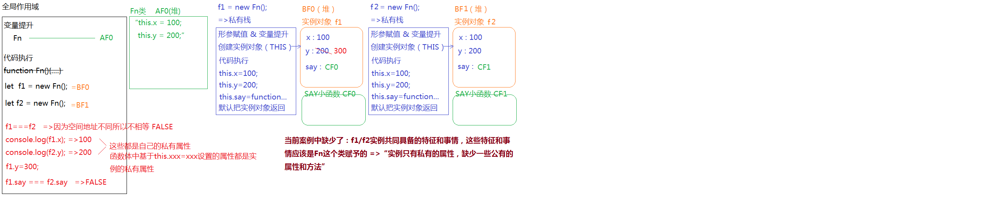

下面用一个例子来描述原型及原型链
```JavaScript
/*
 * 类：函数数据类型
 * 实例：对象数据类型的
 */
function Fn() {
	/*
	 * NEW执行也会把类当做普通函数执行（当然也有类执行的一面）
	 *   1.创建一个私有的栈内存
	 *   2.形参赋值 & 变量提升
	 *   3.浏览器创建一个对象出来（这个对象就是当前类的一个新实例）,并且让函数中的THIS指向这个实例对象 =>“构造函数模式中，方法中的THIS是当前类的实例”
	 *   4.代码执行
	 *   5.在我们不设置RETURN的情况下，浏览器会把创建的实例对象默认返回 
	 */
	this.x = 100;
	this.y = 200;
	this.say = function () {}
}
Fn.prototype.eat = function () {
	console.log('吃饭睡觉打豆豆');
}
Fn.prototype.say = function () {}

var f1 = new Fn();
var f2 = new Fn();
```
图解如下

**原型链查找机制**

> 1.先找自己私有的属性，有则调取使用，没有继续找
> 2.基于\__proto\__找所属类原型上的方法（Fn.prototype），如果还没有则继续基于\__proto\__往上找...一直找到Object.prototype为止

**原型链的对等关系**


**基于内置类原型扩展方法**

```JavaScript
Object.prototype.hasPubProperty = function (property) {
	//=>验证传递的属性名合法性（一般只能是数字或字符串等基本值）
	let x = ["string", "number", "boolean"],
		y = typeof property;
	if (!x.includes(y)) return false;
	//=>开始校验是否为公有的属性（方法中的THIS就是要校验的对象）
	let n = property in this,
		m = this.hasOwnProperty(property);
	return n && !m;
}
console.log(Array.prototype.hasPubProperty('push')); //=>FALSE
console.log([].hasPubProperty('push')); //=>TRUE */
```

#### 2、原型中this指向问题

```JavaScript
function Fn() {
	//=>this:f1这个实例
	this.x = 100;
	this.y = 200;
	this.say = function () {
		console.log(this.x);
	}
}
Fn.prototype.say = function () {
	console.log(this.y);
}
Fn.prototype.eat = function () {
	console.log(this.x + this.y);
}
Fn.prototype.write = function () {
	this.z = 1000;
}
let f1 = new Fn;
f1.say(); //=>this:f1   =>console.log(f1.x)  =>100
f1.eat(); //=>this:f1   =>console.log(f1.x + f1.y)  =>300
f1.__proto__.say(); //=>this:f1.__proto__  =>console.log(f1.__proto__.y)  =>undefined
Fn.prototype.eat(); //=>this:Fn.prototype  =>console.log(Fn.prototype.x + Fn.prototype.y)  =>NaN
f1.write(); //=>this:f1  =>f1.z=1000  =>给f1设置一个私有的属性z=1000
Fn.prototype.write();//=>this:Fn.prototype  =>Fn.prototype.z=1000  =>给原型上设置一个属性z=1000（属性是实例的公有属性）
```
注意看这个f1.eat() eat这个属性是f1实例没有的,所以通过原型链查找到Fn.prototype里面的eat()并执行console.log(this.x + this.y); 这里的this函数点前面是谁就是谁,所以是f1
/*

 * 面向对象中有关私有/公有方法中的THIS问题
 *   1.方法执行，看前面是否有点，点前面是谁THIS就是谁
 *   2.把方法总的THIS进行替换 
 *   3.再基于原型链查找的方法确定结果即可
 */


#### 3、基类object中的hasOwnProperty


> 检测某一个属性名是否为当前对象的私有属性
>
> “in” ：检测这个属性是否属于某个对象（不管是私有属性还是公有属性，只要是它的属性，结果就为TRUE）

```javascript
let ary = [10,20,30];
console.log('0' in ary);  //=>TRUE
console.log('push' in ary); //=>TRUE
console.log(ary.hasOwnProperty('0'));  //=>TRUE
console.log(ary.hasOwnProperty('push')); //=>FALSE "push"是它公有的属性不是私有的

console.log(Array.prototype.hasOwnProperty('push')); //=>TRUE 是公有还是私有属性，需要看相对谁来说的
console.log(Array.prototype.hasOwnProperty('hasOwnProperty')); //=>FALSE
console.log(Object.prototype.hasOwnProperty('hasOwnProperty')); //=>TRUE   
//自己堆中有的就是私有属性，需要基于__proto__查找的就是公有属性（__proto__在IE浏览器中（EDGE除外）给保护起来了，不让我们在代码中操作它）
```

> 检测某个属性是否为对象的公有属性：hasPubProperty
>
> 方法：是它的属性，但是不是私有的

```javascript
//基于内置类原型扩展方法
Object.prototype.hasPubProperty = function (property) {
	//=>验证传递的属性名合法性（一般只能是数字或字符串等基本值）
	let x = ["string", "number", "boolean"],
		y = typeof property;
	if (!x.includes(y)) return false;
	//=>开始校验是否为公有的属性（方法中的THIS就是要校验的对象）
	let n = property in this,
		m = this.hasOwnProperty(property);
	return n && !m;
}
console.log(Array.prototype.hasPubProperty('push')); //=>FALSE
console.log([].hasPubProperty('push')); //=>TRUE
```


#### 4、基于内置类原型的扩展方法
注意:
	**1.自己扩展的方法不能影响原有内置的方法（我们自己设置的方法最好加前缀:my**
    **2.扩展方法中的THIS一般都是当前类的实例（也就是要操作的值）：实例.方法()**

```JavaScript
/*
 * 基于内置类的原型扩展方法 
 *   在内置类原型上的方法，类所对应的实例可以直接调取使用，例如：实例.方法()  ary.push()
 *   如果我们也把自己写的方法放到原型上，那么当前类的实例也可以直接这样调取使用了，很方便
 * 
 * 但是也有需要注意的地方
 * 	 1.自己扩展的方法不能影响原有内置的方法（我们自己设置的方法最好加前缀:my）
 *   2.扩展方法中的THIS一般都是当前类的实例（也就是要操作的值）：实例.方法()
 */
~也是自执行函数的一种写法
~ function () {
	/*
	 * myUnique : 实现数组去重
	 *   @params
	 *   @return
	 *      [Array] 去重后的数组
	 * by zhouxiaotian on 20190805
	 */
	function myUnique() {
		//此时没有传递要操作的ARY进来，但是方法中的THIS是当前要操作的数组：ARY.MYUNIQUE()
		let obj = {};
		for (let i = 0; i < this.length; i++) {
			let item = this[i];
			if (typeof obj[item] !== 'undefined') {
				this[i] = this[this.length - 1];
				this.length--;
				i--;
				continue;
			}
			obj[item] = item;
		}
		obj = null;
		// 保证当前方法执行完返回的结果依然是ARRAY类的一个实例
		return this;
	}
	//=>扩展到内置类的原型上
	Array.prototype.myUnique = myUnique;
}();
let ary = [12, 23, 13, 12, 23, 24, 34, 13, 23];
// ary.myUnique(); 返回去重后的数组（也是ARRAY类的实例）
// ary.sort((a, b) => a - b); 返回排序后的数组
//=>链式写法（保证返回值依然是当前类的实例 一般都会RETURN THIS）
// ary.myUnique().sort((a, b) => a - b).reverse().slice(2).push('珠峰').concat(12);//=>Uncaught TypeError: ary.myUnique(...).sort(...).reverse(...).slice(...).push(...).concat is not a function  执行完push返回的是一个数字（新增后数组的长度），不是数组了，不能在继续使用数组的方法
ary.myUnique().sort((a, b) => a - b).reverse();
console.log(ary);


//不能直接改原有的方法,会直接覆盖的
/* Array.prototype.push = function () {
	console.log("哈哈哈");
}
let ary = [1, 2, 3];
ary.push(100); //=>"哈哈哈"
console.log(ary); //=>数组没变*/

```

## 三十、5.18学习总结(终于一个月了,继续加油离国庆目标又进了一步了)

#### 1、常规练习题一

```JavaScript
function Fn() {
	this.x = 100;
	this.y = 200;
	this.getX = function () {
		console.log(this.x);
	}
}
Fn.prototype.getX = function () {
	console.log(this.x);
};
Fn.prototype.getY = function () {
	console.log(this.y);
};
let f1 = new Fn;
let f2 = new Fn;
console.log(f1.getX === f2.getX);
console.log(f1.getY === f2.getY);
console.log(f1.__proto__.getY === Fn.prototype.getY);
console.log(f1.__proto__.getX === f2.getX);
console.log(f1.getX === Fn.prototype.getX);
console.log(f1.constructor);
console.log(Fn.prototype.__proto__.constructor);
f1.getX();
f1.__proto__.getX();
f2.getY();
Fn.prototype.getY();

// f1.__proto__.getX();
// ->找的是公有方法
// ->this:f1.__proto__===Fn.prototype
// ->console.log(f1.__proto__.x)
// ->undefined

// f2.getY();
// ->找的是公有方法
// ->this:f2
// ->console.log(f2.y)
// ->200

// Fn.prototype.getY()
// ->找的公有的方法
// ->this:Fn.prototype
// ->console.log(Fn.prototype.y)
// ->undefined
```
图解


#### 2、类的prototype
**重定向后的空间中不一定有CONSTRUCTOR属性**
**如果不手动添加的话,类所创建的实例 实例.constructor会指向基类OBJECT==>ƒ Object() { [native code] }**

```JavaScript
/*
 * 重构类的原型：让某个类的原型指向新的堆内存地址（重定向指向）
 *    问题：重定向后的空间中不一定有CONSTRUCTOR属性（只有浏览器默认给PROTOTYPE开辟的堆内存中才存在CONSTRUCTOR），这样导致类和原型机制不完整；所以需要我们手动再给新的原型空间设置CONSTRUCTOR属性；
  如果不手动添加的话,类所创建的实例 实例.constructor会指向基类OBJECT==>ƒ Object() { [native code] }
 *    问题：在重新指向之前，我们需要确保原有原型的堆内存中没有设置属性和方法，因为重定向后，原有的属性和方法就没啥用了（如果需要克隆到新的原型堆内存中，我们还需要额外的处理） =>但是内置类的原型，由于担心这样的改变会让内置的方法都消失，所以禁止了我们给内置类原型的空间重定向，例如：Array.prototype={...}这样没有用，如果想加方法Array.prototype.xxx=function(){...}可以这样处理
 */
/* function Fn() {
	// ...
}
Fn.prototype.xxx = function () {}
//=>批量给原型设置属性方法的时候：重构类的原型
Fn.prototype = {
	constructor: Fn,
	getA: function () {},
	getB: function () {}
}; */

/* //=>批量给原型设置属性方法的时候：设置别名
let proto = Fn.prototype;
proto.getA = function () {}
proto.getB = function () {}
proto.getC = function () {}
proto.getD = function () {} */
```

#### 3、类的prototype重定向常规一

```JavaScript

function fun(){
    this.a=0;
    this.b=function(){
        alert(this.a);
    }
}
fun.prototype={
    b:function(){
        this.a=20;
        alert(this.a);
    },
    c:function(){
        this.a=30;
        alert(this.a)
    }
}
var my_fun=new fun();
my_fun.b();==>0
my_fun.c();==>30
```

图解


#### 4、一道经典面试题

```JavaScript
function C1(name) {
	// name:undefined
	if (name) { //条件不成立
		this.name = name;
	}
}
C1.prototype.name = 'Tom';
// new C1().name; 'Tom'

function C2(name) {
	// name:undefined
	this.name = name;// this.name=undefined;
}
C2.prototype.name = 'Tom';
// new C2().name  undefined

function C3(name) {
	// name:undefined
	this.name = name || 'join';// this.name = undefined || 'join' = 'join';
}
C3.prototype.name = 'Tom';
// new C3().name 'join'

alert((new C1().name) + (new C2().name) + (new C3().name)); //=>"Tomundefinedjoin"


```

#### 5、类的prototype重定向常规练习题二

```JavaScript
function Fn(num) {
    this.x = this.y = num;
}
Fn.prototype = {
    x: 20,
    sum: function () {
        console.log(this.x + this.y);
    }
};
let f = new Fn(10);
console.log(f.sum === Fn.prototype.sum);  //true
f.sum();   //20
Fn.prototype.sum(); //NAN
console.log(f.constructor);  //ƒ Object() { [native code] }
```
图解


#### 6、类的prototype复杂题(这里面还设计了以后的重定向继承原来的方法)

```JavaScript
function Fn() {
    let a = 1;
    this.a = a;
}
Fn.prototype.say = function () {
    this.a = 2;
}
Fn.prototype = new Fn;
let f1 = new Fn;
​
Fn.prototype.b = function () {
    this.a = 3;
};
console.log(f1.a);//1
console.log(f1.prototype);==>undefined//==>原型链查找是通过_proto_这条链找上去的,不会去找类里面的属性
console.log(f1.b); //function () {this.a = 3;};
console.log(f1.hasOwnProperty('b'));//false
console.log('b' in f1);//true
console.log(f1.constructor == Fn);//true  因为原来的天生类创建的prototype堆地址没有被销毁,因为被new Fn的_proto_指向,所以不能销毁
```

图解


#### 7、编写两个方法 plus / minus 实现如下的执行效果(好好学习这个编程思路)

```JavaScript
~ function () {
	//=>x:需要加减的数字（必须是有效数字）
	function checkX(x) {
		x = Number(x);
		return isNaN(x) ? 0 : x;
	}

	function plus(x) {
		// this:我们要操作的原始值数字（this=xxx我们不能给THIS手动赋值）
		//不能这样写 this = this+x
		x = checkX(x);
		return this + x;
	}

	function minus(x) {
		x = checkX(x);
		return this - x;
	}

	/* 扩展到内置类的原型上 */
	Number.prototype.plus = plus;
	Number.prototype.minus = minus;
}();

let n = 10;
let m = n.plus(10).minus(5);
console.log(m); //=>15
```
#### 8、函数的三种角色

```JavaScript
/*
 * 函数数据类型：
 *   1. 普通函数
 *   2. 类（内置类 OR 自定义类）
 * 对象数据类型:
 *   1. {}普通对象  []数组对象  /^$/正则对象  日期对象  Math数学函数对象  arguments等类数组对象  HTMLCollection/NodeList元素或者节点集合类数组对象...
 *   2. 实例也是对象数据类型的
 *   3. 类的prototype也是对象数据类型的（Function.prototype除外,它是一个匿名空函数）
 *   4. 函数也是对象 
 * 
 * ======================================
 * 函数有三种角色
 *   1. 普通函数
 *     + 形参、实参、ARGUMENTS、RETURN、箭头函数
 *     + 私有作用域（栈内存、执行上下文）
 *     + 形参赋值 & 变量提升
 *     + 作用域链      
 *     + 栈内存的释放和不释放（闭包）
 *     + ...
 *   2. 构造函数（类）
 * 	   + 类和实例
 *     + prototype 和 __proto__ 原型和原型链
 *     + instanceof
 *     + constructor
 *     + hasOwnProperty
 *     + ...
 *   3. 普通对象
 *     + 它是由键值对组成的
 *     + ...
 *   函数中的THIS也是重点需要学习的内容
 */
function Fn(n, m) {
	this.x = n + m;
	this.y = n - m;
	let total = n * m;
	return total;
}
Fn.prototype.say = function () {
	console.log('SAY');
}

//=>普通函数
let total = Fn(20, 10);
//=>构造函数（类和实例）
let f = new Fn(20, 10);
//=>普通对象
Fn.total = 1000;
```
图解
虽然Function的prototype是特殊的 是一个函数,但是你把它当对象用就可以了,里面也是有_proto_的指向Object的原型对象


#### 9、阿里超经典面试题
运算符优先级
注意点:变量提升阶段 var只声明,function声明加赋值,然后如果var和function重名了,前面var的值在代码执行的时候会覆盖掉function的值(即使function在var后面)
因为变量提升阶段function已经声明加赋值了,所以代码执行阶段就不执行function那行赋值操作了

```JavaScript
function Foo() {
	getName = function () {
		console.log(1);
	};
	return this;
}
Foo.getName = function () {
	console.log(2);
};
Foo.prototype.getName = function () {
	console.log(3);
};
var getName = function () {
	console.log(4);
};
function getName() {
	console.log(5);
}
Foo.getName();//这个是把foo当成对象
getName();
Foo().getName();
getName();
new Foo.getName(); //=>Foo.getName:输出2这个方法(AF2)  =>new AF2()
new Foo().getName();
new new Foo().getName();
```
图解

解释 new Foo().getName()

先执行new FOO()

new这种执行方式叫做“构造函数执行模式”，此时的CreatePerson不仅仅是一个函数名，被称为“类”，而返回的结果（赋值给person1的）是一个对象，我们称之为“实例”，而函数体中出现的this都是这个实例

所以这个new FOO()虽然里面写了this 但是其实默认返回的也是this 所以返回 这个实例f1

f1.getName()


new foo.getName()//执行过程是先找到foo.getName 然后再new  这里就相当于普通函数执行


## 三十一、5.19学习总结

#### 1、css之文字不换行

**white-space: nowrap;**

#### 2、闭包题目(有点复杂,要注意里面是对象还是函数)
注意这里面第一个return是对象
```JavaScript
function fun(n, o) {
	console.log(o);
	return {
		fun: function (m) {
			return fun(m, n);
		}
	};
}
var c = fun(0).fun(1);
c.fun(2);
c.fun(3);
```
图解


#### 3、call之前说明一下THIS

> 每一个函数（普通函数/构造函数/内置类）都是Function这个内置类的实例，所以：函数.__proto__===Function.prototype，函数可以直接调取Function原型上的方法

```javascript
//Function.prototype => function anonymous(){}
/*
 * call / apply / bind  
 *    原型上提供的三个公有属性方法
 *    每一个函数都可以调用这个方法执行
 *    这些方法都是用来改变函数中的THIS指向的  
 */
function fn(){}
fn.call(); //=>fn函数基于原型链找到Function.prototype上的call方法，并且让其执行（执行的是call方法：方法中的this是fn）
fn.call.call(); //=>fn.call就是Function.prototype上的call方法，也是一个函数，只要是函数就能用原型上的方法，所以可以继续调用call来执行

/*
Function.prototype.call = function $1(){
    //...
}
fn.call => $1
fn.call() => $1()  this:fn
fn.call.call() => $1.call() => 继续让call执行,this:$1

实例.方法()：都是找到原型上的内置方法，让内置方法先执行（只不过执行的时候做了一些事情会对实例产生改变，而这也是这些内置方法的作用），内置方法中的THIS一般都是当前操作的实例
*/
```

#### 4、call介绍
> 语法：函数.call([context],[params1],....)
>
> 函数基于原型链找到Function.prototype.call这个方法，并且把它执行，在call方法执行的时候完成了一些功能
>
> - 让当前函数执行
> - 把函数中的THIS指向改为第一个传递给CALL的实参
> - 把传递给CALL其余的实参，当做参数信息传递给当前函数
>
> 如果执行CALL一个实参都没有传递，非严格模式下是让函数中的THIS指向WINDOW，严格模式下指向的是UNDEFINED

```javascript
window.name = 'WINDOW';
let obj = {name: 'OBJ'};
function fn(n,m) {
	console.log(this.name);
}
fn(10,20); //=>this:window  严格下是undefined
fn.call(obj); //=>this:obj  n/m=undefined
fn.call(obj,10,20); //=>this:obj  n=10 m=20
fn.call(10,20); //=>this:10  n=20  m=undefined

fn.call(); //=>this:window  严格下是undefined
fn.call(null); //=>this:window  严格下是null（第一个参数传递的是null/undefined/不传，非严格模式下this指向window，严格模式下传递的是谁this就是谁，不传this是undefined）

/* 
//=>我们的需求是想让FN执行的时候，方法中的THIS指向OBJ
obj.fn(); //=>Uncaught TypeError: obj.fn is not a function  
//因为此时obj中并没有fn这个属性

-------解决办法---------

obj.fn = fn;
obj.fn(); //=>this:obj  //=>'OBJ'
delete obj.fn;
*/
```
#### 5、手写call(不能一模一样的,因为原生用的是C++写的)

```javascript
~ function () {
	/*
	 * call：改变函数中的THIS指向 
	 *   @params
	 *      context 可以不传递，传递必须是引用类型值（因为后面要给它加$fn的属性）  
	 */
	function call(context) {
		//this:sum 也就是当前要操作的这个函数实例
		context = context || window;
		let args = [], //=>除第一个参数外剩余传递的信息值
			result;
		for (let i = 1; i < arguments.length; i++) {
			args.push(arguments[i]);
		}
		context.$fn = this;
		result = context.$fn(...args); //=>args=[10,20] ...是ES6中的展开运算符，把数组中的每一项分别的展开传递给函数 //=>context.$fn(10,20)
		delete context.$fn;
		return result;
	}
	/* 扩展到内置类的原型上 */
	Function.prototype.call = call;
}();
```
图解

#### 6、阿里的一道call面试题(阿里的题目真是都是没事找事的题目w(ﾟДﾟ)w谁会这样用啊)
好多个call直接理解很难,借用我们的手写的call来理解会好理解点
遇到这种题目建议直接套用公式

1. 一个call是让call左边的函数执行 this是()里面传的参数
2. 二个call是让最后传的参数执行 this是window或者是undefined


#### 7、apply和bind

`apply方法`

> 和call方法一样，都是把函数执行，并且改变里面的this关键字的，唯一的区别就是传递给函数参数的方式不同
>
> - call是一个个传参
> - apply是按照数组传参

```javascript
let obj={name:'OBJ'};
let fn=function(n,m){
    console.log(this.name);
}
//=>让fn方法执行，让方法中的this变为obj，并且传递10/20
fn.call(obj,10,20);
fn.apply(obj,[10,20]);
```

`bind方法`

> 和call/apply一样，也是用来改变函数中的this关键字的，只不过基于bind改变this，当前方法并没有被执行，类似于预先改变this

```javascript
let obj={name:'OBJ'};
function fn(){
    console.log(this.name);
}
document.body.onclick=fn; //=>当事件触发,fn中的this:BODY

//=>点击BODY，让FN中的THIS指向OBJ
//document.body.onclick=fn.call(obj); //=>基于call/apply这样处理，不是把fn绑定给事件，而是把fn执行后的结果绑定给事件
document.body.onclick=function(){
    //this:BODY
    fn.call(obj);
}
document.body.onclick=fn.bind(obj); //=>bind的好处是：通过bind方法只是预先把fn中的this修改为obj，此时fn并没有执行呢，当点击事件触发才会执行fn（call/apply都是改变this的同时立即把方法执行） =>在IE6~8中不支持bind方法  预先做啥事情的思想被称为“柯理化函数”
```

#### 8、获取数组中最大值的几种办法

```javascript
/* 获取数组中的最大值和最小值 */
let ary = [12, 24, 13, 8, 35, 15];

/* 解决方案一：先排序，第一项和最后一项就是我们需要的 */
ary.sort(function (a, b) {
	return a - b;
});
let min = ary[0];
let max = ary[ary.length - 1];
console.log(min, max);

/* 解决方案二： Math.max/Math.min */
//=>Math.max/min要求我们传递的数据是一项项传递进来，获取一堆数中的最大最小，而不是获取一个数组中的最大最小
let min = Math.min([12, 24, 13, 8, 35, 15]);
console.log(min);//=>NaN
let min = Math.min(12, 24, 13, 8, 35, 15);
console.log(min); //=>8

//1.基于ES6的展开运算符
let min = Math.min(...ary);
console.log(min);

//2.利用apply来实现即可（this无所谓，主要是利用apply给函数传参，需要写成一个数组的特征）
let min = Math.min.apply(Math, ary);
console.log(min);

/* 解决方案三：假设法（假设第一个是最大的，让数组中的每一项分别和当前假设的值比较，如果比假设的值大，则把最大的值设为新的假设值，继续向后比较即可） */
let max = ary[0];
/* for (let i = 1; i < ary.length; i++) {
	let item = ary[i];
	item > max ? max = item : null;
} */
ary.forEach(item => {
	item > max ? max = item : null;
});
console.log(max); //=>35
```

#### 9、let const
 1. let / const

> ES6中新增的用来创建变量和常量的

```javascript
let a = 12;
a = 13;
console.log(a); //=>13

const b = 12;
b = 13; //=>Uncaught TypeError: Assignment to constant variable. 基于CONST创建变量，变量存储的值不能被修改（常量）
console.log(b);
```

> let 和 var 的区别

- let 不存在变量提升（当前作用域中，不能在let声明前使用变量）
- 同一个作用域中，let 不允许重复声明
- let解决了typeof的一个暂时性死区问题
- 全局作用域中，使用let声明的变量并没有给window加上对应的属性
- let会存在块作用域（除对象以外的大括号都可被看做块级私有作用域）

#### 10、箭头函数以及this的问题
> ES6中新增了创建函数的方式：“箭头函数”
>
> 真实项目中是箭头函数和FUNCTION这种普通函数混合使用

箭头函数简化了创建函数的代码

```javascript
//=>箭头函数的创建都是函数表达式方式（变量=函数），这种模式下，不存在变量提升，函数只能在创建完成后被执行（也就是创建的代码之后执行）
const fn=([形参])=>{
  //函数体	（return）  
};
fn([实参]);

//=>形参只有一个，小括号可以不加
const fn=n=>{};

//=>函数体中只有一句话，并且是return xxx的，可以省略大括号和return等
const fn=n=>n*10;

/*
function fn(n){
    return function(m){
        return m+(++n);
    }
}
*/
const fn=n=>m=>m+(++n);
```

箭头函数中没有ARGUMENTS，但是可以基于剩余运算符获取实参集合，而且ES6中是支持给形参设置默认值的

```javascript
let obj = {};
let fn = (context = window, ...args) => {
	// console.log(arguments);//=>Uncaught ReferenceError: arguments is not defined 箭头函数中没有arguments
    // ...args：剩余运算符（把除第一项外的，其它传递的实参信息都存储到ARGS这个数组集合中）
	console.log(args);
};
fn(obj, 10, 20, 30); //=>context:obj  arg:[10,20,30]
fn(); //=>context:window  arg:[]
```

箭头函数中没有自己的THIS，它里面用到的THIS，都是自己所处上下文中的THIS（真实项目中，一但涉及THIS问题，箭头函数慎用）

```javascript
window.name = "WINDOW";
let fn = n => {
	console.log(this.name);
};
let obj = {
	name: 'OBJ',
	fn: fn
};
// FN所处的执行上下文中的THIS是WINDOW
fn(10); //=>this:window
fn.call(obj, 10); //=>this:window 不是我们预期的OBJ
document.body.onclick = fn; //=>this:window 不是我们预期的BODY
obj.fn(10); //=>this:window
```

```javascript
let obj = {
	name: 'OBJ',
	fn: function () {
		//=>this:obj 普通函数是有自己的THIS的
		let f = () => {
			console.log(this);
		};
		f(); //=>this:obj
		return f;
	}
};
let f = obj.fn();
f(); //=>this:obj
```

真实项目中的一个应用

```javascript
let obj = {
	name: 'OBJ',
	fn: function () {
		//=>this:obj
		//=>原本期望的需求是：1S后把OBJ中的NAME改为'珠峰'
        setTimeout(() => {
			console.log(this); //=>OBJ
			this.name = '珠峰';
		}, 1000);
        
		/* setTimeout(function () {
			console.log(this);//=>WINODOW
			this.name = '珠峰';
		}, 1000); */

		/* let _this = this;//=>把需要的THIS提前用变量存储起来
		setTimeout(function () {
			_this.name = '珠峰'; //=>需要使用的时候拿出来用即可
		}, 1000); */
	}
};
obj.fn();
```

#### 11、解构赋值
理解 先弄一个和结构目标一样的结构 比如这里要结构数组  所以我们先 let [] = ary,要一一对应
对象的话 让名字对应就可以,不用顺序 用xxx:AA重命名
```JavaScript
/* 数组的解构赋值 */
// let ary = [10, 20, 30, 40, 50];
/* let n = ary[0],
	m = ary[1],
	x = ary.slice(2); */
//=>...x拓展运算符：把剩下的内容存储到X中(X是个数组)，但是它只能出现在最后 
//理解 先弄一个和结构目标一样的结构 比如这里要结构数组  所以我们先 let [] = ary,要一一对应
let [n, m, ...x] = ary;
console.log(n, m, x); //=>10 20 [30,40,50]
//=>如果没有这一项，我们可以基于等号赋值默认值
let [n, , m, , , x = 0] = ary; 
console.log(n, m, x); //=>10 30 0
//=>多维数组解构赋值
let ary = [10, [20, 30, [40, 50]]];
let [n, [, , [, m]]] = ary;
console.log(n, m); //=>10 50

/* 对象的解构赋值 */
let obj = {
	name: '王会峰',
	age: 79,
	sex: 'BOY',
	friends: ["唐明辉", "郭天罡", "王旭东", "郭辉"]
};
=>多维对象获取
let {
	name,
	friends: [firstFriend]
} = obj;
// console.log(name, firstFriend); //=>王会峰 唐明辉
//=>创建的变量要和对象的属性名一致（默认）
let {
	name,
	nianling,
	sex
} = obj;
// console.log(name, sex, nianling); //=>"王会峰" "BOY" undefined
//=>冒号相当于给获取的结果设置了一个别名（变量名）：创建了一个叫做nianling的变量存储于了obj.age的值
let {
	age: nianling
} = obj;
console.log(nianling); //=>79
=>给获取的结果设置默认值（没有这个属性走的是默认值）
let {
	height = "180CM"
} = obj;
console.log(height); //=>"180CM"

// 从服务器获取的DATA数据
let data = {
	"code": 0,
	"data": {
		"today": "2019-08-07",
		"data": [{
			"date": "2019-07-17",
			"number": "17",
			"weekday": "\u661f\u671f\u4e09"
		}, {
			"date": "2019-07-18",
			"number": "9",
			"weekday": "\u661f\u671f\u56db"
		}]
	},
	"version": "17917d337ccb7c4d34624b73efdfa0c0"
};
let {
	code,
	data: {
		today,
		data: calendarData
	}
} = data;
console.log(code, today, calendarData);
calendarData.forEach(item => {
	let {
		weekday,
		date
	} = item;
	console.log(weekday, date);
});
```
#### 12、...运算符

箭头函数没有argument 但是有...
```JavaScript
let obj = {};
let fn = (context = window, ...args) => {
	// console.log(arguments);//=>Uncaught ReferenceError: arguments is not defined 箭头函数中没有arguments
	console.log(args);
};
fn(obj, 10, 20, 30); //=>context:obj  arg:[10,20,30]
fn(); //=>context:window  arg:[]
```

#### 13、箭头函数的this再理解
```JavaScript
var name = 'window'; 

var A = {
   name: 'A',
   sayHello: () => {
      console.log(this.name)
   }
}

A.sayHello();// 还是以为输出A ? 错啦，其实输出的是window
我相信在这里，大部分同学都会出错，以为sayHello是绑定在A上的，但其实它绑定在window上的，那到底是为什么呢？

一开始，我重点标注了“该函数所在的作用域指向的对象”，作用域是指函数内部，这里的箭头函数，也就是sayHello，所在的作用域其实是最外层的js环境，因为没有其他函数包裹；然后最外层的js环境指向的对象是winodw对象，所以这里的this指向的是window对象。

那如何改造成永远绑定A呢：

var name = 'window'; 

var A = {
   name: 'A',
   sayHello: function(){
      var s = () => console.log(this.name)
      return s//返回箭头函数s
   }
}

var sayHello = A.sayHello();
sayHello();// 输出A 

var B = {
   name: 'B';
}

sayHello.call(B); //还是A
sayHello.call(); //还是A
OK，这样就做到了永远指向A对象了，我们再根据“该函数所在的作用域指向的对象”来分析一下：

该函数所在的作用域：箭头函数s 所在的作用域是sayHello,因为sayHello是一个函数。
作用域指向的对象：A.sayHello指向的对象是A。
```

## 三十二、5.20学习总结(今天可能因为最近晚睡或者强度大,中午一阵头晕,晚上回来就补觉加早点休息)


#### 1、ES6...运算符常用方法总结

- 拓展运算符（多用在解构赋值中）
- 展开运算符（多用在传递实参中）
- 剩余运算符（多用在接收实参中）
**可以用于数组和对象的浅克隆**
```javascript
//=>解构赋值
let [n,...m] = [12,23,34];
//n:12
//m:[23,34]

//=>传递实参
let ary=[12,23,13,24,10,25];
let min=Math.min(...ary);
//数组克隆（浅克隆）
let cloneAry=[...ary];
//对象克隆（浅克隆）
let obj={name:'园园',age:16};
let cloneObj={...obj,sex:'girl',age:17};

//=>接收实参
let fn=(n,...arg)=>{
    //n:10
    //arg:[20,30]
};
fn(10,20,30);
```

#### 2、class类

```javascript
//=>传统ES3/ES5中创建类的方法
function Fn(){
    this.x=100;
};
Fn.prototype.getX=function(){
    console.log(this.x);
};
var f1 = new Fn();
f1.getX();
//也可以把它当做普通函数执行
Fn();
//还可以把Fn当做普通的对象设置键值对
Fn.queryX=function(){};
Fn.queryX();
```

```javascript
//=>ES6中类的创建
class Fn{
    //等价于之前的构造函数体
    //new的时候会执行constructor函数
    constructor(n,m){
        this.x=100;
    }
    //给实例设置的私有属性
    y=200  //==>等价于this.y=200 如果constructor里面也有this.y=xx,constructor里面的优先级高

    //直接写的方法就是加在原型上的 === Fn.prototype.getX...
    getX(){
        console.log(this.x);
    }
    
    //前面设置static的：把当前Fn当做普通对象设置的键值对
    static queryX(){}
    static z=300
}
//也可以在外面单独这样写
Fn.prototype.y=200;
Fn.z=300;

let f = new Fn(10,20);
f.getX();
Fn.queryX();

Fn();//=>Uncaught TypeError: Class constructor Fn cannot be invoked without 'new'  =>class创建的类只能new执行，不能当做普通函数执行
```
#### 3、THIS与面向对象的一种高级理解(高阶函数,比较难理解,不过思路很好)
**argument不是数组是类数组的原因是他-proto-是直接指向OBJECT的 他不是数组的实例**

```javascript
function sum(){
   //ARGUMENTS:内置的实参集合（箭头函数中没有），不是数组是类数组（它不是数组的实例，不能直接使用数组的方法  arguments.__proto__===Object.prototype）
   let total=null;
   for(let i=0;i<arguments.length;i++){
      total+=arguments[i];
   }
   return total;
}
let total=sum(10,20,30,40);
```

```javascript
//=>ARG:存储传递的实参信息（数组）
//=>eval:把字符串转换为JS表达式执行
let sum=(...arg)=>{
	return eval(arg.join('+'));
}
//这是箭头函数简写,我个人感觉很影响可读性
let sum=(...arg)=>eval(arg.join('+'));
let total=sum(10,20,30,40);
```

如果ARGUMENTS是一个数组就好了~~~

```javascript
~function(){
    function slice(n){
        //=>n:0 把数组克隆一份新的出来
        let newAry=[];
        for(let i=0;i<this.length;i++){
            newAry.push(this[i]);
        }
        return newAry;
    }
    Array.prototype.slice=slice;
}();
let ary=[10,20,30,40];
let newAry=ary.slice(0);//=>数组克隆
//--------------------------
function sum(){
   //=>把ARGUMENTS转换为数组：借用数组原型上的SLICE方法，只要让SLICE中的THIS指向ARGUMENTS，就相当于把ARGUMENTS转换为新数组
   //let arg=Array.prototype.slice.call(arguments,0); ==>还是这个比较好理解   执行slice方法 本来要截取Array.prototype的 但是call改变了this 所以截取了arguments
   let arg=[].slice.call(arguments,0);
   //=>数组求和
   return eval(arg.join('+'));
}
let total=sum(10,20,30,40);
```

不仅仅是一个方法可以这样调用，很多数组的方法，类数组都能用~~
理解方法 call第一个参数是改变This 第二个参数是call传给前面那个函数的参数,为什么这里是一个函数那,因为forEach这个方法第一个参数本来就是一个参数
```javascript
function sum(){
   let total=null;
   [].forEach.call(arguments,item=>{
      total+=item; 
   });
   return total;
}
let total=sum(10,20,30,40);
```


## 三十三、5.21学习总结(周五休息一下)


## 三十三、5.22学习总结 (周末的学习加油)

#### 1、JSON格式

> 我们基于AJAX等其它方式从服务器获取的数据结果一般都是：JSON格式或者XML格式
>
> - JSON格式的字符串
> - JSON格式的对象

```javascript
//=>普通对象
let obj = {
    name:"珠峰"
};
//=>JSON格式对象（其实就是把属性名用双引号包起来）
obj = {
    "name":"珠峰"
};
//=>JSON格式的字符串
let str = '{"name":"珠峰"}';
```

把JSON格式的字符串转换为对象：window.JSON.parse

```javascript
let str = '{"name":"珠峰"}';
let obj = JSON.parse(str);
//=>{ name:"珠峰" }

//=>在IE低版本浏览器中，全局对象window中没有JSON这个对象，也就没有所谓的parse等方法了
obj=eval('('+str+')'); //=>基于eval可以实现，但是为了保证转换格式正确，我们需要把字符串用小括号包起来转换
```

把对象转换为JSON格式字符串：JSON.stringify

```javascript
let obj = {
    name:"珠峰"
};
let str = JSON.stringify(obj); //=>'{"name":"珠峰"}'
```


#### 2、深入理解数组排序sort方法
**把a,b形参名 改成 next,cur更好理解 下一个,当前**
**如果比较是对象,可以直接获取对象里面要比较的值**
**如果是字符串用localeCompare比较**
```javascript
//=>把数组中的每一项按照AGE进行升序排列
//a-b升序  b-a降序
//SORT中传递一个函数，函数中有A/B
//A当前项的后一项
//B当前项
//如果当前函数返回的是一个小于零的值，让A和B的位置互换，如果返回的是大于等于零的值，位置保持不变
let ary = [{
	id: 1,
	age: 25,
	name: '张三'
}, {
	id: 2,
	age: 32,
	name: '李四'
}, {
	id: 3,
	age: 23,
	name: '张五'
}];
要比较字符串用:localeCompare
// 按照NAME排序 : localeCompare能够进行字符串比较
/* ary.sort((a, b) => {
	return a.name.localeCompare(b.name);
}); */
// 按照AGE升序和降序
ary.sort((a, b) => {
	return a.age - b.age;
});
ary.sort((a, b) => {
	return (a.age - b.age) * -1;
}); 
等价于
ary.sort((a, b) => {
	return (b.age-a.age ) ;
}); 
console.log(ary);
```


#### 3、a标签的使用和阻止默认行为方法
```html
	<!-- A标签第一个作用：超链接 -->
	<!-- <a href="http://www.zhufengpeixun.cn/">珠峰培训</a>
	<a href="http://www.zhufengpeixun.cn/" target="_blank">珠峰培训</a> -->

	<!-- A标签第二个作用：锚点定位 -->
	<!-- <a href="#box">哈哈</a>
	<div id="box">
		呵呵
	</div> -->

	<!-- A标签第三个作用：普通按钮 -->
	<!-- href="javascript:;" 阻止A标签的默认行为 -->
	<a href="javascript:;" id="link">我就是个按钮</a>
	<script>
		// JS阻止默认行为
		link.onclick = function (ev) {
			// ev.preventDefault();
			// 或
			// return false;
		}
```
#### 4、一个商城的排序项目(重点学习他的编程思路,比如封装啊,自定义函数啊)

实现代码如下:
**自定义属性的运用,加到节点.stAttribute,获得getAttribute 添加到对象obj.xx或者obj['xxxx']**
**伪数组转成数组的办法[...arg]或者[].slice.call(arg,0)**
**多运用解构赋值来得到后端返回的数据**
**sort的运用**

```JavaScript
~ function () {
	let _DATA = null;

	/*第一步：从服务器获取数据（AJAX）*/
	let xhr = new XMLHttpRequest;
	xhr.open('GET', 'json/product.json', false);
	xhr.onreadystatechange = function () {
		if (xhr.status === 200 && xhr.readyState === 4) {
			_DATA = xhr.responseText;
		}
	}
	xhr.send();
	_DATA = JSON.parse(_DATA); //=>_DATA：获取的都是JSON字符串，我们要让其变为对象

	//=>第二步：把获取的数据绑定在页面中
	let htmlStr = ``;
	_DATA.forEach(item => {
		let {
			title,
			price,
			time,
			hot,
			img
		} = item;
		htmlStr += `<div class="card" 
					data-price="${price}"
					data-time="${time}"
					data-hot="${hot}">
			
			<div class="card-body">
				<h6 class="card-title">${title}</h6>
				<p class="card-text">价格：￥${price}</p>
				<p class="card-text">好评：${hot}</p>
				<p class="card-text"><small class="text-muted">上架时间：${time}</small></p>
			</div>
		</div>`;
	});
	let cardDeck = document.querySelector('.card-deck');
	cardDeck.innerHTML = htmlStr;

	//=>第三步：点击实现升降序排序
	let navList = document.querySelectorAll('.navbar-nav li'),
		cardList = cardDeck.querySelectorAll('.card');

	//循环给所有的按钮绑定点击事件，点击的时候按照指定的规则排序
	for (let i = 0; i < navList.length; i++) {
		let item = navList[i];
		item['data-type'] = -1; //=>控制升降序
		item.onclick = function () {
			//=>点击当前的某个按钮，让其按照升降序切换，而其余的都应该回归原始-1
			[].forEach.call(navList, item => (item === this ? this['data-type'] *= -1 : item['data-type'] = -1));
			cardList = [].slice.call(cardList, 0);
			cardList.sort((next, cur) => {
				//获取当前按钮记录的排序方式 data-time / data-price / data-hot
				let pai = this.getAttribute('data-pai');
				cur = cur.getAttribute(pai);
				next = next.getAttribute(pai);
				if (pai === "data-time") {
					//获取的是日期数据：我们要把字符串中的“-”给去掉
					cur = cur.replace(/-/g, '');
					next = next.replace(/-/g, '');
				}
				return (next - cur) * this['data-type'];
			});
			cardList.forEach(item => cardDeck.appendChild(item));
		}
	}


	/*
		//给价格按钮绑定点击事件
		//给按钮设置一个自定义属性DATA-TYPE存储排序方式：-1降序 1升序
		navList[1]['data-type'] = -1;
		navList[1].onclick = function () {
			//控制升降序切换
			this['data-type'] *= -1;
			//把元素集合转换为数组，让其按照价格进行排序
			cardList = Array.prototype.slice.call(cardList, 0);
			cardList.sort((next, cur) => {
				//绑定数据的时候，把产品价格信息设置为元素的自定义属性，需要的时候获取
				cur = cur.getAttribute('data-price');
				next = next.getAttribute('data-price');
				return (next - cur) * this['data-type'];
			});
			//循环数组中的每一项,让其按照最新的顺序依次添加到页面中，完成页面排序
			cardList.forEach(item => cardDeck.appendChild(item));
		}

		navList[2]['data-type'] = -1;
		navList[2].onclick = function () {
			//控制升降序切换
			this['data-type'] *= -1;
			//把元素集合转换为数组，让其按照价格进行排序
			cardList = Array.prototype.slice.call(cardList, 0);
			cardList.sort((next, cur) => {
				//绑定数据的时候，把产品价格信息设置为元素的自定义属性，需要的时候获取
				cur = cur.getAttribute('data-hot');
				next = next.getAttribute('data-hot');
				return (next - cur) * this['data-type'];
			});
			//循环数组中的每一项,让其按照最新的顺序依次添加到页面中，完成页面排序
			cardList.forEach(item => cardDeck.appendChild(item));
		} */
}();
```


#### 5、正则表达式先留着以后再学(目前学不进去,可恶啊)


## 三十四、5.23学习总结

#### 1、复习DOM

> DOM：document object model 文档对象模型，提供系列的属性和方法，让我们能在JS中操作页面中的元素

**获取元素的属性和方法**

```javascript
document.getElementById([ID])
[context].getElementsByTagName([TAG-NAME])
[context].getElementsByClassName([CLASS-NAME]) 
//=>在IE6~8中不兼容
document.getElementsByName([NAME]) 
//=>在IE浏览器中只对表单元素的NAME有作用
[context].querySelector([SELECTOR])
[context].querySelectorAll([SELECTOR])
//=>在IE6~8中不兼容

//---------------------
document
document.documentElement  (documentElement 属性以一个元素对象返回一个文档的文档元素。HTML 文档返回对象为HTML元素。注意： 如果 HTML 元素缺失，返回值为 null。)
document.head
document.body
childNodes 所有子节点
children 所有元素子节点
//=>IE6~8中会把注释节点当做元素节点获取到
parentNode
firstChild / firstElementChild
lastChild / lastElementChild
previousSibling / previousElementSibling
nextSibling / nextElementSibling
//=>所有带Element的，在IE6~8中不兼容
```

**DOM的增删改操作**

```javascript
document.createElement([TAG-NAME])
document.createTextNode([TEXT CONTENT])
字符串拼接（模板字符串），基于innerHTML/innerText存放到容器中

[PARENT].appendChild([NEW-ELEMENT])
[PARENT].insertBefore([NEW-ELEMENT],[ELEMENT])

[ELEMENT].cloneNode([TRUE/FALSE])
[PARENT].removeChild([ELEMENT])

//=>设置自定义属性
[ELEMENT].xxx=xxx;
console.log([ELEMENT].xxx);
delete [ELEMENT].xxx;

[ELEMENT].setAttribute('xxx',xxx);
console.log([ELEMENT].getAttribute('xxx'));
[ELEMENT].removeAttribute('xxx');
```

**获取元素样式和操作样式**

```javascript
//=>修改元素样式
[ELEMENT].style.xxx=xxx;  //=>修改和设置它的行内样式
[ELEMENT].className=xxx;  //=>设置样式类

//=>获取元素的样式
console.log([ELEMENT].style.xxx); //=>获取的是当前元素写在行内上的样式,如果有这个样式，但是没有写在行内上，则获取不到
```

#### 2、盒子居中对齐

```JavaScript
	<style>
		* {
			margin: 0;
			padding: 0;
		}

		html,
		body {
			height: 100%;
		}

		.box {
			box-sizing: border-box;
			padding: 15px;
			width: 300px;
			height: 300px;
			border: 10px solid lightblue;
			background: lightcyan;
			font-size: 18px;
			line-height: 30px;
		}

		/* 居中：定位  */
		//第一种知道宽高的情况下用定位
		.box {
			position: absolute;
			top: 50%;
			left: 50%;
			margin-left: -150px;
			margin-top: -150px;
		} 
		//第二种不知道宽高情况下 用CSS3唯一 x轴和我们平常一样(负数就是向左移动),y轴和我们平时的不一样,相反的(负数是向上移动)
		.box {
			position: absolute;
			top: 50%;
			left: 50%;
			/!* 基于CSS3变形属性中的位移，在不知道宽高的情况下也能实现效果 *!/
			transform: translate(-50%, -50%);
		} 
		//第三种运用了类似margin auto居中原理     兼容性不好
		 .box {
			position: absolute;
			top: 0;
			left: 0;
			bottom: 0;
			right: 0;
			margin: auto;
		} 

		/* FLEX :http://www.ruanyifeng.com/blog/2015/07/flex-grammar.html*/
		//第四种flex  运用的最多
		body {
			display: flex;
			/!* 设置元素在FLEX容器主轴和交叉轴方向上的对齐方式：CENTER居中对齐 *!/
			justify-content: center;
			align-items: center;
		} 
	</style>
```

#### 3、JS盒子模型属性

> 基于一些属性和方法，让我们能够获取到当前元素的样式信息，例如：clientWidth 、offsetWidth等
>
> - client
>   - width / height
>   - top / left
> - offset
>   - width / height
>   - top / left
>   - parent
> - scroll
>   - width / height
>   - top / left
>
>  
>
> 方法：window.getComputedStyle([ELEMENT],[伪类]) / [ELEMENT].currentStyle

```javascript
let box = document.getElementById('box');

//=>获取盒子可视区域的宽高（内容宽度+左右PADDING）
//1.内容溢出与否对他无影响
//2.获取的结果是没有单位的（其余的盒模型属性也是）
//3.获取的结果是整数，它会自己进行四舍五入（其余的盒模型属性也是）
box.clientWidth
box.clientHeight

//获取当前页面一屏幕（可视化）区域的宽高
let winW = document.documentElement.clientWidth || document.body.clientWidth;
let winH = document.documentElement.clientHeight || document.body.clientHeight;

//=>获取盒子左边框和上边框的大小(就是border)
box.clientLeft
box.clientTop
```

```javascript
let box = document.getElementById('box');

//=>在CLIENT的基础上加上BORDER == 盒子本身的宽高
box.offsetWidth
box.offsetHeight

//=>在没有内容溢出的情况下，获取的结果和CLIENT是一样的
//=>在有内容溢出的情况下，获取的结果约等于真实内容的宽高（上/左PADDING + 真实内容的高度/宽度）
//1.不同浏览器获取的结果不尽相同
//2.设置overflow属性值对最后的结果也会产生一定的影响
box.scrollWidth
box.scrollHeight

//获取整个页面真实的高度
document.documentElement.scrollHeight || document.body.scrollHeight
```

```javascript
let box = document.getElementById('box');
//=>竖向滚动条卷去的高度
//=>横向滚动条卷去的宽度
//1.边界值
//min=0
//max=整个的高度scrollHeight - 一屏幕高度clientHeight
box.scrollTop
box.scrollLeft

//=>13个盒子模型属性，只有这两个是“可读写”的属性（既可以获取也可以设置对应的值），其余的都是“只读”属性（不能设置值，只能获取）
box.scrollTop=0;
```

```html
//=>offsetParent：获取它的父参照物（不一定是父元素）
//父参照物和它的父元素没有必然的联系，父参照物查找：同一个平面中，最外层元素是所有后代元素的父参照物，而基于position:relative/absolute/fixed可以让元素脱离文档流（一个新的平面），从而改变元素的父参照物
document.body.offsetParent === null;

//=>offsetTop：距离其父参照物的上偏移
//=>offsetLeft：距离其父参照物的左偏移（当前元素的外边框到父参照物的里边框）
/*
 * offset：获取当前元素距离BODY的左/上偏移（不论其父参照物是谁）
 *   @params
 *      curEle:current element当前要操作的元素
 *   @return
 *      [object]包含上/左偏移的信息  => {top:xxx,left:xxx} 
 * by zhufengpeixun on 2019/08/14
*/
function offset(curEle) {
    let par = curEle.offsetParent,
        l = curEle.offsetLeft,
        t = curEle.offsetTop;
    //存在父参照物，而且还没有找到BODY
    while (par && par.tagName !== "BODY") {
        //在原有偏移的基础上累加：父参照物的边框、父参照物的偏移
        if (!/MSIE 8\.0/.test(navigator.userAgent)) {
            //IE8中偏移值自已就算了边框了，不需要我们在加边框的值 navigator.userAgent获取当前浏览器的版本信息
            l += par.clientLeft;
            t += par.clientTop;
        }
        l += par.offsetLeft;
        t += par.offsetTop;
        //继续获取上级参照物
        par = par.offsetParent;
    }
    return {
        top: t,
        left: l
    };
}
```


#### 4、回到顶部案例(学习老师的各种情况的判断)

```JavaScript
<!DOCTYPE html>
<html>

<head>
	<meta charset="UTF-8">
	<title>回到顶部</title>
	<style>
		* {
			margin: 0;
			padding: 0;
		}

		html,
		body {
			height: 1000%;
			/* CSS3中的背景颜色线性渐变 */
			background: -webkit-linear-gradient(top left, lightblue, lightpink, lightyellow);
		}

		.link {
			display: none;
			position: fixed;
			right: 30px;
			bottom: 230px;
			box-sizing: border-box;
			width: 100px;
			height: 100px;
			background: lightcoral;
			font-size: 16px;
			color: #000;
			text-decoration: none;
			text-align: center;
			line-height: 100px;
		}
	</style>
</head>

<body>
	<a href="javascript:;" id="link" class="link">回到顶部</a>

	<script>
		let HTML = document.documentElement,
			LINK = document.getElementById('link');

		// 1.当浏览器滚动条滚动的时候，我们进行验证：卷去的高度超过两屏，我们让#LINK显示
		function check() {
			//winH:一屏幕高度  scrollT:卷去的高度
			let winH = HTML.clientHeight,
				scrollT = HTML.scrollTop;
			LINK.style.display = scrollT >= winH * 2 ? 'block' : 'none';
		}
		window.onscroll = check;

		// 2.点击回到顶部
		LINK.onclick = function () {
			/* 让按钮隐藏 */
			LINK.style.display = 'none';
			//先禁止滚动事件触发（因为在回到顶部的运动过程中，如果事件一直在，会计算按钮显示隐藏的样式，无法让按钮隐藏）
			window.onscroll = null;

			/* 实现动画 */
			let step = 1000;
			let timer = setInterval(() => {
				//每一次获取最新的SCROLL-TOP值，在现有的基础上减去步长，让其走一步
				let curT = HTML.scrollTop;
				if (curT === 0) {
					//边界判断：已经回到顶部后，我们清除定时器
					clearInterval(timer);
					//恢复滚动条滚动的监听事件
					window.onscroll = check;
					return;
				}
				curT -= step;
				HTML.scrollTop = curT;
			}, 17);
		};


		//SET-INTERVAL：设置一个定时器（TIMER代表这个定时器），每间隔INTERVAL这么久，就会把FUNCTUION执行一次...一直到手动清除定时器为止
		// let timer = setInterval([FUNCTUION], [INTERVAL]);
		// clearInterval(timer);
	</script>
</body>

</html>
```


## 三十五、5.24学习总结

#### 1、getComputedStyle

> 获取当前元素所有经过浏览器计算过的样式
>
> - 只要元素在页面中呈现出来，那么所有的样式都是经过浏览器计算的
> - 哪怕你没有设置和见过的样式也都计算了
> - 不管你写或者不写，也不轮写在哪，样式都在这，可以直接获取
>
> 在IE6~8浏览器中不兼容，需要基于currentStyle来获取

```javascript
//=>第一个参数是操作的元素  第二个参数是元素的伪类:after/:before
//=>获取的结果是CSSStyleDeclaration这个类的实例（对象），包含了当前元素所有的样式信息
let styleObj = window.getComputedStyle([element],null);
styleObj["backgroundColor"]
styleObj.display

//=>IE6~8
styleObj = [element].currentStyle;
```

#### 2、单张图片延迟加载(以后瀑布流多张图片延迟加载)

```HTML
<!DOCTYPE html>
<html>

<head>
	<meta charset="UTF-8">
	<title>图片延迟加载</title>
	<style>
		* {
			margin: 0;
			padding: 0;
		}

		img {
			border: none;
		}

		img[src=""] {
			display: none;
		}

		.imgBox {
			box-sizing: border-box;
			margin: 800px auto;
			width: 300px;
			height: 245px;
			background: #CCC;
		}

		.imgBox img {
			display: none;
			width: 100%;
			height: 100%;
		}
	</style>
</head>

<body>
	<!-- 
		图片延迟加载 “图片懒加载”
		1.结构中，我们用一个盒子包裹着图片（在图片不展示的时候，可以占据着这个位置，并且设置默认的背景图或者背景颜色）
		2.最开始，IMG的SRC中不设置任何的图片地址，把图片的真实地址设置给自定义属性DATA-SRC/TRUE-IMG（最开始不展示图片:可以让图片隐藏）
		3.当浏览器窗口完全展示到图片位置的时候，我们再去加载真实图片，并且让其显示出来（第一屏幕中的图片一般都会延迟加载，来等待其它资源先加载完）
	 -->
	<div class="imgBox">
		
	</div>

	<!-- IMPORT JS -->
	<script src="4.延迟加载.js"></script>
</body>

</html>
```

```JavaScript
/*
 * offset：获取当前元素距离BODY的左/上偏移（不论其父参照物是谁）
 *   @params
 *      curEle:current element当前要操作的元素
 *   @return
 *      [object]包含上/左偏移的信息  => {top:xxx,left:xxx} 
 * by zhufengpeixun on 2019/08/14
 */
function offset(curEle) {
	let par = curEle.offsetParent,
		l = curEle.offsetLeft,
		t = curEle.offsetTop;
	while (par && par.tagName !== "BODY") {
		if (!/MSIE 8\.0/.test(navigator.userAgent)) {
			l += par.clientLeft;
			t += par.clientTop;
		}
		l += par.offsetLeft;
		t += par.offsetTop;
		par = par.offsetParent;
	}
	return {
		top: t,
		left: l
	};
}


/*
 * 图片完全显示出来的条件 
 *   A:盒子底边距离BODY（页面最顶端）的距离：盒子的高度+盒子距BODY的上偏移
 *   B:浏览器底边距离BODY的距离：一屏幕的高度 + 卷去的高度
 *   A<=B：盒子就完全出现在用户的视野中
 * 让图片显示
 *   获取图片TRUE-IMG属性的值，赋值给SRC属性，当图片能正常加载出来后，让图片显示即可
 */
let imgBox = document.querySelector('.imgBox'),
	_img = imgBox.querySelector('img');

//=>显示图片 
//curImg:要显示的图片
function lazyImg(curImg) {
	//给SRC赋值真实的图片地址
	let trueImg = curImg.getAttribute("trueImg");
	curImg.src = trueImg;   //这些属性都是获取的节点自带的
	//console.log(curImg.tagName)//这些属性都是获取的节点自带的
	//校验图片是否能够正常加载出来：IMG.ONLOAD事件用来监听图片是否能加载
	curImg.onload = function () {
		curImg.style.display = 'block';
	};
	//=>设置自定义属性:isLoad存储当前图片已经加载过了
	curImg.isLoad = true;
}

//=>监听页面滚动事件（不论基于什么方式，只要页面滚动了，则触发事件）
window.onscroll = function () {
	//=>已经加载过就不要在重复加载了
	if (_img.isLoad) return;

	let HTML = document.documentElement,
		B = HTML.clientHeight + HTML.scrollTop,
		A = imgBox.offsetHeight + offset(imgBox).top; //=>当前案例中，获取距离BODY的上偏移完全可以imgBox.offsetTop，因为父参照物就是BODY
	if (A <= B) {
		//=>符合图片显示的条件了
		lazyImg(_img);
	}
};
```

## 三十六、 5.25-5.26学习总结(通宵加班休息)

## 三十七、 5.27学习总结(今天从头看一遍笔记,看到了5.13 明天继续)

#### 1.call 和 apply 的区别是什么，哪个性能更好一些？

```JavaScript

fn.call(obj,10,20,30);
fn.apply(obj,[10,20,30]);
//=>call的性能要比apply好那么一些（尤其是传递给函数的参数超过三个的时候），所以后期开发的时候，可以使用call多一点
let arr = [10, 20, 30],
	obj = {};
function fn(x, y, z) {}
fn.apply(obj, arr); //=>x=10 y=20 z=30
fn.call(obj, arr); //=>x=[10,20,30] y=z=undefined
fn.call(obj, ...arr); //=>基于ES6的展开运算符也可以实现把数组中的每一项依次传递给函数
//=>自己实现性能测试（只供参考）：任何的代码性能测试都是和测试的环境有关系的，例如CPU、内存、GPU等电脑当前性能不会有相同//的情况，不同浏览器也会导致性能上的不同；
console.time()//可以测试出一段程序执行的时间
console.profile()//在火狐浏览器中安装FireBug，可以更精准的获取到程序每一个步骤所消耗的时间
console.time('A');
for (let i = 0; i < 100000000; i++) {

}
console.timeEnd('A');
```

#### 2、实现 (5).add(3).minus(2) ，使其输出结果为：6
**最好做一个有效数字的判断**
```JavaScript
 ~ function () {
	//=>每一个方法执行完，都要返回NUMBER这个类的实例，这样才可以继续调取NUMBER类原型中的方法（链式写法）
	function check(n) {
		n = Number(n);
		return isNaN(n) ? 0 : n;
	}

	function add(n) {
		n = check(n);
		return this + n;
	}

	function minus(n) {
		n = check(n);
		return this - n;
	}

	Number.prototype.add = add;
	Number.prototype.minus = minus;
	/!* ["add", "minus"].forEach(item => {
		Number.prototype[item] = eval(item);
	}); *!/
}();
console.log((5).add(3).minus(2)); 
```
#### 3、箭头函数和普通函数的区别
```JavaScript
/* 箭头函数与普通函数（function）的区别是什么？构造函数（function）可以使用 new 生成实例，那么箭头函数可以吗？为什么？ */
/*
 * 箭头函数和普通函数的区别
 *   1.箭头函数语法上比普通函数更加简洁（ES6中每一种函数都可以使用形参赋默认值和剩余运算符）
 *   2.箭头函数没有自己的THIS，它里的THIS是继承函数所处上下文中的THIS（使用CALL/APPY等任何方式都无法改变THIS的指向）
 *   3.箭头函数中没有ARGUMENTS（类数组），只能基于...ARG获取传递的参数集合（数组）
 *   4.箭头函数不能被new执行（因为：箭头函数没有this也没有prototype）
 */
 function Fn() {
	this.x = 100;
}
Fn.prototype.getX = function () {};
let f = new Fn; 

let Fn = () => {
	this.x = 200;
};
let f = new Fn; //=>Uncaught TypeError: Fn is not a constructor


function fn(x) {
	return function (y) {
		return x + y;
	}
}
let fn = x => y => x + y;

let obj = {
	name: 'OBJ'
};
function fn1() {
	console.log(this);
}
fn1.call(obj);
let fn2 = () => {
	console.log(this);
};
fn2.call(obj);

document.body.onclick = () => {
	//=>THIS:WINDOW 不是当前操作的BODY了
};
document.body.onclick = function () {
	//=>THIS:BODY
	// arr.sort(function (a, b) {
	// 	//=>THIS:WINDOWN 回调函数中的THIS一般都是WINDOW
	// 	return a - b;
	// });
	arr.sort((a, b) => {
		//=>THIS:BODY
		return a - b;
	});
};

//=>回调函数：把一个函数B作为实参传递给另外一个函数A，函数A在执行的时候，可以把传递进来的函数B去执行（执行N次，可传值，可改THIS）
function each(arr, callBack) {
	//=>callBack:function(item, index){}
	for (let i = 0; i < arr.length; i++) {
		let flag = callBack.call(arr, arr[i], i);
		//=>接受回调函数返回的结果，如果是FALSE，我们结束循环
		if (flag === false) {
			break;
		}
	}
}
each([10, 20, 30, 40], function (item, index) {
	//=>this:原始操作数组
	if (index > 1) {
		return false;
	}
});

let fn = (...arg) => {
	// console.log(arguments); //=>Uncaught ReferenceError: arguments is not defined
	console.log(arg);
```

#### 4、如何把一个字符串的大小写取反（大写变小写，小写变大写），例如 ’AbC' 变成 'aBc'
1.这个办法是把字符串变成了字符串数组
```JavaScript
function change(a){
   //let b=[];
   let b=[].map.call(a,item=>{
    
    return item.toUpperCase()==item?item.toLowerCase():item.toUpperCase()
    console.log(item)
   }).join('')
   console.log(b)
   return b
  }
   console.log(change('aTAA')) 
```
   

也可以用原始的split方法把字符串变成数组再用循环
**split('')可以把字符串一个一个拆成数组**


**可以通过ES6新语法Array.from()把字符串变成数组**


#### 5、实现一个字符串匹配算法，从字符串 S 中，查找是否存在字符串 T，若存在返回所在位置，不存在返回-1！（如果不能基于indexOf/includes等内置的方法，你会如何处理呢？

```JavaScript
~ function () {
	/*
	 * 循环原始字符串中的每一项，让每一项从当前位置向后截取T.length个字符，然后和T进行比较，如果不一样，继续循环；如果一样返回当前索引即可（循环结束）；
	 */
	 function myIndexOf(T) {
		//=>THIS:S
		let lenT = T.length,
			lenS = this.length,
			res = -1;
		if (lenT > lenS) return -1;
		for (let i = 0; i <= lenS - lenT; i++) {
			if (this.substr(i, lenT) === T) {
				res = i;
				break;
			}
		}
		return res;
	} 

	/*
	 * 正则处理 
	 */
	function myIndexOf(T) {
		//=>THIS:S
		let reg = new RegExp(T),
			res = reg.exec(this);
		return res === null ? -1 : res.index;
	}

	String.prototype.myIndexOf = myIndexOf;
}();
```
#### 6、输出下面代码运行结果
总结:1.  **对象中属性100和'100'是一样的,所以这个后面会覆盖前面的100**


2.  **Symbol是ES6中新增的数据类型  typeof Symbol('123')==="symbol"  它创建出来的值是唯一值  Symbol('123')===Symbol('123'):FALSE**
3.  **对象的属性名不能是一个对象（遇到对象属性名，会默认转换为字符串）**
4.  **数组和普通对象调用的toString()是不一样的  数组调用的是数组原形上面的,普通对象调用的是Object上面的**

5.  **数组的toString是把每个数组的元素以，分割的字符串返回的   对象的toString返回的是特定的类型[object  类型]；**


```JavaScript
 //example 1
var a={}, b='123', c=123;  
a[b]='b';
a[c]='c';  
console.log(a[b]); //=>c  因为：a["123"] <=> a[123]

//example 2
var a={}, b=Symbol('123'), c=Symbol('123');  
a[b]='b';
a[c]='c';  
console.log(a[b]); //=>b //=>Symbol是ES6中新增的数据类型  typeof Symbol('123')==="symbol"  它创建出来的值是唯一值  Symbol('123')===Symbol('123'):FALSE

//example 3
var a={}, b={key:'123'}, c={key:'456'};  
a[b]='b';
a[c]='c';  
console.log(a[b]);//=>c
//1.对象的属性名不能是一个对象（遇到对象属性名，会默认转换为字符串）
// obj={}  arr=[12,23]  obj[arr]='珠峰'  obj=>{"12,23":"珠峰"}
//2.普通对象.toString() 调取的是Object.prototype上的方法（这个方法是用来检测数据类型的）
// obj={}  obj.toString()=>"[object Object]" 
// obj[b]='b'  => obj["[object Object]"]='b' 

```

## 三十八、 5.28-5.29(状态不佳,不能这样了!卷起来)

## 三十九、 5.30学习总结

#### 1、数组扁平化的几种方法
 **Array.prototype.flat()**
flat() 方法会按照一个可指定的深度递归遍历数组，并将所有元素与遍历到的子数组中的元素合并为一个新p返回。


**递归比较难理解多看看,其他方法也得多看都是知识点结合**
```JavaScript

/* https://developer.mozilla.org/en-US/docs/Web/JavaScript */
/*编写一个程序，将数组扁平化，并去除其中重复部分数据，最终得到一个升序且不重复的数组*/
let arr = [
	[1, 2, 2],
	[3, 4, 5, 5],
	[6, 7, 8, 9, [11, 12, [12, 13, [14]]]], 10
];

//=>法1.使用ES6中提供的 Array.prototype.flat 处理
 arr = arr.flat(Infinity);

//=>法2.把数组直接变为字符串即可（数组TOSTRING之后，不管你有多少级，最后都会变为以逗号分隔的字符串，没有中括号和所谓的层级了），相当于直接的扁平化了
 arr = arr.toString().split(',').map(item => {
 	return Number(item);
 });

arr = arr.toString()  //'1,2,2,3,4,5,5,6,7,8,9,11,12,12,13,14,10'=>这里面每个都是字符串
arr = arr.split(',')  //["1", "2", "2", "3", "4", "5", "5", "6", "7", "8", "9", "11", "12", "12", "13", "14", "10"]
arr = arr.map((item) => {
	return Number(item)
}) //[1, 2, 2, 3, 4, 5, 5, 6, 7, 8, 9, 11, 12, 12, 13, 14, 10]

//=>法3(不推荐)JSON.stringify也可以扁平化数组(这个方法明显和上个一样,但还多加了一个正则)
JSON.stringify(arr) : "[[1,2,2],[3,4,5,5],[6,7,8,9,..."
replace(/(\[|\])/g, '') : "1,2,2,3,4,5,5,6,7,8,9..."
arr = JSON.stringify(arr).replace(/(\[|\])/g, '').split(',').map(item => Number(item));

//=>基于数组的some方法进行判断检测：验证数组中的某一项有没有符合函数中提供的规则的
//=>find和some的区别：some返回的是boolean，find找到符合规则的，返回当前这一项，没找到符合规则的，返回undefined
//=>Array.isArray([val])：检测某个值是否为数组类型（挺准的）
比如这种情况Array.isArray()都可以准确的测试
图在外面
 var A = [2, 3, 4, 5];
var B = A.find(item => {
	return item < 6;
});
console.log(B); 
//concat可以连接一个或多个数组
//concat也可以把单纯的值连接不需要一定是数组,字符串也可以
法4.while (arr.some(item => Array.isArray(item))) {
	arr = [].concat(...arr);
}

//=>自己递归处理
法5(这个是面试官想听的)~ function () {
	function myFlat() {
		let result = [],
			_this = this;
		//=>循环ARR中的每一项，把不是数组的存储到新数组中
		let fn = (arr) => {
			for (let i = 0; i < arr.length; i++) {
				let item = arr[i];
				if (Array.isArray(item)) {
					fn(item);
					continue;
				}
				result.push(item);
			}
		};
		fn(_this);
		return result;
	}
	Array.prototype.myFlat = myFlat;
}();
arr = arr.myFlat();


//=>基于ES6中的new Set()去重数组（也可以自己写方法）
// [...new Set(arr)]
// Array.from(new Set(arr))
arr = Array.from(new Set(arr)).sort((a, b) => a - b);
console.log(arr);
```


#### 2、手写new实现过程

```JavaScript
function Dog(name) {
	this.name = name;
}
Dog.prototype.bark = function () {
	console.log('wangwang');
}
Dog.prototype.sayName = function () {
	console.log('my name is ' + this.name);
}
//=>Fn当前要NEW的类  =>Dog
//=>ARG后期需要给构造函数传递的参数信息  =>['三毛']
function _new(Fn, ...arg) {
	//=>创建一个空对象，让他的原型链指向Fn.prototype（作为Fn的一个实例）
	//=>Object.create([AA对象])：创建一个空对象obj，并且让空对象obj作为AA对象所属构造函数的实例（obj.__proto__=AA）
	// let obj = {};
	// obj.__proto__ = Fn.prototype;
	let obj = Object.create(Fn.prototype);
	Fn.call(obj, ...arg);
	return obj;
}
let sanmao = _new(Dog, '三毛');
/* 
 * let sanmao=new Dog('三毛'); 
 *   1.像普通函数执行一样，形成一个私有的作用域
 *     + 形参赋值
 *     + 变量提升
 *   2.默认创建一个对象,让函数中的this执行这个对象,这个对象就是当前类的一个实例
 *   3.代码执行
 *   4.默认把创建的对象返回
 */

//=>基于内置的new关键词，我们可以创建Dog的一个实例sanmao，实例可以调取原型上的属性和方法，现在的需求是：自己实现一个_new方法，也能模拟出内置new后的结果
// function _new() {
// 	//=>完成你的代码
// }
sanmao.bark(); //=>"wangwang"
sanmao.sayName(); //=>"my name is 三毛"
console.log(sanmao instanceof Dog); //=>true
```

#### 3、匿名函数有名字的问题

```JavaScript
var b = 10;
(function b() {
	b = 20;
	console.log(b); //=>函数
})();
console.log(b); //=>10 

 let fn = function AAA() {
	// "use strict";
	// AAA = 1000; //=>Uncaught TypeError: Assignment to constant variable.
	console.log(AAA); //=>当前函数
};
// AAA(); //=>Uncaught ReferenceError: AAA is not defined  
// 1.本应匿名的函数如果设置了函数名，在外面还是无法调用，但是在函数里面是可以使用的
// 2.而且类似于创建常量一样，这个名字存储的值不能再被修改（非严格模式下不错报，但是不会有任何的效果，严格模式下直接报错，我们可以把AAA理解为是用 const 创建出来的）
fn(); 

 var b = 10;
(function b(b) {
	b = 20;
	console.log(b); //=>20 里面的b一定需要是私有的，不能是全局的（声明它或者改为形参）
})();
console.log(b); //=>10 
```

#### 4、定时器异步编程
```JavaScript
//=>定时器是异步编程：每一轮循环设置定时器，无需等定时器触发执行，继续下一轮循环（定时器触发的时候，循环已经结束了）
for (let i = 0; i < 10; i++) {
	//=>LET存在块级作用域，每一次循环都会在当前块作用域中形成一个私有变量i存储0~9
	//当定时器执行的时候，所使用的i就是所处块作用域中的i
	setTimeout(() => {
		console.log(i);
	}, 1000);
} 

//=>闭包解决
 for (var i = 0; i < 10; i++) {
	~ function (i) {
		setTimeout(() => {
			console.log(i);
		}, 1000);
	}(i);
} 
for (var i = 0; i < 10; i++) {
	setTimeout((i => () => console.log(i))(i), 1000);
} 

//=>可以基于bind的预先处理机制：在循环的时候就把每次执行函数需要输出的结果，预先传给函数即可
var fn = function (i) {
	console.log(i);
};
for (var i = 0; i < 10; i++) {
	setTimeout(fn.bind(null, i), 1000);
} 
```

## 四十、5.31学习总结(不知不觉到了40天了,再接再厉!国庆目标更近了)

#### 1、关于==和===比较

```JavaScript
/*
 * ==进行比较的时候，如果左右两边数据类型不一样，则先转换为相同的数据类型，然后在进行比较
 *   1. {}=={} 两个对象进行比较，比较的是堆内存的地址
 *   2. null==undefined 相等的  / null===undefined 不相等
 *   3. NaN==NaN 不相等  NaN和谁都不相等
 *   4. [12]=="12"//true  对象和字符串比较，是把对象toString()转换为字符串后再进行比较的
 *   5. 剩余所有情况在进行比较的时候，都是转换为数字（前提数据类型不一样）
 *      	对象转数字：先转换为字符串，然后再转换为数字
 *      	字符串转数字：只要出现一个非数字字符，结果就是NaN
 *      	布尔转数字：true->1  false->0
 *      	null转数字0
 *      	undefined转数字NaN
 *      [12]==true   => Number([12].toString())==1  false
 *      []==false    => 0==0   true
 *      []==1        => 0==1   false
 *      "1"==1       => 1==1   true
 *      true==2      => 1==2   false
 * .....
 */
```

#### 2、一道关于转换的题目(思路非常新奇)

```JavaScript
if (a == 1 && a == 2 && a == 3) {
	console.log('OK');
}

方法一 运用对象和数字比较会先调用对象的tostring方法,我们自己写tostring这样调用的就是我们自己的
//=>对象和数字比较：先把对象.toString()变为字符串，然后再转换为数字
var a = {
	n: 0,
	//=>私有的属性方法
	toString: function () {
		return ++this.n;
	}
};
// a.toString(); //=>此时调取的就不再是Object.prototype.toString了，调取的是自己私有的

方法二  shift:删除数组第一项，把删除的内容返回，原有数组改变
//=>shift:删除数组第一项，把删除的内容返回，原有数组改变
let a = [1, 2, 3];
a.toString = a.shift;
if (a == 1 && a == 2 && a == 3) {
	console.log('OK');
}

方法三  Object.defineProperty
 Object.defineProperty(window, 'a', {
	get: function () {
		//=>this:window.a
		this.value ? this.value++ : this.value = 1;
		return this.value;
	}
});
```
#### 3、一道关于底层知识的题目(也是非常的值得学习)

```JavaScript
题目
let obj = {
	2: 3, 
	3: 4, 
	length: 2, 
	push: Array.prototype.push
}
obj.push(1);
obj.push(2);
console.log(obj); 
===================================================
Array.prototype.push = function @@(val) {
	this[this.length] = val;
	//=>this.length在原来的基础上加1
	return this.length;
}
let obj = {
	2: 3, //=>1
	3: 4, //=>2
	length: 2, //=>3/4
	push: Array.prototype.push
}
obj.push(1);
//=>@@(1)  //=>this:obj  //=>obj[obj.length]=1  //=>obj[2]=1  //=>obj.length=3
obj.push(2);
//=>@@(2)  //=>this:obj  //=>obj[obj.length]=2  //=>obj[3]=2  //=>obj.length=4
console.log(obj); 
```

#### 4、很多数组的新的方法(复习巩固) (也是建议反复观看)

```JavaScript
某公司1到12月份的销售额存在一个对象里面
如下： {
    1: 222,
    2: 123,
    5: 888
}，
请把数据处理为如下结构：[222, 123, null, null, 888, null, null, null, null, null, null, null] 
===================================================================
法一:  用new Array(12) 来创建数组 里面传数字就是创建里面12个空的数组 ==>[empty × 12]
	再用.fill([val])填充里面的数据 再用map循环  和OBJ[xxx]比较
let obj = {
	1: 222,
	2: 123,
	5: 888
};
let arr = new Array(12).fill(null).map((item, index) => {
	return obj[index + 1] || null;
});
console.log(arr);

法二:把Obj转成真数组(需要先给对象加一个length),再截取,再遍历
Array.from() 方法从一个类似数组或可迭代对象创建一个新的，浅拷贝的数组实例。
let obj = {
	1: 222,
	2: 123,
	5: 888
};
obj.length = 13;
let arr = Array.from(obj).slice(1).map(item => {
	return typeof item === "undefined" ? null : item;
});
console.log(arr);

法三: Object.keys() 方法会返回一个由一个给定对象的自身可枚举属性组成的数组，数组中属性名的排列顺序和正常循环遍历该对象时返回的顺序一致 。
//=>Object.keys(obj):获取obj中所有的属性名，以数组的方式返回
// console.log(Object.keys(obj)); //=>["1","2","5"]
let arr = new Array(12).fill(null);
Object.keys(obj).forEach(item => {
	arr[item - 1] = obj[item];
});
console.log(arr);
```

#### 5、普通的算法题

```JavaScript
//给定两个数组， 写一个方法来计算它们的交集   思考题：交差并补?
let nums1 = [12, 23, 34, 23, 45, 34, 25, 46, 35];
let nums2 = [10, 35, 24, 23, 36, 47, 56];
let arr = [];
nums1.forEach((item, index) => {
	//=>index是第一个数组当前项的索引
	//=>n当前项在第二个数组中找到相同那一项的索引
	let n = nums2.indexOf(item);
	if (n >= 0) {
		arr.push(item);
		nums1.splice(index, 1);
		nums2.splice(n, 1);
	}
});
```

#### 6、算法题旋转数组

```JavaScript
/* 
旋转数组
给定一个数组，将数组中的元素向右移动 k 个位置，其中 k 是非负数
输入: [1, 2, 3, 4, 5, 6, 7] 和 k = 3
输出: [5, 6, 7, 1, 2, 3, 4]
解释:
向右旋转 1 步: [7, 1, 2, 3, 4, 5, 6]
向右旋转 2 步: [6, 7, 1, 2, 3, 4, 5]
向右旋转 3 步: [5, 6, 7, 1, 2, 3, 4]
​
输入: [-1, -100, 3, 99] 和 k = 2
输出: [3, 99, -1, -100]
解释: 
向右旋转 1 步: [99, -1, -100, 3]
向右旋转 2 步: [3, 99, -1, -100] 
*/
function rotate(k) {
	//=>参数处理
	if (k < 0 || k === 0 || k === this.length) return this;
	if (k > this.length) k = k % this.length;
	//=>旋转数组
	// return this.slice(-k).concat(this.slice(0, this.length - k));
	// return [...this.splice(this.length - k), ...this];

	/!* for (let i = 0; i < k; i++) {
		this.unshift(this.pop());
	} *!/
	new Array(k).fill('').forEach(() => this.unshift(this.pop()));
	return this;
}
Array.prototype.rotate = rotate;

let arr = [1, 2, 3, 4, 5, 6, 7];
console.log(arr.rotate(3));
```

#### 7、经典算法-冒牌排序

.jpg)

.jpg)

.jpg)

.jpg)

.jpg)

#### 8、 经典算法-插入排序


.jpg)

.jpg)

.jpg)

.jpg)


## 四十一、6.1学习总结(儿童节快乐) 6月计划是需要把珠峰JS的视频给完结掉的  7月要开始VUE了

#### 1、CSS3中的transform属性

**现在主要用的就是transform中的translate**
**有时候做项目的时候,用margin会顶开旁边的元素,很让人讨厌,所以以后可以用transform来,不会影响其他元素**

```css
/*
 * CSS3中的变形属性：transform，改变元素的样式
 * 	 优势：开启了硬件加速，比传统的样式改变性能流畅一些
 *   特点：基于TRANSFORM变形的元素，相当于脱离了文档流，对其余元素的位置不会产生影响
 *	有时候做项目的时候,用margin会顶开旁边的元素,很让人讨厌,所以以后可以用transform来,不会影响其他元素
 *   + scale(N) 缩放
 *   + translate(X,Y) 位移   translate3d(X,Y,Z)/translateX/translateY/translateZ
 *   + rotate(Ndeg) 旋转N度  rotateX/rotateY
 *   + skew(Ndeg) 倾斜N度    
 *   + matrix 矩阵变形       matrix3d
 */
.meimei {
	display: block;
	width: 400px;
	height: 300px;
	/* transform: scale(0.8) rotate(180deg) skew(-45deg); */
	/* transform: translate(200px,200px); */
}
```

#### 2、css3中的其他动画(目前先了解一下就好)
```css
/*
 * CSS3中的过渡动画:transition
 *   给元素设置过渡效果，当元素的样式在某种情况下发生改变了，不是立即改变，而是按照指定的效果慢慢的去改变，从而实现动画效果
 *   + transition-property：设置过渡的样式属性（哪些样式改变会执行过渡效果），默认是all，元素所有的样式改变都会执行过渡效果
 *   + transition-druation：动画运行的时间 ms/s
 *   + transition-timing-function：运行的方式，linear默认值“匀速运动”、ease、ease-in、ease-out、ease-in-out、cubic-bezier...
 *   + transition-delay：设置延迟时间，默认值0s“立即执行”
 */
/* .meimei {
	/!* transition: all 1s linear 0s; *!/
	//=>all linear 0s 都是默认的 如果不修改 可以不写 直接写.2s
	transition: .2s;
} */

/* .meimei:hover {
	transform: scale(1.5);
	-webkit-filter: grayscale(1);
} */

/*
 * CSS3中的帧动画：animation
 *   1.制作运动的轨迹（每一帧元素的样式） @keyframes
 *     @keyframes 动画名{
 *	       0%或者from{ 第一帧的样式 }
 *         ...
 *         50%{ 中间某帧的样式 }
 *         ...
 *         100%或者to{ 最后一帧的样式 }
 *     }
 *   2.播放动画（按照轨迹运动） animation
 *     + animation-name：动画名
 *     + animation-duration：播放的时间
 *     + animation-timing-function：运动方式，默认ease
 *     + animation-delay：延迟时间，默认0s
 *     + animation-iteration-count：播放次数，默认1，infinite无限次播放
 *     + animation-fill-mode：控制运动状态
 *         + forwards：animation动画，元素运动完，默认会返回第一帧所在的位置，如果设置了这个属性，则运动完停留在最后一帧的位置
 *         + backwards：在动画设置延迟时间的情况下，我们让元素在第一帧位置等待运行
 *         + both：同时具备以上两个特点
 */
/* @keyframes AAA {

	0%,
	100% {
		transform: translate(0, 0);
	}

	25% {
		transform: translate(800px, 0);
	}

	50% {
		transform: translate(800px, 400px);
	}

	75% {
		transform: translate(0, 400px);
	}
}

.meimei {
	animation: AAA 5s linear infinite both;
} */

@keyframes heartBeat {
	0% {
		transform: scale(1);
	}

	14% {
		transform: scale(1.3);
	}

	28% {
		transform: scale(1);
	}

	42% {
		transform: scale(1.3);
	}

	70% {
		transform: scale(1);
	}
}

.meimei {
	animation-name: heartBeat;
	animation-duration: 1.3s;
	animation-timing-function: ease-in-out;
}
```

#### 3、定时器与浏览器运行机制与事件循环
```JavaScript
	/*
		 * setTimeout
		 * setInterval 
		 * 定时器的返回值是一个数字，代表当前是第几个定时器
		 *   + 我们后期可以基于clearTimeout/clearInterval清除定时器
		 *   + 手动把timer赋值为null，后期基于它的值验证是否存在定时器
		 * 
		 * 定时器是异步编程的
		 */
		 let timer = null;
		timer = setTimeout(() => {
			clearTimeout(timer);
			timer = null;
		}, 1000); 
=====================================
		 let n = 0;
		setTimeout(() => {
			n++;
			console.log(n); //=>2. 3
		}, 1000);
		n += 2;
		console.log(n); //=>1. 2 
==========================================
		 let n = 0;
		setTimeout(() => {
			n++;
			console.log(n); //=>3
		}, 0); //=>写零也不是立即执行，而是有一个最小的等待时间，10MS左右
		n += 2;
		console.log(n); //=>2 
===============================================================
		//=>定时器设置一个等待时间，到达时间后不一定执行（如果当前主线程被占用着，所有任务都要等主线程空闲先来，才能被安排执行 =>"因为JS是单线程的"）
		let n = 0;
		setTimeout(() => {
			n++;
			console.log(n); //=>3
		}, 0);
		console.time('AA');
		for (let i = 0; i < 90000000; i++) {}
		console.timeEnd('AA');
		n += 2;
		console.log(n);//=>2  

		let n = 0;
		setTimeout(() => {
			n++;
			console.log(n); //=>没有执行，主线程被死循环给牵绊住了
		}, 0);
		n += 2;
		console.log(n); //=>2
		while (1 === 1) {

		} 

========================================================
		 let n = 0;
		setTimeout(() => {
			n++;
			console.log(n); //=>4. 6
		}, 500);
		setTimeout(() => {
			n += 2;
			console.log(n); //=>2. 2
		}, 50);
		//=>约等于160ms
		for (let i = 0; i < 90000000; i++) {}
		setTimeout(() => {
			n += 3;
			console.log(n); //=>3. 5
		}, 20);
		console.log(n);//=>1. 0 
=================================================================
		 let n = 0;
		setTimeout(() => {
			n++;
			console.log(n);
		}, 500);
		setTimeout(() => {
			n += 2;
			console.log(n); //=>2
			while (1 === 1) {}
		}, 50);
		for (let i = 0; i < 90000000; i++) {}
		console.log(n); //=>0 
		
```
浏览器运行原理


事件循环


定时器进入event loop后 会根据时间的快慢执行,但是假如主线程有个循环执行了好久 循环前的定时器提前到达时间的话,循环前的定时器会比循环后的定时器早执行

## 四十二、6.2学习总结

#### 1、一张背景图片多次使用
**通过移动背景图片的位置,来实现,类似于精灵图**

```css
.container .button-prev,
.container .button-next {
	position: absolute;
	top: 50%;
	margin-top: -35px;
	z-index: 999;
	width: 40px;
	height: 70px;
	background: url("../images/icon-slides.png") no-repeat;
}

.container .button-prev {
	left: 0;
	background-position: -83px 0;
}

.container .button-prev:hover {
	background-position: 0 0;
}

.container .button-next {
	right: 0;
	background-position: -124px 0;
}

.container .button-next:hover {
	background-position: -41px 0;
}
```

#### 4、组件的封装思路(重点,难点,瓶颈的点)


 * 细节知识点：
 *   1.我们封装公共方法的时候，如果需要传递的参数过多（超过两个就可以理解为多了），则不要定义为普通的形参，让用户依次传递，这样会受到 顺序、传或者不传 等因素的影响，管理起来很复杂；我们可以把需要传递的值统一放到一个对象中（一般都是options），这样我们传递的信息可传可不传，顺序也随便，最后把传递的信息覆盖默认的信息即可，方便管理，也方便进行二次扩展
 *   
 *   2.我们把后期需要用到的信息都挂载到当前类的实例上，这样后面不管在哪个方法中用这些信息，只要能获取到实例，直接通过实例获取即可
 *   
 *   3.本插件中需要使用的工具类方法，我们一把放到类的私有属性上（普通对象）

**参数的处理就有很多知识点需要学习的(太妙了)**
第一步关于插件的参数接收与处理
**第一步需要对传进来的参数进行是否合法的判断**
**第二步对合法的参数进行数据处理**
**参数要是对象的话,有二级对象的话,要进行额外的处理,且要进行一个hasOwnProperty的判断**

```JavaScript

~ function () {
	/* Banner：渐隐渐现轮播图插件 */
	class Banner {
		constructor(selector, options = {}) {
			//=>参数初始化
			this.initialParams(options);

			//=>获取需要操作的容器
			if (!selector) throw new ReferenceError('The first selector parameter must be passed~~');
			if (typeof selector === "string") {
				this.container = document.querySelector(selector);
			} else if (selector.nodeType) {
				//这个else if 判断是判断是不是传进来的值直接就是已经获取到的类似document.querySelector(selector)的参数进来
				//一般不会有人这样传的
				this.container = selector;
			}
			this.wrapper = this.container.querySelector('.wrapper');
			this.slideList = this.wrapper.querySelectorAll('.slide');
			this.autoTimer = null;
			this.activeIndex = this.initialSlide;
			this.count = this.slideList.length;
			},
			/*===Banner.prototype===*/
					/*
					 * initialParams：初始化插件的参数配置信息
					 */
					initialParams(options) {
						//1.首先设置默认的参数信息
						let _default = {
							initialSlide: 0,
							speed: 300,
							autoplay: 3000,
							pagination: {
								el: '.pagination',
								triggerEvent: 'click'
							},
							navigation: {
								nextEl: '.button-next',
								prevEl: '.button-prev',
								hide: true
							},
							on: {
								init: function (examp) {},
								transitionStart: function (examp) {},
								transitionEnd: function (examp) {}
							}
						};
						//2.把传递进来的OPTIONS中的信息替换_DEFAULT中的信息
						//进行第一轮筛选数据把一级对象全部拿出来赋值
						for (let key in options) {
							if (!options.hasOwnProperty(key)) break;
							//这个正则是判断如果是这3个属性就不赋值了
							if (/^(pagination|navigation|on)$/i.test(key)) continue;
							_default[key] = options[key];
						}
						//=>pagination
						//这是做了一个假如传了一个null,我们就把默认值改成null
						let pagination = options.pagination;
						//这个if判断是判断假如不是null我们就给默认值 因为undefined===null 3等是false
						if (pagination !== null) {
							//这里是防止不传的时候对undefined进行遍历
							pagination = pagination || {};
							for (let key in pagination) {
								if (!pagination.hasOwnProperty(key)) break;
								_default['pagination'][key] = pagination[key];
							}
						} else {
							_default['pagination'] = null;
						}
			
						//=>navigation
						let navigation = options.navigation;
						if (navigation !== null) {
							navigation = navigation || {};
							for (let key in navigation) {
								if (!navigation.hasOwnProperty(key)) break;
								_default['navigation'][key] = navigation[key];
							}
						} else {
							_default['navigation'] = null;
						}
			
						//=>on
						let _on = options.on;
						if (_on !== null) {
							_on = _on || {};
							for (let key in _on) {
								if (!_on.hasOwnProperty(key)) break;
								_default['on'][key] = _on[key];
							}
						} else {
							_default['on'] = null;
						}
			
						//3.把处理好的信息挂载到实例上
						for (let key in _default) {
							if (!_default.hasOwnProperty(key)) break;
							this[key] = _default[key];
						}
					}
					},
					window.Banner = Banner;
					}();
```
## 四十三、6.3学习总结(穿插学习法,今天学一下VUE)

#### 1、VUE全家桶


#### 2、MVVM理解
**其实就是相当于VUE是VM(中间层),来处理视图层(div)和数据层(js中的数据)**


#### 3、比较VUE和操作DOM(来理解VUE)
普通操作DOM来改变


使用vue创建的实例
相当于new了一个vue的实例出来,然后我们传对应的参数给vue这个类,和昨天学习的自己封装组件传的参数类似理解起来
一个页面可以创建多了实例,你可以每个在创建个div然后把ID传给新的new Vue来


vue中的v-model


#### 4、new Vue中的el 和data修改值的问题

**el不能直接获取HTML和body**


**对象假如添加新的键值对,视图不会重新渲染,除非直接覆盖原来的或者用vue内置的$set(obj,key,value)**


**数组也和对象类似,不过他还有数组本身的push等方法可以修改,arr[2]='你好'这种是不行的**


new Vue 里面的data和method都会挂在到实例上


#### 5、vue中一些常用指令
v-model


v-once 就是不准备修改的数据,获取到第一次不打算改变了(用的不多,但是肯定会有他出现的场景)
.jpg)
v-if和v-show区别

v-html和v-text 在vue没加载之前只是相当于给标签加上一个自定义属性,浏览器不会解析,胡子语法的话会出现{{msg}} 因为他是在标签文本里面的(浏览器从上而上执行代码解析到胡子语法的时候,vue.js还没被解析到)

v-bind


#### 6、各种循环的比较
for of


for in
**会遍历对象原型上自定义的方法,所以要进行hasOwnProperty判断**


#### 7、对象中函数的写法和箭头函数问题

函数名(){}这个写法是ES6新语法,箭头函数的this是往外面找函数作用域所在的作用域,这里外面都是对象所以this是window


#### 8、vue中指令
v-on
如果不传$event 默认是参数,传了第一个参数就是事件对象

事件修饰符(vue的官方文档)


#### 8、vue表单处理

单选框v-model的值等于选中的value值,
多选框中v-model的值是选中的value值会被加到数组中

单选


表单的多选和全选不全选案例


## 四十四、6.4、6.5学习总结(打疫苗,周六休息)
## 四十五、6.6号学习总结


#### 1、过滤器

**也可以在v-xx里面写方法**


#### 2、计算属性
方法在div中执行{{change()}}
计算属性{{change}}
方法是函数,计算属性是属性不是函数不用括号()
**data computer 和method里面名字不能重复**


计算属性和方法的区别
**计算属性有缓存,只要关联的响应式数据没有变化,页面重新加载是不会变化的,而方法是页面每次加载都会执行**


vue中强制刷新视图


**计算属性必须要关联响应式数据(data中的值才是响应式)**


**计算属性完整写法get,set**


#### 3、计算属性的全选和非全选

要触发计算属性的setter 只能直接改变计算属性的值 就是计算属性名字=xxxx才会触发


#### 4、监听器


虽然计算属性在大多数情况下更合适，但有时也需要一个自定义的侦听器。
这就是为什么 Vue 通过 watch 选项提供了一个更通用的方法，来响应数据的变化。
当需要在数据变化时执行异步或开销较大的操作时，这个方式是最有用的。

#### 5、Class 与 Style 绑定
class语法


可以用计算属性


数组语法


style语法


#### 6、数组reduce方法
把数组里面的数组从左到右累加起来
第一个参数是回调函数,第二个参数是累加的初始值(可写,可不写)


#### 7、生命周期函数


一般都直接写el 不用$mount


如果写了template 那就会渲染template不渲染el里面的东西了


## 四十六、6.7学习总结

#### 1、ref vue中操作DOM


#### 2、Vue组件化开发

组件的特点


全局组件
组件的命名(那最好还是都用xx-xx命名不会错)
组件的命名在HTML的DOM中你不管命名是MyClass还是my-class 在DOM div中只能写<my-class></my-class> 不能写<MyClass> 因为
由于 HTML 是大小写不敏感的，在 DOM 模板中必须仍使用 kebab-case。
但是你可以在template中使用


组件的template


把template都抽离出来


组件的插槽


具名插槽


作用域插槽
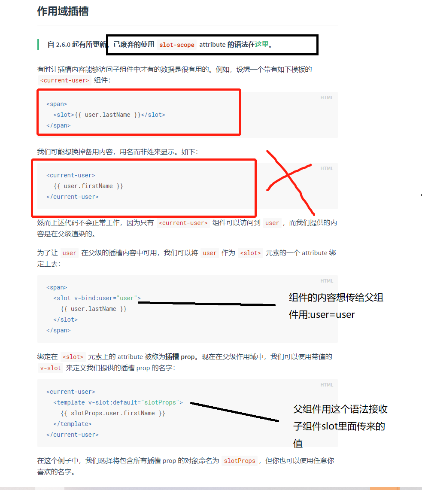

局部组件


## 四十七、6.8学习总结

#### 1、组件通信父传子props

props 接收的信息也会挂在到实例上


props命名规范
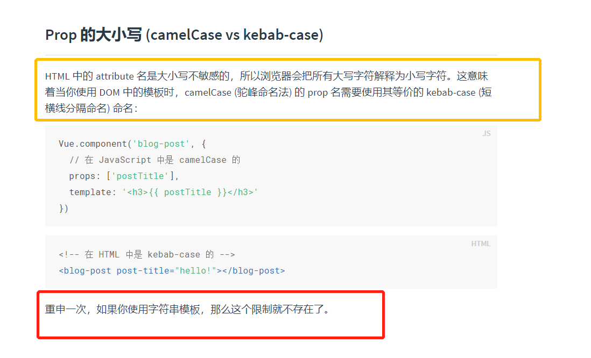

props格式验证


自定义规则例子2


组件上可以直接写class style  这就解释了项目中为什么可以改别人写好组件样式或者覆盖的原因


尽量不要子组件修改父组件传过来的props


虽然修改了但是会报错控制台


解释单项数据流


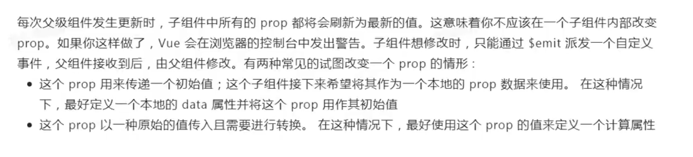

子组件修改父组件信息$emit

@kobe-bryant支持,不支持@kobeBryant这种写法


#### 2、兄弟组件通信

事件总线bus


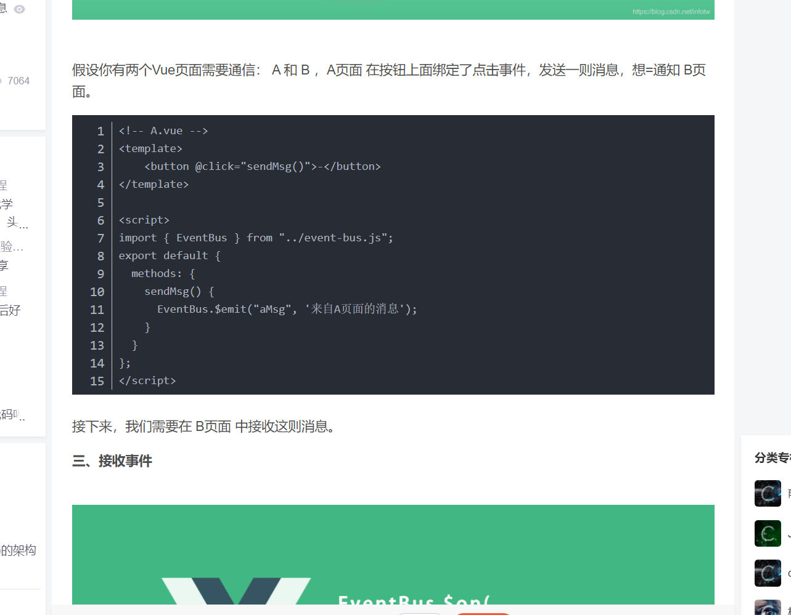


#### 3、组件通信ref和parent与children
.jpg)

$parent(vue不推荐使用)


$children


$refs
用children可能好几个集合 这个方便


但是这些方法vue官方都不推荐


#### 4、祖先后代通信

.png)


.png)

## 四十八、6.9号学习总结(既然想换工作就要更努力学习)

#### 1、VUE中浅理解的数据响应式
Object.defineProperty
默认情况下这里面3个配置参数都是false


用Object.defineProperty定义对象的属性一般是为了设置GETTER和SETTER

get是获取这个对象属性时候触发的,
set是修改这个属性时候触发的

vue中的响应式 基本原理是vue中的observer函数会把data中的初始化数据给进行get和set

.png)
.png)


#### 2、v-model的双向绑定大致实现原理

v-model类似的实现原理

不能这样写,这样会无限递归的,因为一直修改msg了

需要增加一个临时变量

视图更新再改变数据,监听input的input事件(这是移动端的)

oninput 事件在用户输入时触发。

该事件在 <input> 或 <textarea> 元素的值发生改变时触发。

提示： 该事件类似于 onchange 事件。不同之处在于 oninput 事件在元素值发生变化是立即触发， onchange 在元素失去焦点时触发。另外一点不同是 onchange 事件也可以作用于 <keygen> 和 <select> 元素。


#### 3、webpack


局部安装是不能直接使用命令的,除非用npx 或者在package.json里面配置
所以可以 npx webpack 打包  也可以用配置里的  npm run build 或者 yarn build


我们一个项目中可能要有好几个webpack.config.js文件 名字肯定要不一样 我们要怎么设置那


如果我们不改名字就叫webpack.config.js就不需要那后缀名了


要打包同时启动服务设置命令


打包HTML


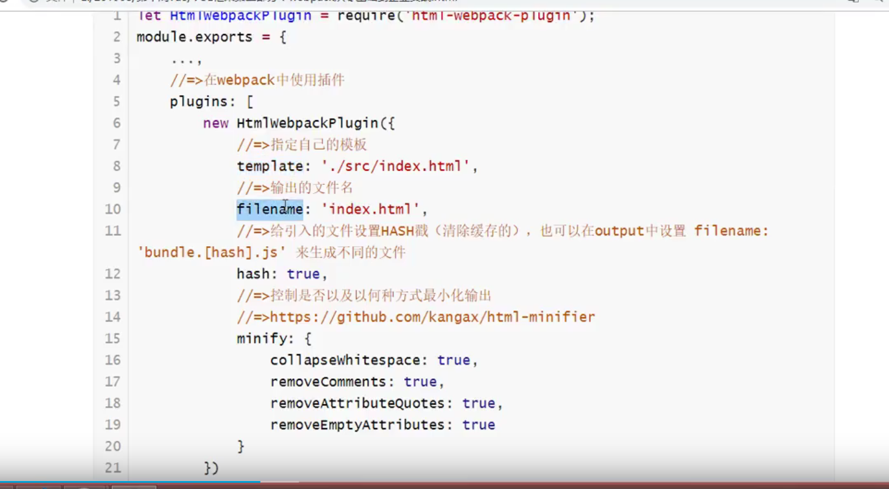


项目中可能会有浏览器缓存所以需要每次加载不同的


编译的css根文件夹记得要在js根文件夹中引入,不然会报错


配置CSS


到这里我们的css是在HTML中style里面的下面我们要抽离出去

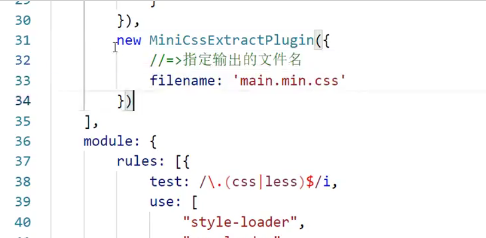

下面进行CSS压缩


## 四十九、6.10号学习总结

6.9号提前计划好,今天不学新内容,单纯的复习笔记!!!笔记非常需要很认真的看一遍

## 五十、6.11,6.12休息
## 五十一、6.13学习总结

#### 1、计算属性和watch再对比


#### 2、计算属性过滤与排序的运用

数组filter方法


#### 3、自定义指令


#### 4、自定义插件
自定义插件内容

自定义插件使用


#### 5、组件再加深理解
组件注册几种方法(这种项目基本不用的,都是用单文件组件的)


组件的单文件组件(项目中的用法)


Vue渲染两种方式：
		1、render：h => h(App)
		2、components注册组件，template解析，但是vue导入需要导入带解析器的版本
#### 6、脚手架
脚手架2配置是暴露的, 我们可以直接在里面修改配置
脚手架3以上的webpack都被隐藏了, 需要通过脚手架扩展的vue.config.js来配置运行启动命令
	
项目的启动
       脚手架2是:npm run dev
       脚手架3是:npm run serve 
	   
	   
eslint的禁用
eslint的配置的错误级别

	1、
	// 局部禁用某个错误提示
	/* eslint-disable no-unused-vars */
	

	2、
	//package.json当中找到eslintConfig项，全局配置禁用某些错误提示
	"rules": {
		"no-unused-vars":"off"
    	}
	

	3、
	
	//开发阶段直接关闭eslint的提示功能
	
	手动创建vue.config.js
	module.exports = {
		//  写自己想要配置的东西去覆盖系统自带的
		// 关闭ESLint的规则
 		lintOnSave: false
	}


脚手架的2种渲染模板方式
```JavaScript
// /* eslint-disable no-unused-vars */
// //局部禁用当前这个类型的错误（只禁用当前文件的这个类型的报错）
import Vue from 'vue' //默认引入的就是runtime-only版本的，不带解析器
// import Vue from 'vue/dist/vue.esm.js' //是我们自己找到的带解析器的版本
import App from '@/App'

 new Vue({
   el:'#app',
   components:{
    App,
  },
  template:'<App />'  //=>要这样解析需要带解析器的vue版本
 })

// You are using the runtime-only build of Vue where the template compiler is not available.
//  Either pre-compile the templates into render functions, or use the compiler-included build.
// 我们现在默认导入的Vue是一个 runtime-only版本的Vue，这个版本的Vue不带解析器


// 这个使用render函数的 为什么就可以使用runtime-only版本的Vue
new Vue({
  el:'#app',
  render: h => h(App) //这个函数和上面我们自己写的 功能差不多
                      // 1、定义并注册了App
                      // 2、使用了App组件
                      // 3、比上面的写法多干了一件事，就是寻找解析器的loader
})


//以后我们要使用的是下面这种
//下面的打包出来的项目体积小


```

#### 7、事件总线再理解


#### 8、vue配置跨域代理


## 五十二、6.14学习总结

#### 1、学习小tip  定时器里面的回调函数最好用箭头函数,因为箭头函数本身this指向window

CSS属性选择
选择第一个

选择不包括第四个的其他

#### 2、vuex

一些基本概念和理解(这些主要看看,下面例子代码理解)
1、状态管理是什么：
		Vuex 是一个专为 Vue.js 应用程序开发的状态管理模式，是一个官方插件。
		它采用集中式存储管理应用的所有组件的状态（数据），并以相应的规则保证状态以一种可预测的方式发生变化。


		我们也可以认为它也是一种组件间通信的方式，并且适用于任意组件
	
	2、理解：对vue应用中多个组件的共享状态进行集中式的管理(读/写)


	3、为什么要有这个（问题）：
		1)多个视图依赖于同一状态
	
		2)来自不同视图的行为需要变更同一状态


		3)以前的解决办法
			a.将数据以及操作数据的行为都定义在父组件
			b.将数据以及操作数据的行为传递给需要的各个子组件(有可能需要多级传递)
	
		4)vuex就是用来解决这个问题的


	4、什么时候用：
		Vuex 可以帮助我们管理共享状态，并附带了更多的概念和框架。这需要对短期和长期效益进行权衡。
		也就是说应用简单（组件比较少）就不需要使用（但是可以），如果应用复杂，使用就会带来很大的便捷


​	

	5、Vuex核心：把所有的共享状态数据拿出来放在Vuex中进行集中式管理	
	
		1、安装vuex
		2、引入vuex并声明使用
		3、向外暴露一个store的实例化对象
		4、将暴露出去的store实例化对象引入到实例化Vue的配置对象当中使用
		5、书写store对象当中包含的4个核心概念


​		
​		Vuex4个核心概念
​		state          代表初始状态数据    是一个包含n个属性（不是方法）的对象
​		getters	       代表计算属性数据    是一个包含n个计算属性的方法的对象
​		actions        代表用户行为数据    是一个包含n个用户行为回调方法的对象，（用来映射组件用户的行为回调函数）
​		mutations      代表直接修改数据的数据  是一个包含n个直接修改状态数据方法的对象 （用来让action的行为调用）		
​		注意：只能通过mutations的方法去直接修改，也就是说要想写state数据必须通过mutations
​		      actions里面是用户操作的行为回调函数，它的内部可以写异步和判断
​		      mutations里面是直接修改数据的函数数据，它的内部不可以写异步和判断
​	
	6、小案例：count计算
		先按照原来的走
		在原来的基础上去更改
			1、数据转移到state
			2、用户操作对应的真实操作转移到actions
			3、对数据直接更改的操作转移到mutations
			4、用户需要使用什么计算的数据getter 转移到getters
		
		mapActions    在组件方法当中可以直接代替dispatch提交操作    映射获取到actions的方法
		
		mapMutations  在组件方法当中可以直接代替commit更改数据      映射获取到mutations的方法
	
	 	mapGetters    在computed当中可以获取根据state计算的数据     映射获取到getters的方法
	
		mapState      在computed当中可以获取state当中的数据	    映射获取到state的属性


​	
​        	...mapActions(['decrement','incrementIfOdd','incrementAsync']),  名字相同可以映射
​        	...mapActions({'increment':'iincrement'})  名字不同需要这样映射


#### 3、vuex使用
**好好看这个vuex**
要使用vuex记得创建一个store文件夹index.js

```JavaScript
//1、安装  npm i vuex

//2、引入并声明使用vuex插件
import Vue from 'vue'
import Vuex from 'vuex'
Vue.use(Vuex)

//3、向外暴露一个store的实例化对象

// state是一个包含多个属性（不是方法）的对象，其实就是用来存储数据用的
const state = {
  count:0
}
// mutations也是一个对象，是一个包含了多个方法的对象，其实就是用这个里面的方法去直接操作数据的
// 这个里面的方法不能包含 if  for  异步，是直接操作的
//一般mutations里面的方法名字都是大写
const mutations = {
  INCREMENT(state){
    state.count++
  },
  DECREMENT(state){
    state.count--
  }
}
// actions也是一个对象，是一个包含了多个方法的对象。这个对象内部的方法是用来和vue当中用户的操作去关联的
// 这个里面的方法可以包含if  for  异步。
const actions = {
  // context  上下文对象 本质其实就是store对象
  //这里操作的结果是去mutations里面执行mutation里面的INCREMENT方法
  iincrement(context){
    context.commit('INCREMENT')
  },
  //这个{commit}相当于{commit}=context  解构赋值context
  decrement({commit}){
    commit('DECREMENT')
  },
//异步
  incrementAsync({commit}){
    setTimeout(() => {
      commit('INCREMENT')
    }, 1000);
  },
   // context  上下文对象 本质其实就是store对象
  //我们的context里面我们也没传commit啊,为什么里面有 因为commit是一个方法可能是原型上的方法,和dispatch类似
  //我们这里没有this所以是通过context结构赋值出来state操作里面的count
  //if判断
  incrementIfOdd({commit,state}){
    if(state.count % 2 === 1){
      commit('INCREMENT')
    }
  }
}

// getters也是一个对象，是一个包含了多个方法的对象。这个对象内部的每个方法对应了一个计算属性的get，就是
// 通过state当中的已有数据 计算出来的一个新的想要使用的属性数据
const getters = {}


//全写在这里太乱了,所以把这些属性写在了外面,就是上面那些
export default new Vuex.Store({
  //包含了6个核心概念，
  //现在咱们讲4个
  state,
  mutations,
  actions,
  getters

})

//4 将暴露出去的store实例化对象引入到实例化Vue的配置对象当中使用


```

vue中如何使用

```html
<template>
  <div>
    <button @click="increment">点击加1</button>
    <button @click="decrement">点击减1</button>
    <button @click="incrementIfOdd">点击如果是奇数加1</button>
    <button @click="incrementAsync">点击异步加1</button>
    <p>{{ count }}</p>
    <!-- <p>{{$store.state.count}}</p> -->
  </div>
</template>

<script>
import { mapActions, mapState } from "vuex";
export default {
  name: "",
  // data(){
  //   return {
  //     count:0
  //   }
  // },

  // 如果是映射方法，无论是actions还是mutations的方法都映射到methods里面
  // 如果是映射属性数据，无论是state的数据还是gettters当中的方法都映射到computed里面

  computed: {
	  //这2种方法效果是一样的
    ...mapState(["count"]),
    // count(){
    //   return this.$store.state.count
    // }
  },

  // computed:mapState(["count"])

  // methods:mapActions(['increment','decrement','incrementIfOdd','incrementAsync'])

  methods: {
    //mapActions()这个函数允许传递一个数组，当回调函数名字和actions当中方法名字一样时候
    //这个函数调用之后返回的是一个对象，这个对象如下
    // {
    //   increment(){
    //     // this.count++
    //     //dispatch 和 emit 都是触发分发的意思  分发触发actions当中对应的方法
    //     this.$store.dispatch('increment')  //这个'increment'是去触发vuexactions里面的increment
    //   },
    //   decrement(){
    //     // this.count--
    //     this.$store.dispatch('decrement')
    //   },
    //   incrementIfOdd(){
    //     // if(this.count % 2 === 1) this.count++
    //     this.$store.dispatch('incrementIfOdd')
    //   },
    //   incrementAsync(){
    //     // setTimeout(() => {
    //     //   this.count++
    //     // },1000)
    //     this.$store.dispatch('incrementAsync')
    //   }
    // }
    //名字一样可以这样传递数组
    //mapActions映入相当于一个函数 函数执行的返回值是一个对象就是什么的对象 然后我们结构他就得到了原来的效果
	//...不能直接...Obj解构对象会报错的需要外面再包一个对象{...Obj}这样 这里是因为methods:{}是一个对象把...mapActions结构出来的值包起来了,所以可以
    // ...mapActions(['increment','decrement','incrementIfOdd','incrementAsync'])
    
    ...mapActions(["decrement", "incrementIfOdd", "incrementAsync"]),
    //名字不一样的必须使用对象
    ...mapActions({
      increment() {
        // this.count++
        //dispatch 和 emit 都是触发分发的意思  分发触发actions当中对应的方法
		//这里是故意把vuex里面的actions方法改成不一样了
        this.$store.dispatch("iincrement");
      },

    }),

    //最原始的写法
    increment(){
      // this.count++
      //dispatch 和 emit 都是触发分发的意思  分发触发actions当中对应的方法
      this.$store.dispatch('increment')
      // this.$store.commit('INCREMENT')
    },
    // decrement(){
    //   // this.count--
    //   this.$store.dispatch('decrement')
    // },
    // incrementIfOdd(){
    //   // if(this.count % 2 === 1) this.count++
    //   this.$store.dispatch('incrementIfOdd')
    // },
    // incrementAsync(){
    //   // setTimeout(() => {
    //   //   this.count++
    //   // },1000)
    //   this.$store.dispatch('incrementAsync')
    // }
  },
};
</script>

<style scoped>
</style>
```

vuex中是可以传参的


vuex原理图
也可以直接mutations但是几乎不用


#### 4、路由介绍以及知识点

vue-router

	是什么
		是vue官方的一个插件
		专门用来实现一个SPA应用
		基于vue的项目基本都会用到此库
		vuex  vue-router  这两个插件应用比较广泛


​	
	单页Web应用（single page web application，SPA）
		整个应用只有一个完整的页面（这个完整的页面，由多个组件组成）
	
		点击页面中的链接不会刷新页面, 本身也不会向服务器发普通请求
	
		当点击路由链接时, 只会做页面的局部更新（组件切换）
	
		数据都需要通过ajax请求获取, 并在前端异步展现


	路由组件和非路由组件
		
		组件：             一个组件包含 html css js img的结合体     定义   注册   使用
		
		路由组件：  	  定义   注册（不是在另外一个组件当中注册，是在路由当中注册的）   使用	
				<router-link></router-link>用户点击的链接    
				<router-view></router-view>组件切换的地方
	
		非路由组件： 	  定义   注册（一定是在另外一个组件当中去注册的）   使用 	 <Header />	


	路由
		是一个key:value的映射关系
	
		前台路由   路径 和 要显示的组件
		{
	
			path:'/home',
			component:Home
	
		}
		当点击链接的时候，路径会发生变化，但是不会向服务器发普通请求，而是去显示对应的组件，显示组件过程当中发ajax请求
		把数据渲染在组件当中	


		后台路由   路径 和 匹配的函数
	
		app.get('/users/info',function(){})
	
		当点击链接（a标签）的时候，路径会发生变化，而且会向服务器发普通请求，
		然后匹配到后端的一个函数处理这个路由的请求，返回需要的数据


	简单理解前台路由：路由可以让我们实现组件的切换和跳转：
			点击链接，
			匹配路由，
			显示对应的组件


	怎么做	
	
		1、拆分页面定义组件
			路由组件和非路由组件


		2、路由器当中定义路由：
	
			路由的使用
				1、安装
				2、引入并声明使用
				3、实例化一个路由器对象并暴露
				4、将实例化的路由器对象在new Vue的配置对象当中使用
				5、new路由器时候配置对象当中的代码


​			
​								
		3、使用路由实现组件切换
			router-link    路由连接，就是点哪，可以让你的路径变为你指定的 to
	
			router-view    路由组件显示区域，就是组件需要在哪显示


	路由传参： 
		第一步：把参数写在路径当中   （三种）
		第二步：点击路由链接的时候，路径会去路由器当中的路由当中匹配，匹配同时会把参数解析添加到路由对象当中
		第三步：匹配成功，显示对应的路由组件同时把当前的路由对象传递到路由组件当中，我们就可以从路由对象当中获取参数
		（props）


		1、	最原始的传参
				参数：params参数,是属于路径的一部分       /message/10
				      query参数路径后使用?去拼接起来的    /xxx/  ? aa = bb && xx = yy  


		2、     路由链接组件传递数据给命名路由
				路由链接组件中给路由传参可以写成对象形式，前提需要给路由起名字name，也叫命名路由


​	  

		3、	使用props简化路由传参给子组件操作（路由当中传参的三种操作）
				1）布尔值  
				路由当中需要配置 props:true,只能接收params参数，它会把路由当中接收的参数，置为子组件的属性     
				2）对象
				很少用，只能给子组件传递默认静态值
				3）函数
				用的比较多，比较灵活，可以把params和query的参数都映射为子组件的属性
				props(route){ //route就是当前我这个路由对象
	                            	//把路由对象当中的参数，不管什么参数
	                            	//全部拿到作为子组件的属性去使用
	                            	return {
	                                		msgId:route.params.msgId,
	                                		msgContent:route.query.msgContent
	                            	}
	                        	}


		4、    路由组件和非路由组件的最大区别
	
			除了在注册和使用的时候这两种组件有区别，其实他们的生命周期也是有很大区别的
	
			路由组件的生命周期是点击链接的时候，才开始的，路由组件才会创建，mounted才能执行
			路由组件在切换的时候，会被销毁，显示的时候重新创建
	
			同一个路由组件传参显示不同数据，mounted回调只会执行一次，因为是同一个组件


​	

	缓存路由组件


​		
		使用的是vue的一个组件，参考vue的官方文档
		使用这个东西可以保证我们在切换组件的时候，原来显示的组件不被销毁


		<keep-alive include="Home">   Home是对应的组件对象的名字，不是路由的名字
	        		<router-view></router-view>
	      	</keep-alive>


​		
​		
	编程式导航和声明式导航
		前面我们都是借助router-link 自动生成的跳转方式去跳转的，叫做声明式导航
		编程式导航：说白了就是让我们自己手写代码，去跳转
	
		1)	this.$router.push(path): 相当于点击路由链接(可以返回到当前路由界面)
		2)	this.$router.replace(path): 用新路由替换当前路由(不可以返回到当前路由界面)
		3)	this.$router.back(): 请求(返回)上一个记录路由
		4)	this.$router.go(-1): 请求(返回)上一个记录路由
		5)	this.$router.go(1):  请求下一个记录路由
	
		$router.push()和$router.replace()的区别，返回有区别。
		$router.push()是往历史记录里面追加
		$router.replace()每一次都是覆盖添加


​	
​		
		hash模式:
			告诉浏览器#后面的参数当做前台路由来解析
   		 	路径中带#: http://localhost:8080/#/home/news
    			发请求的路径: http://localhost:8080  项目根路径
    			响应: 返回的总是index页面  ==> path部分(/home/news)被解析为前台路由路径

		history模式:
				路径中不带#: http://localhost:8080/home/news
				发请求的路径: http://localhost:8080/home/news
				响应: 404错误
			没有#直接把home/news当做后台路由解析,请求接口,直接404报错


    			希望: 如果没有对应的资源, 返回index页面, path部分(/home/news)被解析为前台路由路径
    
    			解决: 添加配置
        			devServer添加: historyApiFallback: true, // 任意的 404 响应都被替代为 index.html
        			output添加: publicPath: '/', // 引入打包的文件时路径以/开头


## 五十三、6.15学习总结

#### 1、路由的用法代码截图加注释(路由器配置文件代码)

```JavaScript
//2
import Vue from 'vue'
import VueRouter from 'vue-router'

import Home from '@/views/Home'
import About from '@/views/About'
import Message from '@/views/Message'
import News from '@/views/News'
import MessageDetail from '@/views/MessageDetail'
import NewsDetail from '@/views/NewsDetail'


Vue.use(VueRouter)

//3
export default new VueRouter({
  //默认不写就是hash模式带#的
  mode:'history',
  //配置路由
  routes:[
    {
      path:'/home',
      component:Home,   //注册路由组件
      //子路由（二级）
      //子路由会自动去父路由那拿取父路由的路径的,所以可以简写,不用写全
      children:[
        {
          path:'message',//简写实际上应该是/home/message
          component:Message,
          children:[
            {
              // :msgid是用来接收路径传过来的params参数
              //params参数名字必须和这个:msgid一样
              path:'msgdetail/:msgid',
              component:MessageDetail,
              name:'msgdetail',  //命名路由
				//props需要在路由组件用props接收props: ["msgid", "content"],
              // 法一:props:true   ,这个只能传params参数
              // 法二:props:{username:'赵丽颖'} ==>基本不用,因为只能传自己写死的值
              props(route){
                return {msgid:route.params.msgid,content:route.query.content}
              }
              // 1、如果写的是布尔值，值为true代表会把传递过来的路径当中的params参数映射为要显示的组件当中属性去使用
              // 2、如果写对象,props是用来把需要自己额外传递的静态数据传映射为组件当中的属性，这个对象用法只能传递一些自己添加的额外数据
              // 3、如果写函数，可以让我们自己把params参数和query参数一起映射为组件当中的属性


              //匹配的同时把参数给解析出来，添加到当前这个路由对象当中(理解)
              // params:{
                    // msgid:1
              // },
              // query:{
                    // content:message01
              // }

            }
          ]
        },
        {
          path:'news',
          component:News,
          children:[
            {
              path:'newsdetail/:newsid',
              component:NewsDetail,
              name:'newsdetail'
            }
          ]
        },
        {
          path:'',//简写  应该是写/home  不写他会和父路由拼接的
          redirect:'message' //简写/hone/message
        }
      ]
    },
    {
      path:'/about',
      component:About
    },
    //重定向路由
    {
      path:'/',
      redirect:'/home'
    }
  ]
})

```

#### 2、路由代码路由组件代码

Home.vue
**主要是说keep-alive,用了keep-alive路由组件切换的时候就有缓存了**
```html
<template>
  <div role="tabpanel" class="tab-pane active" id="home">
    <!-- Nav tabs -->
    <ul class="nav nav-tabs" role="tablist">
      <li role="presentation" class="active">
        <!-- <a href="#Message" aria-controls="Message" role="tab" data-toggle="tab"
          >Message</a
        > -->
        <router-link to="/home/message" aria-controls="Message" role="tab" data-toggle="tab">Message</router-link>
      </li>
      <li role="presentation">
        <!-- <a href="#News" aria-controls="News" role="tab" data-toggle="tab"
          >News</a
        > -->
        <router-link to="/home/news" aria-controls="News" role="tab" data-toggle="tab">News</router-link>
      </li>
    </ul>
    <!-- Tab panes -->
    <div class="tab-content">
      <!-- include="Message" 包含这个名字（组件对象当中的name值）的组件，会被缓存,可以是数组-->
      <keep-alive include="Message">
        <router-view></router-view>
      </keep-alive>
    </div>
  </div>
</template>

<script>
export default {
  name: "",
};
</script>

<style scoped>
</style>
```

Message.vue 路由组件
**路由带参数跳转的3种方式**
```HTML
<template>
  <div role="tabpanel" class="tab-pane active" id="Message">
    <ul class="list-group">
      <li class="list-group-item" v-for="(message,index) in messages" :key="message.id">
        <!-- <a href="##">message01</a> -->
        <!-- <router-link to="/home/message/msgdetail">{{message.content}}</router-link> -->


        <!-- //1、路径的字符串拼接写法 -->
        <!-- <router-link :to="'/home/message/msgdetail/'+ message.id + '?content='+message.content">{{message.content}}</router-link> -->
        <!-- //2、路径的模板字符串拼接写法 -->
        <!-- <router-link :to="`/home/message/msgdetail/${message.id}?content=${message.content}`">{{message.content}}</router-link> -->
        <!-- //3、路径的对象写法(项目中推荐这种写法) ,一般这种写法需要给路由写个名字name:'xxxxx'-->
        <router-link :to="{name:'msgdetail',params:{msgid:message.id},query:{content:message.content}}">{{message.content}}</router-link>
        <!-- 路由传参写法
        // params参数和query参数    params参数是路径的一部分  query参数不占路径
        -->
      </li>
    </ul>
    <input type="text">
    <div class="alert alert-success" role="alert">
      <router-view></router-view>
    </div>
  </div>
</template>


<script>
export default {
  name: "Message",
  data(){
    return {
      messages:[
        {id:1,content:'message01'},
        {id:2,content:'message02'},
        {id:3,content:'message03'}
      ]
    }
  }
};
</script>

<style scoped>
</style>
```

MessageDetail.vue 路由组件
**用props接收路由设置的props参数**
**同一个路由组件传参显示不同数据，mounted回调只会执行一次，因为是同一个组件(只有路径变化了才会,路径后面的参数变化是不会变的)**
**上述问题用watch来监测route里面参数的变化**
小回顾:对象中函数的写法
数组的find方法:find() 方法返回数组中满足提供的测试函数的第一个元素的值。否则返回 undefined。
```HTML
<template>
  <ul class="list-group">
    <!-- <li class="list-group-item">{{$route.params.msgid}}</li> -->
    <li class="list-group-item">{{ msgid }}</li>
    <!-- <li class="list-group-item">{{$route.query.content}}</li> -->
    <li class="list-group-item">{{ content }}</li>

    <li class="list-group-item">{{ title }}</li>
  </ul>
</template>
<script>
let msgArr = [
  { id: 1, title: "title01" },
  { id: 2, title: "title02" },
  { id: 3, title: "title03" },
];
export default {
  name: "",
  props: ["msgid", "content"],
  data() {
    return {
      title: "",
    };
  },
  //同一个路由组件传参显示不同数据，mounted回调只会执行一次，因为是同一个组件(只有路径变化了才会,路径后面的参数变化是不会变的)
  mounted() {
    this.findTitle()
  },
  //项目中会经常出现同一个路由组件显示不同数据,这种情况会经常出现
  //点击三个链接，他们共用的是同一个路由组件，路由组件是同一个，就不会销毁重新创建
  //点击三个链接的时候，传递的参数不一样，路由组件还是那一个，导致mounted只会执行一次
  //第一次会正常，后面点击的时候title就不会变化了
  watch: {
    //也可以直接这样写  这是ES6对象里面函数的简便写法
  /*   $router(newVal, oldVal){
      this.findTitle()
    } */
    //或者这样写 这是对象正常写法
  /*   $route:function(newQuestion, oldQuestion){
      
    } */
    $route: {
      handler(newVal, oldVal) {
        this.findTitle()
      },
    },
  },
  methods: {
    findTitle() {
      setTimeout(() => {
        this.title = msgArr.find((item) => item.id === this.msgid).title;
      }, 1000);
    },
  },
};
</script>

<style scoped>
</style>
```

News.vue 组件 
编程式导航
1)	this.$router.push(path): 相当于点击路由链接(可以返回到当前路由界面)
		2)	this.$router.replace(path): 用新路由替换当前路由(不可以返回到当前路由界面)
		3)	this.$router.back(): 请求(返回)上一个记录路由
		4)	this.$router.go(-1): 请求(返回)上一个记录路由
		5)	this.$router.go(1):  请求下一个记录路由
```HTML
<template>
  <div role="tabpanel" class="tab-panel" id="News">
    <ul class="list-group">
      <li class="list-group-item" v-for="(news,index) in newsList" :key="news.id">
        {{news.content}}
        <button
          type="button"
          class="btn btn-primary"
          data-toggle="button"
          aria-pressed="false"
          autocomplete="off"
          @click="toNewsDetail(news)"
        >{{news.id}}</button>
      </li>
    </ul>
    <button @click="$router.back()">返回</button>
    <div class="alert alert-success" role="alert">
      <router-view></router-view>
    </div>
  </div>
</template>

<script>
export default {
  name: "",
  data(){
    return {
      newsList:[
        {id:1,content:'newsOne'},
        {id:2,content:'newsTwo'},
        {id:3,content:'newsThree'},
      ]
    }
  },
  methods:{
    toNewsDetail(news){
      //跳转路由切换组件，有历史记录，返回的时候可以返回到之前去过的地方
      // this.$router.push
      // this.$router.push('/home/news/newsdetail/'+news.id + '?content=' +  news.content)
      // this.$router.push(`/home/news/newsdetail/${news.id}?content=${news.content}`)
      // this.$router.push({name:'newsdetail',params:{newsid:news.id},query:{content:news.content}})

      //跳转路由切换组件，没有有历史记录，返回的时候不可以返回到之前去过的地方
      // this.$router.replace
      this.$router.replace({name:'newsdetail',params:{newsid:news.id},query:{content:news.content}})
    }
  }
};
</script>

<style scoped>
</style>
```

NewsDeatil.vue 
```HTML
<template>
  <ul class="list-group">
    <li class="list-group-item">{{$route.params.newsid}}</li>
    <li class="list-group-item">{{$route.query.content}}</li>
  </ul>
</template>

<script>
export default {
  name: "",
};
</script>

<style scoped>
</style>
```

假如使用了history模式
	解决: 添加配置
        			devServer添加: historyApiFallback: true, // 任意的 404 响应都被替代为 index.html
        			output添加: publicPath: '/', // 引入打包的文件时路径以/开头


在根index.html中需要修改引入的文件,引入方式
```HTML
<head>
  <meta charset="UTF-8">
  <meta name="viewport" content="width=device-width, initial-scale=1.0">
  <title>Document</title>
  <!-- 使用history模式的时候这些链接不能.开头了要/来头 -->
  <!-- <link rel="stylesheet" href="./css/bootstrap.css"> -->
  <link rel="stylesheet" href="/css/bootstrap.css">
```
## 五十四、6.16学习总结

### 研究vue源码

#### 1、数据代理

 1) 理解
- 是什么? 通过vm直接操作vm内部的data的属性数据,本来应该是vm._data.msg来访问msg的,有了代理后直接vm.msg 举例: this._data.msg  ===> this.msg
- 作用: 简化编码(少写了一层)

 2) 原理
- 通过defineProperty()给vm添加与data所有属性对应的属性
- 给属性指定getter(意思是get()这个方法)与setter
- 在getter方法中, 读取data中msg属性值返回   ==> 当this.msg时自动调用
- 在setter方法中, 将最新msg值赋值给data的msg属性  ==> 当this.msg = 'xxx'时自动调用

代码实现大致,获取到配置参数中的data,用object.keys()遍历data对象,然后再把每个属性用proxy函数,绑定object.define.property


```JavaScript

/* 
相当于Vue的构造函数
*/
function MVVM(options) {
    // 将配置对象保存到vm上
    this.$options = options;
    // 将data对象保存到vm和局部变量data上
    var data = this._data = this.$options.data;
    // 将vm保存到变量me
    var me = this;

    // 遍历data中所有属性
    Object.keys(data).forEach(function(key) { // 某个属性: name
        // 对当前属性实现数据代理
        me._proxy(key);
    });

    // 对data中所有层次属性进行监视劫持
    observe(data, this);

    // 创建一个编译对象(编译模板)
    this.$compile = new Compile(options.el || document.body, this)
}

MVVM.prototype = {
    $watch: function(key, cb, options) {
        new Watcher(this, key, cb);
    },

    _proxy: function(key) {// name
        var me = this;
        // 给vm添加指定的属性
        Object.defineProperty(me, key, {
            configurable: false, // 不可重新定义
            enumerable: true, // 可以枚举遍历
            // 当通过vm.xxx读取属性值时自动调用
            get: function proxyGetter() {
                // 读取data中对应的属性值返回
                return me._data[key];
            },
            // 当通过vm.xxx = value修改属性时, 自动调用
            set: function proxySetter(newVal) {
                // 将最新的值保存到data对应的属性上
                me._data[key] = newVal;
            }
        });
    }
};

```


#### 2、虚拟DOM中的h函数
有待继续研究

## 五十五、6.17学习总结

今天赶任务一天,脑子高度使用,晚上学习效率不咋地,看了一遍VUE响应式数据绑定,但是学的东西还不足以记入笔记,只是表达过了一遍

#### 1、v-model原理
 数据双向绑定

 1 相关理解

- 以input中使用v-model来说: <input v-model="msg"/>
- 从data到页面的绑定:  输入框是根据data中的msg做初始化显示和更新显示
- 从页面到data绑定: 当输入发生改变时, 会自动的将输入的最新值自动保存到data的msg上

 2 原理

- 从data到页面的绑定: 内部给input指定了动态value为msg的值, 因为有单向数据绑定的存在, 一旦更新msg, 输入框就会自动 更新显示
- 从页面到data绑定:内部给input绑定了input事件监听, 在回调函数中读取input最新的value值保存到data的msg属性上

```HTML
  <div id="test">
    <input type="text" v-model="msg">

    <input type="text" :value="msg" @input="msg=$event.target.value"> 
    <p>{{msg}}</p>
  </div>
```


  #### 2、CSS属性选择


#### 3、V-for遍历出来的盒子单选和多选

单选最简单的方法就是设置一个current参数判断当前点击的index是否等于


多选用到了类似自定义属性的原理(是一个好编程逻辑)


## 五十六、6.18 19 20 3天周末颓废休息

## 五十七、6.21 6.22 23学习总结

promise的一晚  源码属实难


#### 1、promise基础
 这个概况太笼统了  统一使用尚硅谷的笔记
 promise源码GET


## 五十八、 6.24学习总结

#### 1、组件通信之$attr

 <KInput type="password" v-model="userInfo.password" placeholder="请输入用户名"></KInput> 
 这里写了一个参数placeholder 子组件是没有用props接收的
 直接子组件用:$attrs就可以了
 ```HTML
 <template>
   <div>
     <!-- 想要在自定义组件让外面使用的时候可以使用v-model必须要写:value="value" @input="onInput" -->
     <!-- 自定义组件双向绑定：:value  @input -->
     <!-- v-bind="$attrs"展开$attrs -->
     <!-- $attrs就是把父组件传过来的值,假如没用props接收的话,就会全放在这里面,然后再把里面的值展开 -->
     <!-- 包含了父作用域中不作为 prop 被识别 (且获取) 的 attribute 绑定 (class 和 style 除外)。当一个组件没有声明任何 prop 时，这里会包含所有父作用域的绑定 (class 和 style 除外)，并且可以通过 v-bind="$attrs" 传入内部组件——在创建高级别的组件时非常有用。 -->
     <input :type="type" :value="value" @input="onInput" v-bind="$attrs">
   </div>
 </template>
 
 <script>
   export default {
     inheritAttrs: false, // 设置为false避免设置到根元素上
     props: {
       value: {
         type: String,
         default: ''
       },
       type: {
         type: String,
         default: 'text'
       }
     },
     methods: {
       onInput(e) {
         // 派发一个input事件即可
         this.$emit('input', e.target.value)
 
         // 通知父级执行校验
         this.$parent.$emit('validate')
       }
     },
   }
 </script>
 
 <style scoped>
 
 </style>
 ```
 
 vm.$listeners
 2.4.0 新增
 
 类型：{ [key: string]: Function | Array<Function> }
 
 只读
 
 详细：
 
 包含了父作用域中的 (不含 .native 修饰器的) v-on 事件监听器。它可以通过 v-on="$listeners" 传入内部组件——在创建更高层次的组件时非常有用。
 
 
 #### 2、混入mixins基本用法

就是把组件里面script里面的公共部分写在一个Js文件里面 然后倒入


#### 3、事件总线的挂载


#### 4、nextTick


#### 5、startsWith


#### 6、Element.attributes


#### 7、filter
.jpg)


## 五十九、6.25-6-27休息还有重新看VUE源码

## 六十、6.28学习总结(面试专题)

#### 1、前台数据存储
问法 1、怎么实现自动登录   2、我有一个token要存起来应该怎么实现那?

前台存储有3种方式
- cookie
- sessionStorage
- localStorage

注意: session后台数据存储

 cookie

- 本身用于浏览器和Server通讯
- 被 "借用" 到本地存储
- 可用document.cookie读取或保存
- 可以利用cookies工具库简化编码


 cookie的缺点

- 存储大小有限, 最大4KB
- http请求时会自动发送给服务器, 增加了请求的数据量
- 原生的操作语法不太方便操作cookie
- 浏览器可以设置禁用


 localStoarge与sessionStorage

- 相同点:
  - 纯浏览器端存储, 大小不受限制, 请求时不会自动携带
  - 只能保存文本, 如果是对象或数组, 需要转换为JSON
  - API相同:
    - setItem(key, value)
    - getItem(key, value)
    - removeitem(key, value)
  - 浏览器不能禁用
- 不同点:
  - localStorage保存在本地文件中, 除非编码或手动删除, 否则一直存在
  - sessonStorage数据保存在当前会话内存中, 关闭浏览器则清除


 区别cookie 与 localStorage和sessionStorage

- 容量
- 请求时是否自动携带
- API易用性
- 浏览器是否可禁用

 区别cookie与session

- cookie保存在浏览器端(前台可以操作)
- session保存在服务器端(前台不能操作)
- session依赖于cookie(session的id以cookie的形式保存在浏览器端)


我:实现自动登录可以用cookie,前台页面调用接口实现自动登录,后台那边验证,如果账号密码没问题,后台就给我创建一个cookie,
因为前台的cookie是临时的,且存储空间小,后台的cookie是持久的,并且设置cookie max地址,设置后就变成持久的cookie了 返回给浏览器后就是一个持久的cookie了
再次登录的时候,会从本地读出来这个cookie并且携带上放在请求头上去后台,后台就会验证
后期我们做项目用的是token  用户点击登录调用接口,后台那边验证通过后,通过加密密钥,形成一个加密的token,然后会设置有效时间,返回给前台 
我会把返回的token存在localStorage,因为localStorage存的是持久的,关了浏览器还有 sessionStorage关了浏览器就没了;

#### 2、从输入url到渲染出页面的整个过程
[](http://www.baidu.com

1. DNS 解析（查询）：将域名地址解析 ip 地址

- 浏览器 DNS 缓存
- 计算机 DNS 缓存
- 路由器 DNS 缓存
- 网络运营商 DNS 缓存
- 递归查询

2. TCP 链接：TCP 三次握手  ===> 建立连接

- 客户端发送服务端：我准备好了，请你准备一下
- 服务端发送客户端：我也准备好了，请你确认一下
- 客户端发送服务端：确认完毕


3. 发送请求

- 将请求报文发送过去

4. 返回响应

- 将响应报文发送过来

5. 解析渲染页面

- 遇到 HTML，调用 HTML 解析器，解析成 DOM 树
- 遇到 CSS，调用 CSS 解析器，解析成 CSSOM 树
- 遇到 JS，调用 JS 解析器（JS 引擎），解析 JS 代码
  - 可能要修改元素节点，重新调用 HTML 解析器，解析更新DOM 树
  - 可能要修改样式节点，重新调用 CSS 解析器，解析更新 CSSOM 树
- 将 DOM + CSSOM = Render Tree（渲染树）
- layout 布局：计算元素的位置和大小信息
- render 渲染：将颜色/文字/图片等渲染上去

6. 断开链接：TCP 四次挥手
   (断开请求链接 2 次, 断开响应链接 2 次)
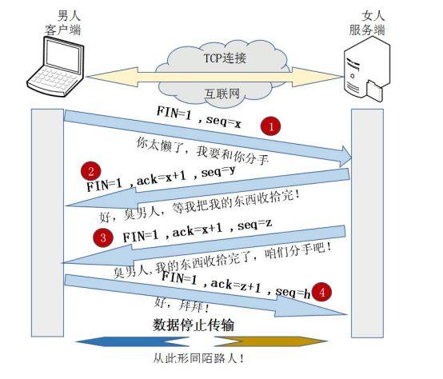
- 客户端发送服务端：请求数据发送完毕，可以断开了
- 服务端发送客户端：请求数据接受完毕，可以断开了
- 服务端发送客户端：响应数据发送完毕，可以断开了
- 客户端发送服务端：响应数据接受完毕，可以断开了


)

#### 3、手写call,apply,bind 用函数和方法2种方式

```JavaScript
//函数
   function call(fn,obj, ...args) {
      if (obj === null || obj === undefined) {
        obj = obj || window
      }
      // fn 中存储的是外部传入进来的f1函数对象,
      obj.tempFn = fn
      // obj.tempFn(...args) 就相当于f1(10,20) 的返回值 给了result
      const result = obj.tempFn(...args)
      // 把上面使用完毕的函数删除了(清理使用后的缓存数据了)
      delete obj.tempFn
      // 把f1函数调用后的结果返回
      return result
    }
	
	//方法
	  Function.prototype.call = function (obj, ...args) {
	      // 判断是否传了obj的对象
	      if(obj===null||obj===undefined){
	        obj = obj||window
	      }
	      // 此时代码能够执行到这里,说明式一个对象调用了这个call方法,所以,this就是当前对象,又由于该对象一定是一个函数对象
	      // 所以,this是一个函数对象(this是个函数)
	      // 把当前的this存储起来(把这个函数存储起来)
	
	      // window.tempFn = f1
	      obj.tempFn = this
	      // 调用这个函数
	      obj.tempFn(...args)
	
	    }
		
		/* 
		自定义函数对象的apply方法
		*/
		function apply (fn, obj, args) {
		  // 如果传入的是null/undefined, this指定为window
		  if (obj===null || obj===undefined) {
		    obj = obj || window
		  }
		  // 给obj添加一个方法: 属性名任意, 属性值必须当前调用call的函数对象
		  obj.tempFn = fn
		  // 通过obj调用这个方法
		  const result = obj.tempFn(...args)
		  // 删除新添加的方法
		  delete obj.tempFn
		  // 返回函数调用的结果
		  return result
		}
		
		/* 
		  自定义函数对象的bind方法
		  重要技术:
		    高阶函数
		    闭包
		    call()
		    三点运算符
		*/
		function bind (fn, obj, ...args) {
		  if (obj===null || obj===undefined) {
		    obj = obj || window
		  }
		  
		  return function (...args2) {
		    return call(fn, obj, ...args, ...args2)
		  }
		}
		```
		
		
#### 4、节流防抖

什么情况下使用那
项目可以做什么优化鸭?
我项目做搜索的时候,有个模糊查询,使用节流
   /*
        1. 事件频繁触发可能造成的问题?
        1). 一些浏览器事件:window.onresize、window.mousemove等，触发的频率非常高，会造成浏览器性能问题
        2). 如果向后台发送请求，频繁触发，对服务器造成不必要的压力
    
    2. 如何限制事件处理函数频繁调用
        1). 函数节流
        2). 函数防抖

    3. 函数节流(throttle)
        1). 理解: 
            在函数需要频繁触发时: 函数执行一次后，只有大于设定的执行时间后才会执行第二次
            适合多次事件按时间做平均分配触发 (触发少量几次)
        2). 场景：
            窗口调整（resize）
            页面滚动（scroll）
            DOM 元素的拖拽功能实现（mousemove）
            抢购疯狂点击（click）
            
    4. 函数防抖(debounce)
        1). 理解:
            在函数需要频繁触发时: 在规定时间内，只让最后一次生效，前面的不生效。
            适合多次事件一次响应的情况
        2). 场景：
            输入框实时搜索联想（keyup/input）
    
    */
   
#### 5、数组去重

```JavaScript
/*
方法1: 利用forEach()和indexOf()
  说明: 本质是双重遍历, 效率差些
*/
function unique1 (array) {
  const arr = []
  array.forEach(item => {
    if (arr.indexOf(item)===-1) { // 内部在遍历判断出来的
      arr.push(item)
    }
  })
  return arr
}

/*
方法2: 利用forEach() + 对象容器
  说明: 只需一重遍历, 效率高些
*/
function unique2 (array) {
  const arr = []
  const obj = {}
  array.forEach(item => {
    if (!obj.hasOwnProperty(item)) {// 不用遍历就能判断出是否已经有了
      obj[item] = true
      arr.push(item)
    }
  })
  return arr
}

/*
方法3: 利用ES6语法
    1). from + Set
    2). ... + Set
    说明: 编码简洁
*/
function unique3 (array) {
  // return Array.from(new Set(array))
  return [...new Set(array)]
}
```
#### 6、数组扁平化


```JavaScript
/* 
数组扁平化: 取出嵌套数组(多维)中的所有元素放到一个新数组(一维)中
  如: [1, [3, [2, 4]]]  ==>  [1, 3, 2, 4]
*/

/*
方法一: 递归 + reduce() + concat()
*/
function flatten1 (array) {

  return array.reduce((pre, item) => {
    if (Array.isArray(item) && item.some((cItem => Array.isArray(cItem)))) {
      return pre.concat(flatten1(item))
    } else {
      return pre.concat(item)
    }
  }, [])
}

/*
方法二: ... + some() + concat()
*/
function flatten2 (array) {

  let arr = [].concat(...array)
  while (arr.some(item => Array.isArray(item))) {
    arr = [].concat(...arr)
  }
  return arr
}
//foreach不能用continue,用return退出当前函数
function float(arr) {
      let result = [];
      let fn = function (array) {
        console.log(array);
        array.forEach((item)=>{
          if(Array.isArray(item)){
            fn(item);
           return
          }
          result = result.concat(item)
        })
      }
      fn(arr)
      return result
    }
```

#### 7、深拷贝

```JavaScript

//1.基础版本(不能进行循环引用,会报错)
export function deepClone2(target){
    //检测数据的类型
    if(typeof target === 'object' && target !== null ){
        //创建一个容器
        const result = Array.isArray(target) ? [] : {};
        //遍历对象
        for(let key in target){
            //检测该属性是否为对象本身的属性(不能拷贝原型对象的属性)
            if(target.hasOwnProperty(key)){
                //拷贝
                result[key] = deepClone2(target[key]);
            }
        }
        return result;
    }else{
        return target;
    }
}

2.加强版本(可以循环引用)
export function deepClone3(target, map=new Map()){
    //检测数据的类型
    if(typeof target === 'object' && target !== null ){
        //克隆数据之前, 进行判断, 数据之前是否克隆过
        let cache = map.get(target);
        if(cache){
            return cache;
        }
        //创建一个容器
        const result = Array.isArray(target) ? [] : {};
        //将新的结果存入到容器中
        map.set(target, result);
        //遍历对象
        for(let key in target){
            //检测该属性是否为对象本身的属性(不能拷贝原型对象的属性)
            if(target.hasOwnProperty(key)){
                //拷贝
                result[key] = deepClone3(target[key], map);
            }
        }
        return result;
    }else{
        return target;
    }
}

//3.终极无敌加强版本性能加强版
export function deepClone4(target, map=new Map()){
    //检测数据的类型
    if(typeof target === 'object' && target !== null ){
        //克隆数据之前, 进行判断, 数据之前是否克隆过
        let cache = map.get(target);
        if(cache){
            return cache;
        }
        //判断目标数据的类型
        let isArray = Array.isArray(target);
        //创建一个容器
        const result = isArray ? [] : {};
        //将新的结果存入到容器中
        map.set(target, result);
        //如果目标数据为数组
        if(isArray){
            //forEach 遍历
            target.forEach((item, index) => {
                result[index] = deepClone4(item, map);
            });
        }else{
            //如果是对象, 获取所有的键名, 然后 forEach 遍历
            Object.keys(target).forEach(key => {
                result[key] = deepClone4(target[key], map);
            });
        }
        return result;
    }else{
        return target;
    }
}
```


#### 8、自定义new和instanceof工具函数
```JavaScript
/* 
自定义new工具函数
  语法: newInstance(Fn, ...args)
  功能: 创建Fn构造函数的实例对象
  实现: 创建空对象obj, 调用Fn指定this为obj, 返回obj
*/
function newInstance(Fn, ...args) {
  // 创建一个新的对象
  const obj = {}
  // 执行构造函数
  const result = Fn.apply(obj, args) // 相当于: obj.Fn()
  // 如果构造函数执行的结果是对象, 返回这个对象
  if (result instanceof Object) {
    return result
  }
  // 如果不是, 返回新创建的对象
  obj.__proto__.constructor = Fn // 让原型对象的构造器属性指向Fn
  
  return obj
}

/* 
自定义instanceof工具函数: 
  语法: myInstanceOf(obj, Type)
  功能: 判断obj是否是Type类型的实例
  实现: Type的原型对象是否是obj的原型链上的某个对象, 如果是返回true, 否则返回false
*/
function myInstanceOf(obj, Type) {
  // 得到原型对象
  let protoObj = obj.__proto__

  // 只要原型对象存在
  while(protoObj) {
    // 如果原型对象是Type的原型对象, 返回true
    if (protoObj === Type.prototype) {
      return true
    }
    // 指定原型对象的原型对象
    protoObj = protoObj.__proto__
  }

  return false
}
```

#### 9、简单排序: 冒泡 / 选择 / 插入
```JavaScript
/* 
冒泡排序的方法
*/
function bubbleSort (array) {
  // 1.获取数组的长度
  var length = array.length;

  // 2.反向循环, 因此次数越来越少
  for (var i = length - 1; i >= 0; i--) {
    // 3.根据i的次数, 比较循环到i位置
    for (var j = 0; j < i; j++) {
      // 4.如果j位置比j+1位置的数据大, 那么就交换
      if (array[j] > array[j + 1]) {
        // 交换
        // const temp = array[j+1]
        // array[j+1] = array[j]
        // array[j] = temp
        [array[j + 1], array[j]] = [array[j], array[j + 1]];
      }
    }
  }

  return arr;
}

/* 
选择排序的方法
*/
function selectSort (array) {
  // 1.获取数组的长度
  var length = array.length

  // 2.外层循环: 从0位置开始取出数据, 直到length-2位置
  for (var i = 0; i < length - 1; i++) {
    // 3.内层循环: 从i+1位置开始, 和后面的内容比较
    var min = i
    for (var j = min + 1; j < length; j++) {
      // 4.如果i位置的数据大于j位置的数据, 记录最小的位置
      if (array[min] > array[j]) {
        min = j
      }
    }
    if (min !== i) {
      // 交换
      [array[min], array[i]] = [array[i], array[min]];
    }
  }

  return arr;
}

/* 
插入排序的方法
*/
function insertSort (array) {
  // 1.获取数组的长度
  var length = array.length

  // 2.外层循环: 外层循环是从1位置开始, 依次遍历到最后
  for (var i = 1; i < length; i++) {
    // 3.记录选出的元素, 放在变量temp中
    var j = i
    var temp = array[i]

    // 4.内层循环: 内层循环不确定循环的次数, 最好使用while循环
    while (j > 0 && array[j - 1] > temp) {
      array[j] = array[j - 1]
      j--
    }

    // 5.将选出的j位置, 放入temp元素
    array[j] = temp
  }

  return array
}
```

#### 10、nexttick


比如这个例子,如果不使用获取的数据是不对的


#### 11、data为什么是一个函数
(因为响应式递归需要是函数)
Vue 实例的数据对象。Vue 会递归地把 data 的 property 转换为 getter/setter，
从而让 data 的 property 能够响应数据变化。对象必须是纯粹的对象 (含有零个或多个的 key/value 对)：浏览器 API 创建的原生对象，
原型上的 property 会被忽略。大概来说，data 应该只能是数据 - 不推荐观察拥有状态行为的对象。

当一个组件被定义，data 必须声明为返回一个初始数据对象的函数，因为组件可能被用来创建多个实例。如果 data 仍然是一个纯粹的对象，则所有的实例将共享引用同一个数据对象！
通过提供 data 函数，每次创建一个新实例后，我们能够调用 data 函数，从而返回初始数据的一个全新副本数据对象。


Vue组件可能存在多个实例，如果使用对象形式定义data，则会导致它们共用一个data对象，那么状态
变更将会影响所有组件实例，这是不合理的；采用函数形式定义，在initData时会将其作为工厂函数返
回全新data对象，有效规避多实例之间状态污染问题。而在Vue根实例创建过程中则不存在该限制，也
是因为根实例只能有一个，不需要担心这种情况

#### 12、watch的一些属性


## 六十一、6.29-7.1面试准备加面试(下周开始重新系统学习前端技术)
## 六十二、7.2-7.4(南京游玩放松2天)
周日收到了一份超出预期的工作offer 不知道我能不能胜任 加油啊 啊杰
游玩了2天南京属实真的累
如果不出意外,我会在这家新公司呆足够2年左右,然后冲击阿里巴巴前端P6岗位
明天开始要重新弄一个新的学习计划出来了  开始查漏补缺    webpack nodejs  vue各种知识源码 vue3 正则表达式 axios等等前端知识恶补

## 六十三、7.5-7.10
整离职,新工作的事情,又没有学习

## 六十四、7.11(学习总结)
			git版本管理工具
#### 1、commit上去的东西是没法删除的
本地库的东西上传了是没法删除的(只能重新再传一个版本,但是老版本还是在的),暂存区的是可以删除的


#### 2、git小技巧
输入文字按住tab会自动补全
