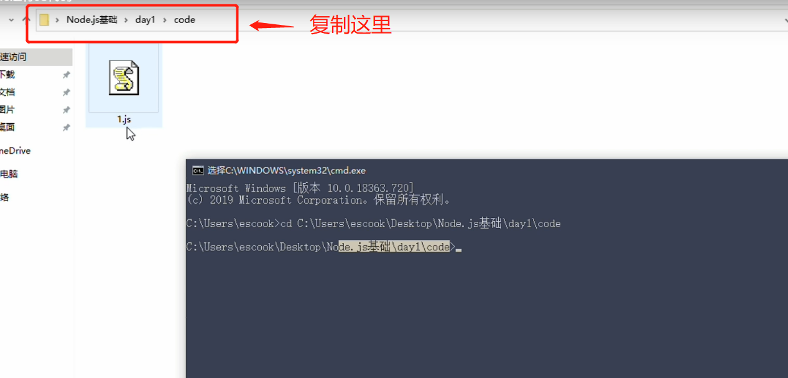
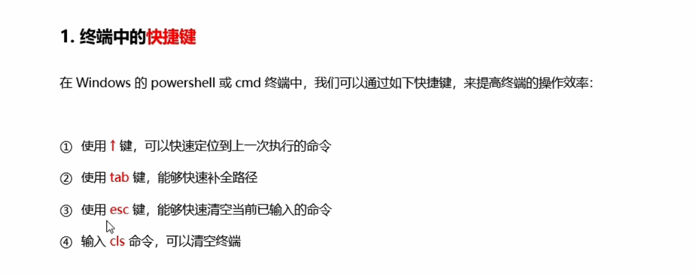
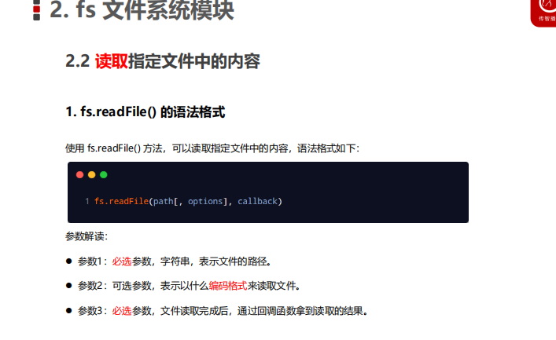
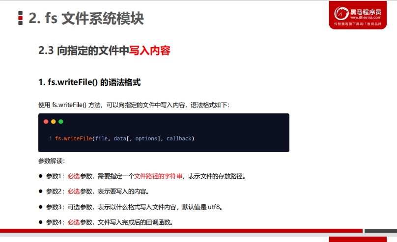
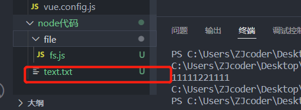
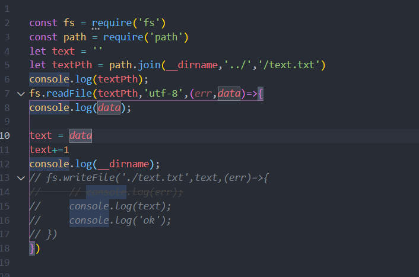
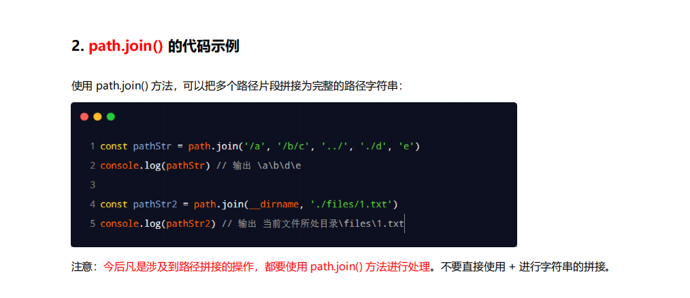

## 1、2022/5/19学习总结
day1 ppt   
>基础方法都在ppt里面   下面记录一些听课里面觉得需要自己记得点
### 1、关于cmd中快速进入到期待项目的文件夹

打开cmd  cd+复制的文件夹路径

也可以用shell窗口 shift+左键

### 2、终端的快捷键

### 3、node中的fs模块

### 4、node中的path模块

拼接的时候如果加上'../' 就会把上一级的目录去除    写几个../ 就抵消几级路径  这个例子中text在上一级目录中使用../就可以解决
如果是./的话会被忽略

一些其他方法见ppt

### 5、node中的http
 1. ip地址和域名是可以互相转换的  例如 域名:www.baidu.com  和 ip地址:180.101.49.12   在浏览器输入都是可以访问的
 2. 查看ip地址 在cmd中  输入 ping+域名   如 ping www.baidu.com
 3.  在开发期间，自己的电脑既是一台服务器，也是一个客户端，为了方便测试，可以在自己的浏览器中输入 127.0.0.1 这个IP 地址，
 就能把自己的电脑当做一台服务器进行访问了。
 4. 127.0.0.1 对应的域名是 localhost，它们都代表我们自己的这台电脑，在使用效果上没有任何区别。
 5. IP地址和域名是一一对应的关系，这份对应关系存放在一种叫做域名服务器(DNS，Domain name server)的电脑中。使用者
只需通过好记的域名访问对应的服务器即可，对应的转换工作由域名服务器实现。因此，域名服务器就是提供 IP 地址和域名
之间的转换服务的服务器。
 6. 在实际应用中，URL 中的 80 端口可以被省略。默认不设置就是 127.0.0.1:80    localhost:80  如果你写了其他端口就不能忽略
